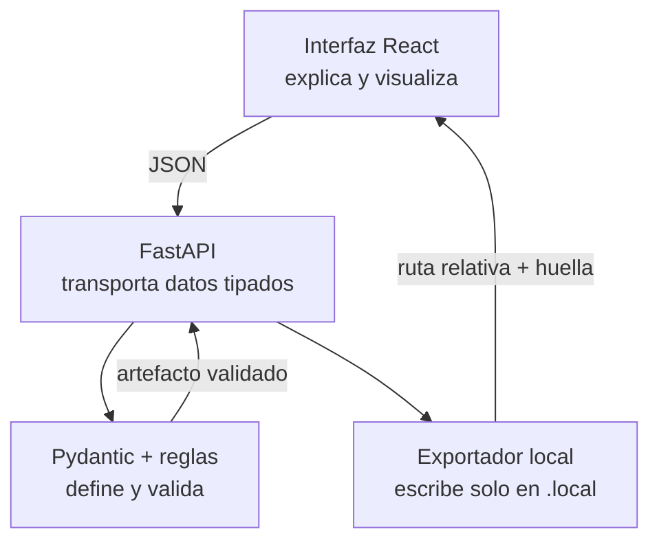
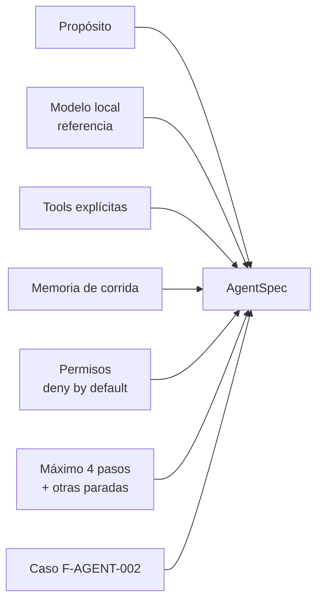

# Arquitectura explicada

> Documento didáctico; describe el código sin formar parte del runtime.

## 1. La idea central

La arquitectura separa cuatro responsabilidades que suelen mezclarse:

- La interfaz no inventa contratos: muestra lo que devuelve la API.
- FastAPI no decide el contenido: valida y conecta las operaciones.
- El dominio no conoce React ni rutas HTTP: contiene conceptos y reglas.
- El exportador no genera contenido: solo persiste un artefacto cuya huella es válida.

## 2. Componentes y por qué existen

### `backend/src/prompt_agent_factory/contracts.py`

**Qué es:** el vocabulario formal del laboratorio.

**Para qué sirve:** define los campos válidos, tipos, límites y relaciones de `PromptSpec`, `AgentSpec`, `SkillSpec` y `RunRecord`.

**Por qué se incluye:** un modelo puede producir JSON sintácticamente válido pero semánticamente incompleto. Pydantic rechaza campos desconocidos y obliga a declarar permisos, parada, evaluación y fuentes.

### `api_models.py`

**Qué es:** el contrato de conversación entre navegador y backend.

**Para qué sirve:** representa el briefing, las preguntas guiadas, el progreso visual y las respuestas de exportación.

**Por qué está separado:** un formulario incompleto no es todavía un artefacto reutilizable. Mezclarlos permitiría guardar borradores inválidos como si fueran finales.

### `factory.py`

**Qué es:** el motor determinista de la Parte 1.

**Para qué sirve:** detecta huecos, formula preguntas y construye cada artefacto con políticas seguras por defecto.

**Por qué no usa Ollama aún:** necesitamos una referencia reproducible. En la Parte 2 compararemos la propuesta del modelo contra esta base y podremos atribuir las diferencias al modelo, no a contratos cambiantes.

### `hashing.py`

**Qué es:** serialización canónica y SHA-256.

**Para qué sirve:** produce `content_hash`; si alguien modifica un campo después de validar, la exportación falla.

**Qué no demuestra:** una huella confirma integridad del contenido, no su calidad ni su autoría.

### `config.py`

**Qué es:** carga de configuración y guardas locales.

**Para qué sirve:** busca primero un `.env` del laboratorio y después el `.env` global. Rechaza red remota, telemetría y escrituras externas en esta parte.

### `exporter.py`

**Qué es:** la única frontera de escritura del backend.

**Para qué sirve:** guarda JSON con UTF-8 dentro de `.local/exports` mediante reemplazo atómico.

**Por qué se limita la ruta:** el artefacto no debe convertir una petición en escritura arbitraria sobre el equipo.

### `main.py`

**Qué es:** la aplicación FastAPI.

**Para qué sirve:** publica endpoints, genera OpenAPI y traduce errores de dominio a respuestas HTTP claras.

### `frontend/src/App.tsx`

**Qué es:** la lección interactiva.

**Para qué sirve:** permite editar un briefing, muestra preguntas, visualiza los nodos reales y enseña el JSON generado.

### `contracts/generated/*.schema.json`

**Qué es:** la representación estándar JSON Schema de los modelos Pydantic.

**Para qué sirve:** otros lenguajes o proyectos pueden validar los artefactos sin importar este paquete Python.

**Por qué se genera:** evita mantener manualmente dos contratos que podrían divergir.

## 3. Estados del flujo

| Estado | Significado visible | Cuándo aparece aquí |
|---|---|---|
| `idle` | Todavía no participa | Nodos posteriores a un briefing incompleto |
| `queued` | Está listo para el siguiente paso | Contrato listo para construir o exportar |
| `waiting` | Falta información humana | Preguntas guiadas pendientes |
| `done` | Paso comprobado | API completó esa transformación |
| `failed` | Error terminal | Validación o exportación falló |

Los estados `running`, `retrying` y `blocked` ya forman parte del vocabulario común, pero serán más relevantes al incorporar Ollama, tools y SSE.

## 4. Endpoints

| Método y ruta | Entrada | Salida | Propósito didáctico |
|---|---|---|---|
| `GET /api/v1/health` | Ninguna | Estado sanitizado | Distinguir configuración de uso real del LLM |
| `GET /api/v1/lesson` | Ninguna | Etapas y glosario | Permitir que la UI explique desde la API |
| `GET /api/v1/contracts/{name}` | Nombre | JSON Schema | Inspeccionar el contrato formal |
| `POST /api/v1/factory/questions` | `FactoryIntake` | Preguntas y estados | Separar captura de construcción |
| `POST /api/v1/factory/draft` | Briefing completo | Artefacto validado | Construir sin efectos externos |
| `POST /api/v1/artifacts/export` | Artefacto | Ruta y huella | Demostrar una frontera de escritura acotada |

## 5. Cómo se forma un `AgentSpec`

Una lista de tools debe confirmarse incluso si está vacía. Así distinguimos “este agente no necesita herramientas” de “olvidamos decidir qué herramientas puede usar”.

## 6. Decisiones aplazadas

- **Ollama:** Parte 2; propondrá mejoras, nunca saltará la validación.
- **SQLite:** cuando necesitemos versiones y catálogo persistente.
- **SSE:** cuando una generación tenga eventos temporales reales.
- **Ejecución de tools:** laboratorio 02; aquí solo se describen.
- **Flowise, prompt-master y SkillSpector:** variantes comparables posteriores, no dependencias ocultas de la base.
