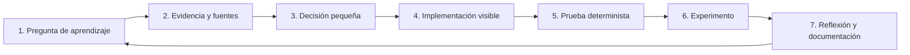

# Metodología de construcción y aprendizaje

> Documento didáctico; registra el método seguido sin mezclarse con los archivos de ejecución.

Este documento registra **cómo** se construyó la fábrica, no solo qué archivos quedaron. Se actualizará al cerrar cada parte para que el proyecto también enseñe un método reproducible de ingeniería.

## Ciclo que seguiremos en cada parte

## Parte 1 · Contratos deterministas

### 1. Pregunta de aprendizaje

¿Cómo convertimos “quiero un prompt o un agente” en un artefacto que otra persona o aplicación pueda comprender, validar y evaluar?

### 2. Fuentes examinadas

La jerarquía aplicada fue:

1. `docs/humano/sistema.md` y decisiones explícitas del usuario.
2. Corpus `Prompts/`.
3. Plan y casos de evaluación de `docs/`.
4. Repositorios solo como candidatos futuros.
5. Documentación oficial de las dependencias ejecutables.

Del corpus se tomaron conceptos, no instrucciones ejecutables ni cifras como hechos confirmados:

| Fuente del corpus | Aporte usado en el diseño |
|---|---|
| `2. Anatomia de una Instruccion.docx` | Rol, tarea, contexto, formato, restricciones y evaluación |
| `4. Estructura Prompting.docx` | Salida estructurada y validación separada de veracidad |
| `5. Anti-Alucinaciones.docx` | Datos reales, permiso de incertidumbre y parada por información faltante |
| `6. Antipatrones.docx` | Evitar esquema ausente, reglas acumuladas y formato implícito |
| `7. System Prompts.docx` | Separar reglas de sistema, consulta y datos de entrada |
| `8. Context Enginereering.docx` | Tratar contexto como arquitectura de información |
| `11.d Agentes Fundamentos.docx` | Mínimo privilegio, contención y supervisión humana |
| `16. Observabilidad y Trazas.docx` | Eventos, linaje, tools, fallos y métricas |
| `18. Seguridad y Jailbreaks.docx` | Sandboxing, trazabilidad y límites de autoridad |

### 3. Decisión pequeña

La primera entrega no utilizaría un LLM. Tendría que:

- Hacer preguntas guiadas.
- Producir tres artefactos tipados.
- Incluir desde el inicio permisos, parada, evaluación y fuentes.
- Rechazar campos desconocidos.
- Exportar únicamente dentro del laboratorio.
- Mostrar visualmente cada transformación.

### 4. Implementación visible

Se dividió en cuatro capas: interfaz, API, dominio y exportación. Cada capa tiene una responsabilidad comprobable y el grafo visual se deriva de respuestas reales de la API.

### 5. Pruebas deterministas

Las pruebas comprueban:

- Qué preguntas aparecen cuando falta información.
- Que un briefing completo produce el tipo correcto.
- Que los permisos parten de `deny`.
- Que el presupuesto de pasos está acotado.
- Que modificar un artefacto invalida su huella.
- Que la API devuelve errores estructurados.
- Que los JSON Schema pueden regenerarse.

### 6. Experimento de esta parte

Construir el mismo caso F-PROMPT-001 desde la interfaz y desde `factory-demo`. Ambos resultados tendrán identificadores y fechas diferentes, pero la misma estructura, políticas y campos obligatorios.

### 7. Reflexión

Esta base permite que en la Parte 2 la pregunta sea medible: “¿Ollama mejora la redacción o cobertura del artefacto sin romper el contrato?”. Sin una referencia determinista, solo compararíamos textos subjetivos.

## Registro de decisiones

### D-01 · Contratos estrictos

- **Decisión:** `extra="forbid"` en todos los modelos.
- **Motivo:** detectar de inmediato campos inventados o incompatibles.
- **Costo:** las ampliaciones requieren versionar el schema.

### D-02 · Denegar por defecto

- **Decisión:** red y escrituras externas son `false`; lo no declarado se niega.
- **Motivo:** una intención incompleta no debe crear autoridad implícita.
- **Costo:** cada capacidad legítima debe declararse.

### D-03 · Huella de contenido

- **Decisión:** SHA-256 sobre JSON canónico sin el propio campo hash.
- **Motivo:** detectar cambios entre validación y exportación.
- **Costo:** cualquier cambio legítimo exige recalcular la huella.

### D-04 · Sin SQLite todavía

- **Decisión:** exportación de archivos en `.local` durante esta parte.
- **Motivo:** aún no necesitamos consultas, historial ni concurrencia de escritura.
- **Señal para cambiar:** cuando añadamos catálogo de versiones y comparación de borradores.

### D-05 · Sin SSE todavía

- **Decisión:** estados síncronos de API.
- **Motivo:** no existe trabajo prolongado ni streaming real que observar.
- **Señal para cambiar:** generación con Ollama y ejecución por nodos en la Parte 2.

## Cómo mantener esta metodología

Al cerrar una nueva parte:

1. Añadir su pregunta de aprendizaje.
2. Registrar qué fuentes influyeron y qué afirmaciones se validaron.
3. Documentar decisiones y alternativas descartadas.
4. Explicar los archivos nuevos o modificados.
5. Registrar pruebas ejecutadas y sus límites.
6. Incluir al menos un ejercicio y un fallo intencional.
7. Declarar con precisión qué queda pendiente.

## Fuentes oficiales vivas usadas para la implementación

- [FastAPI: cuerpos de petición con modelos Pydantic](https://fastapi.tiangolo.com/tutorial/body/)
- [FastAPI: modelos de respuesta](https://fastapi.tiangolo.com/tutorial/response-model/)
- [Vite: guía oficial de inicio](https://vite.dev/guide/)
- [React Flow: guía oficial](https://reactflow.dev/learn)

Estas fuentes validan el uso de las herramientas; el comportamiento real del laboratorio se confirma con pruebas locales y el lockfile.
