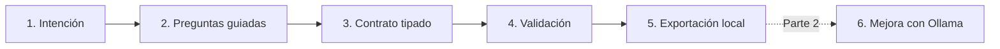

# Guía didáctica · Fábrica de prompts, agentes y skills

> Esta carpeta reúne la documentación para aprender. El código ejecutable permanece separado en `backend/`, `frontend/`, `contracts/` y `examples/`.

Esta aplicación enseña a convertir una intención humana incompleta en un artefacto claro, validado, versionable y reutilizable. Es el primer laboratorio ejecutable de BL_Loops y funciona de forma autónoma.

> Estado: **Parte 1 — contratos deterministas**. La interfaz, la API, la validación y la exportación son reales. Todavía no se llama a Ollama; esa variabilidad se añadirá en la Parte 2.

## Qué aprenderás

Al terminar esta parte podrás explicar:

- Por qué una idea todavía no es un prompt.
- Qué diferencia hay entre `PromptSpec`, `AgentSpec` y `SkillSpec`.
- Por qué un agente necesita tools, memoria, permisos y condiciones de parada.
- Cómo Pydantic transforma expectativas humanas en un contrato verificable.
- Para qué sirve una huella `content_hash`.
- Por qué separamos construcción determinista y generación con IA.

## El recorrido visual



La pantalla web muestra los cinco primeros nodos y su estado real después de cada llamada a la API. En esta parte el flujo es síncrono; SSE se incorporará cuando exista una ejecución prolongada que justifique eventos en tiempo real.

## Los cuatro contratos

### `PromptSpec`

Es el plano de una instrucción para un modelo. Separa rol, entradas, instrucciones, restricciones, contrato de salida, incertidumbre, evaluación y fuentes.

### `AgentSpec`

Es un `PromptSpec` ampliado con modelo, objetivo, herramientas, memoria, permisos, presupuesto de pasos, supervisión humana y condiciones de parada. Un agente no es únicamente “un prompt largo”.

### `SkillSpec`

Describe un procedimiento portable: cuándo se activa, qué instrucciones sigue, qué recursos puede leer y cómo aplica revelado progresivo.

### `RunRecord`

Es el sobre de evaluación que más adelante se exportará como una línea JSONL. Registra configuración, eventos, uso de recursos y puntuaciones sin conectar el laboratorio con el comparador central.

## Estructura del laboratorio

```text
01-prompt-agent-factory/
├── AGENTS.md                       # reglas portables para futuras sesiones
├── backend/
│   ├── src/prompt_agent_factory/  # contratos, reglas, API y exportador
│   └── tests/                     # pruebas deterministas
├── contracts/generated/           # JSON Schema visible y portable
├── examples/intakes/              # briefings sintéticos reproducibles
├── frontend/                      # React + TypeScript + React Flow
├── docs/humano/                   # explicación, práctica y metodología
├── .env.example                   # configuración si se copia el laboratorio
├── pyproject.toml                 # dependencias y comandos Python
└── README.md                      # entrada técnica breve
```

No importa código de otro laboratorio. Dentro de BL_Loops busca el `.env` de la raíz; si copias esta carpeta, acepta un `.env` local equivalente.

## Recorrido recomendado

1. Lee esta página para formar el mapa mental.
2. Sigue [QUICKSTART.md](QUICKSTART.md) y abre la aplicación.
3. Carga el ejemplo didáctico y pulsa **Analizar intención**.
4. Observa por qué cada nodo cambia de estado.
5. Construye un borrador y compara el formulario con el JSON.
6. Exporta el artefacto a `.local/exports`.
7. Revisa [ARCHITECTURE.md](ARCHITECTURE.md) para conectar la experiencia con el código.
8. Resuelve [EXERCISES.md](EXERCISES.md) y usa [EVALUATION.md](EVALUATION.md) para comprobarte.

## Modo demostración sin interfaz

```powershell
uv run factory-demo
```

El comando toma un briefing sintético, construye un `PromptSpec`, valida su huella y lo exporta dentro de `.local/exports`. No usa red, no consulta Ollama y no toca archivos externos.

## Documentación del aprendizaje

- [QUICKSTART.md](QUICKSTART.md): comandos copiables y resultados esperados.
- [ARCHITECTURE.md](ARCHITECTURE.md): componentes, archivos, contratos y decisiones.
- [METHODOLOGY.md](METHODOLOGY.md): metodología seguida y cómo mantenerla al avanzar.
- [EXERCISES.md](EXERCISES.md): práctica básica, intermedia y avanzada.
- [EVALUATION.md](EVALUATION.md): casos, métricas y criterios de aprobado.
- [TROUBLESHOOTING.md](TROUBLESHOOTING.md): síntomas, causas y diagnóstico.
- [CONTRACTS.md](CONTRACTS.md): lectura guiada de los JSON Schema.

## Límites deliberados de la Parte 1

- No genera texto con IA.
- No ejecuta agentes ni herramientas.
- No usa SQLite.
- No emite SSE.
- No instala Flowise, `prompt-master` ni SkillSpector como dependencias.

Estos límites no son carencias ocultas: aíslan el concepto que estamos aprendiendo. La siguiente parte conectará Ollama para proponer y criticar borradores conservando estos contratos como barrera de validación.
