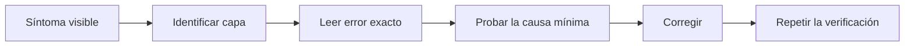

# Diagnóstico de problemas

> Guía humana de diagnóstico; el runtime no depende de este archivo.

## Método de diagnóstico



No reinstales todo ante el primer error. Identifica si el fallo pertenece a configuración, backend, frontend, contrato o exportación.

## `uv` usa otra versión de Python

**Síntoma:** indica Python 3.13 o 3.14, o rechaza `requires-python`.

**Comprobación:**

```powershell
py -3.12 --version
uv python find 3.12
```

**Corrección:**

```powershell
uv sync --python 3.12 --all-groups
```

## La interfaz muestra “Backend no disponible”

**Causa probable:** Uvicorn no está iniciado en el puerto 8011.

**Comprobación:** abre `http://127.0.0.1:8011/api/v1/health` o ejecuta:

```powershell
Invoke-RestMethod http://127.0.0.1:8011/api/v1/health
```

**Corrección:** inicia el backend con el comando de `QUICKSTART.md`. No cambies el proxy de Vite antes de comprobar el puerto.

## El botón de construir sigue desactivado

**Causa:** el briefing no llegó al 100 %.

**Comprobación:** pulsa **Analizar intención** y revisa las tarjetas de preguntas. En agentes y skills también debes confirmar explícitamente la lista de tools.

## HTTP 422 `incomplete_intake`

No es un fallo del servidor. Es una respuesta educativa que incluye `guidance.questions`; completa esos campos y reintenta.

## HTTP 422 `content_hash_mismatch`

El contenido cambió después de construirlo o el JSON se editó manualmente. Vuelve a construir el artefacto. No corrijas la huella a mano salvo que el ejercicio sea implementar una herramienta de versionado.

## Se rechaza el `.env`

La Parte 1 falla de forma cerrada si detecta endpoint remoto, telemetría o escrituras externas. Compara nombres de claves con `.env.example`; no compartas el contenido real del `.env` en reportes o capturas.

## El frontend compila pero el grafo está vacío

Comprueba que `@xyflow/react/dist/style.css` se importe en `main.tsx` y que el contenedor del grafo tenga altura. Después ejecuta:

```powershell
npm --prefix frontend run build
```

## Un JSON Schema parece desactualizado

```powershell
uv run factory-export-schemas
git diff -- contracts/generated
```

El primer comando regenera; el segundo permite inspeccionar qué cambió. No aceptes un cambio de schema sin actualizar pruebas y documentación.
