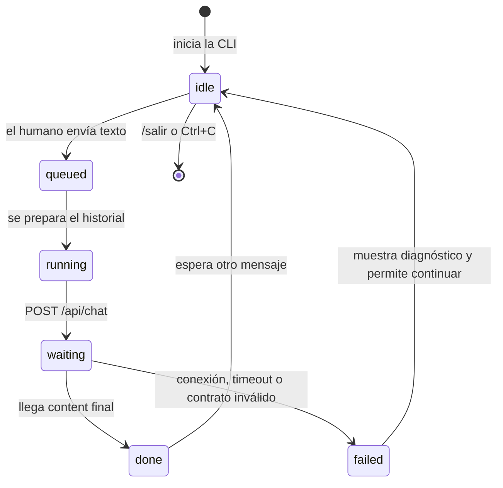
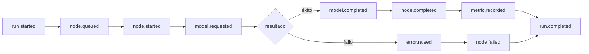

# Arquitectura explicada

## Corte vertical



Cada estado mostrado y exportado corresponde a un hecho real del programa. No se simula actividad del modelo.

## Componentes

| Componente | Entrada | Salida | Responsabilidad |
|---|---|---|---|
| `cli.py` | Texto del humano | Texto en terminal | Ciclo de conversación y memoria en RAM |
| `config.py` | `.env` raíz, `.env` local o entorno | `Settings` validado | Valores por defecto, rutas seguras y endpoint local |
| `ollama_client.py` | Historial de mensajes | `ChatResult` | `POST /api/chat`, errores y contrato de respuesta |
| `run_log.py` | Estados y métricas | JSONL | Observabilidad local sin conversación cruda |
| `validation.py` | Archivo JSONL | Resumen o error | Importación, secuencia y evento terminal |

## Contrato con Ollama

La solicitud esencial es:

```json
{
  "model": "gemma4:e4b",
  "messages": [
    {"role": "system", "content": "..."},
    {"role": "user", "content": "Hola"}
  ],
  "stream": false,
  "think": false
}
```

La instrucción de sistema pide claridad, continuidad y que los datos definidos por el humano se acepten como contexto de la conversación. La aplicación consume `message.content`, ignora cualquier campo de pensamiento y no lo incorpora al siguiente turno.

## Memoria

```text
inicio:  [system]
turno 1: [system, user-1, assistant-1]
turno 2: [system, user-1, assistant-1, user-2, assistant-2]
cierre:  la lista desaparece
```

No hay SQLite ni archivos de conversación. Esto hace visible la idea básica antes de estudiar memoria persistente.

## Configuración portable

Dentro de BL_Loops se lee primero el `.env` de la raíz. Un `.env` dentro del laboratorio puede sobreescribirlo y permite copiar el proyecto fuera del repositorio. Las variables explícitas del proceso tienen la prioridad final.

Solo se aceptan URLs HTTP cuyo host sea `localhost`, `127.0.0.1` o `::1`. El transporte tampoco hereda proxies HTTP del sistema ni sigue redirecciones: la solicitud va directamente a Ollama local. Las etiquetas de modelo cloud se rechazan. La carpeta de corridas debe ser relativa y permanecer dentro del laboratorio.

## Errores y reintentos

No hay reintentos automáticos. Un timeout puede ocurrir después de que Ollama comenzó a procesar; repetir a ciegas duplicaría trabajo y ocultaría el fallo. La CLI informa el error y deja al humano decidir si vuelve a enviar el mensaje.

## Traza JSONL



El contrato ejecutable está en `contracts/run-event.schema.json`. Se registran longitudes, latencia y tokens disponibles, pero no el texto del humano, la respuesta, secretos ni PII.
