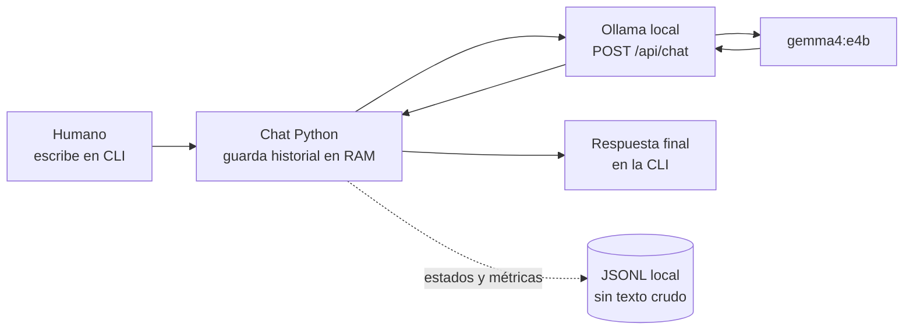

# Aprende el agente más pequeño posible

Este laboratorio responde una pregunta concreta: **¿cuál es el camino mínimo para conversar con un modelo local desde la terminal?**

Al terminar podrás explicar y ejecutar estos cuatro pasos:

1. El humano escribe texto en PowerShell.
2. Python añade ese mensaje al historial en memoria.
3. El cliente envía el historial a `gemma4:e4b` por la API local de Ollama.
4. La terminal muestra únicamente la respuesta final del modelo.

## Mapa visual

## Tres conceptos

### Modelo

`gemma4:e4b` genera la respuesta. Sus pesos y su ejecución pertenecen a Ollama, no a este repositorio.

### Agente mínimo

Aquí “agente” significa una aplicación que recibe una observación del humano, prepara contexto, solicita una decisión al modelo y devuelve el resultado. Todavía no actúa sobre herramientas ni sobre el sistema.

### Memoria de conversación

El programa conserva en RAM los mensajes anteriores y vuelve a enviarlos en el turno siguiente. Al cerrar la CLI se pierde esa memoria. La traza JSONL conserva métricas y estados, no la conversación.

## Recorrido guiado

1. Sigue [QUICKSTART.md](QUICKSTART.md) y abre el chat.
2. Escribe: `Recuerda que mi color de prueba es verde.`
3. Pregunta: `¿Cuál es mi color de prueba?`
4. Observa la ruta textual `humano -> Ollama -> agente`.
5. Sal con `/salir` y valida la traza.
6. Continúa con [EXERCISES.md](EXERCISES.md).

## Qué no hace

- No busca en internet.
- No lee archivos ni ejecuta comandos.
- No guarda conversaciones ni PII.
- No cambia de modelo ni usa una API pagada como fallback.
- No muestra el campo de pensamiento del modelo.

La arquitectura exacta está en [ARCHITECTURE.md](ARCHITECTURE.md); los fallos esperados están en [TROUBLESHOOTING.md](TROUBLESHOOTING.md).
