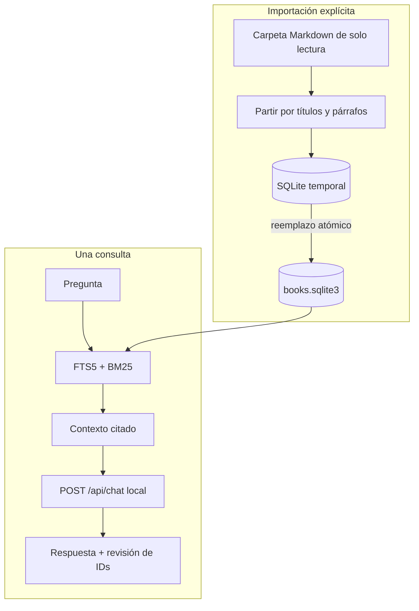
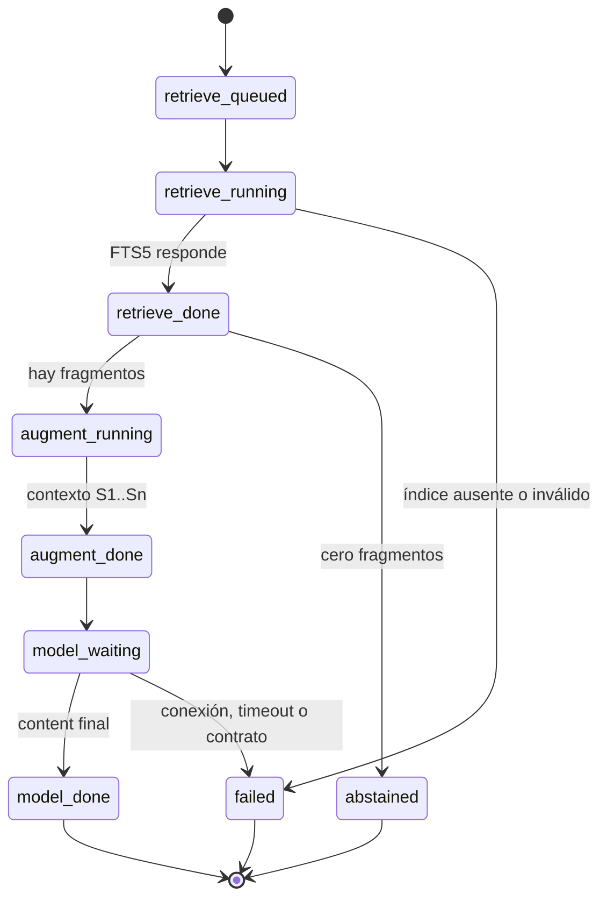

# Arquitectura explicada

## Dos flujos separados



El índice temporal evita mezclar una versión vieja con una importación incompleta. Una fuente
vacía o ilegible falla antes de reemplazar el índice anterior.

## Nodos y estados de una pregunta



Cada transición visible también produce un evento JSONL. No hay animaciones ni reintentos
inventados.

## Componentes

| Componente | Entrada | Salida | Responsabilidad |
|---|---|---|---|
| `config.py` | `.env` y entorno | `Settings` | Endpoint local, modelo y rutas encerradas |
| `corpus.py` | Markdown o pregunta | SQLite o top-k | Troceado, deduplicación, FTS5 y BM25 |
| `prompting.py` | Pregunta + top-k | Mensajes | Separar datos no confiables y asignar `[S#]` |
| `ollama_client.py` | Mensajes | `ChatResult` | `POST /api/chat` sin proxy ni redirecciones |
| `pipeline.py` | Pregunta | Respuesta citada | Estados, abstención y presentación CLI |
| `run_log.py` | Eventos sanitizados | JSONL | Observabilidad sin contenido crudo |
| `validation.py` | JSONL | Resumen o error | Importación, identidad y secuencia |

## Esquema local

```text
metadata   clave, valor (schema, conteos, hash del corpus)
documents  ruta relativa, título, hash, cantidad de fragmentos
chunks     documento, sección, líneas, texto, hash
chunks_fts título, sección, texto (tabla virtual FTS5)
```

FTS5 tokeniza Unicode y elimina diacríticos para buscar español. Los términos se convierten a una
expresión segura con `OR`; la puntuación BM25 pondera título y sección por encima del cuerpo. En
SQLite, los mejores valores BM25 son numéricamente menores.

## Contrato con Ollama

La solicitud esencial usa `/api/chat`, `stream: false` y `think: false`. El prompt trata el corpus
como datos no confiables, prohíbe obedecer instrucciones incrustadas y exige respaldar afirmaciones
con `[S1]`, `[S2]`, etc. La aplicación solo consume `message.content`.

## Seguridad y límites

- El transporte acepta solo HTTP local, no hereda proxies y no sigue redirecciones.
- La fuente se lee; las únicas escrituras viven en `.local/`.
- El índice contiene texto del corpus y permanece ignorado por Git.
- El JSONL guarda longitudes, tiempos, tokens y conteos, no contenido crudo.
- La revisión de citas comprueba que los IDs existan; no demuestra por sí sola que cada frase esté
  realmente respaldada. Esa fidelidad requiere el caso sintético y revisión humana.
- No hay retry automático. Un timeout del modelo queda como corrida fallida y el humano decide.

