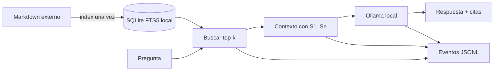

# Aprende RAG desde su forma más sencilla

## Objetivo

Este laboratorio permite ver qué cambia cuando un modelo recibe primero fragmentos recuperados
de una biblioteca local. La primera variante evita embeddings y frameworks: usa búsqueda de texto
completo de SQLite, construye un contexto pequeño y llama a Ollama.

Al terminar podrás distinguir tres piezas:

1. **Recuperar:** localizar fragmentos que comparten palabras con la pregunta.
2. **Aumentar:** adjuntar esos fragmentos, su procedencia y reglas de fidelidad.
3. **Generar:** pedir al modelo una respuesta con citas como `[S1]`.

## Mapa visual

La flecha de importación es distinta de la consulta: el runtime no vuelve a leer los libros para
cada pregunta. Por eso el laboratorio puede copiarse junto con su `.local` o reconstruirse desde
otra carpeta Markdown sin depender de BL_Loops.

## Recorrido sugerido

1. Sigue [QUICKSTART.md](QUICKSTART.md) para crear el índice y hacer una pregunta.
2. Lee [ARCHITECTURE.md](ARCHITECTURE.md) mientras observas los tres pasos de la CLI.
3. Ejecuta los ejercicios de [EXERCISES.md](EXERCISES.md).
4. Usa el corpus sintético y la rúbrica de [EVALUATION.md](EVALUATION.md).
5. Si algo falla, consulta [TROUBLESHOOTING.md](TROUBLESHOOTING.md).

## Qué aprenderás también cuando falle

Una búsqueda léxica necesita palabras compartidas. Si preguntas mediante una paráfrasis que no
aparece en el corpus, FTS5 puede devolver cero resultados aunque exista una idea relacionada. Esa
limitación es el punto de comparación futuro con RAG vectorial, no un fallo que deba ocultarse.

