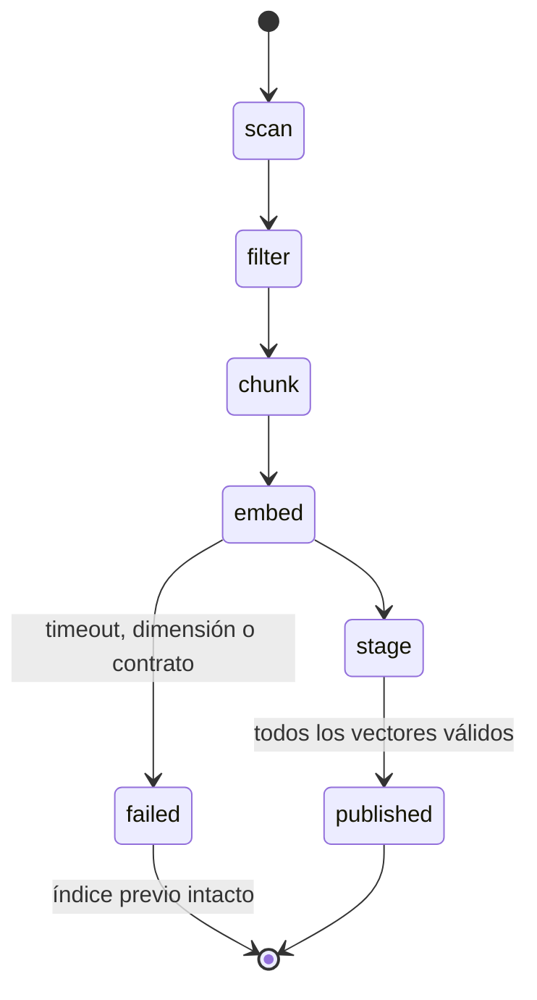

# Arquitectura

## Importación

El perfil durable incluye modelo, dimensión e instrucción de consulta. La aplicación falla cerrada
si el runtime intenta consultar un índice creado con otro perfil.

## Consulta híbrida

FTS5 produce un ranking BM25; el vector de consulta se compara por producto punto con vectores
normalizados, equivalente a coseno. RRF combina posiciones sin pretender que BM25 y coseno tengan
la misma escala.

Para cientos de fragmentos, recorrer BLOB `float32` es más sencillo que instalar un servidor
vectorial. Este diseño deberá revisarse si el corpus crece varios órdenes de magnitud.

## Política de calidad

- Excluye `Contexto (Wikipedia)`, `Fuentes y Adquisición`, `Metadatos` y `Temas (Open Library)`.
- Elimina pies de generación y enlaces de adquisición.
- Omite líneas de autor aisladas y documentos que, después del filtro, no tienen conocimiento.
- Conserva descripciones editoriales, temas y artículos recibidos.
- Marca `received`, `generated` o `unreviewed` en cada resultado.
- No decide que una afirmación sea verdadera; solo reduce contaminación conocida.

## Seguridad

Fuente de solo lectura, escrituras confinadas, transporte local sin proxy ni redirección, sin
retry automático y JSONL sin contenido crudo. Los fragmentos siguen tratándose como datos no
confiables frente a inyección indirecta.
