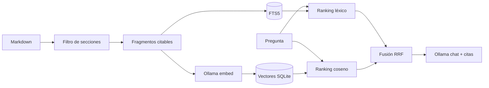

# RAG vectorial e híbrido, paso a paso

## Por qué existe

El RAG léxico es suficiente para búsquedas con palabras exactas y para este volumen. Falló, sin
embargo, cinco preguntas parafraseadas de ventas. Un spike local separó claramente un pasaje
semánticamente relevante de un distractor. También reveló que varias fichas contienen secciones de
Wikipedia ajenas al libro.

Por eso este laboratorio resuelve dos problemas distintos:

1. **Recall semántico:** encontrar ideas aunque cambien las palabras.
2. **Higiene:** no indexar secciones contaminadas ni fichas que solo contienen metadatos.

Sigue [QUICKSTART.md](QUICKSTART.md), después compara modos con
[EVALUATION.md](EVALUATION.md).
