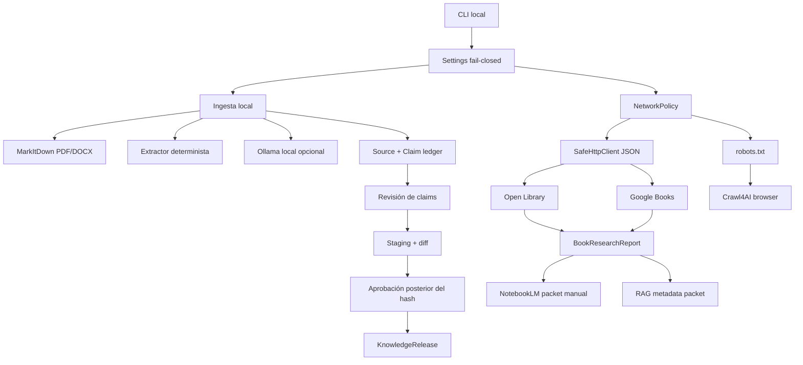

# Arquitectura

El runtime, no el LLM ni una página adquirida, controla permisos, presupuestos, transiciones y
publicación.

## Componentes



Los conectores producen artefactos locales. No inyectan automáticamente su contenido en una
corrida editorial ni saltan la revisión humana.

Ollama verifica el modelo una vez en `/api/tags`, deshabilita proxies y solo acepta loopback. Los
documentos se fragmentan de forma reproducible; `MAX_LLM_CHUNKS_PER_DOCUMENT` limita el trabajo
antes de llamar al modelo. La salida es JSON estricto y cada texto/localizador se comprueba contra
la fuente. Un fallo genera `run.failed` y JSONL terminal, sin reparación ni fallback.

## Política de red

La autorización exige todos estos controles:

1. `NETWORK_ENABLED=true`.
2. `BL_LOOPS_RUNTIME_NETWORK=true`.
3. `BL_LOOPS_ALLOW_REAL_CONNECTORS=true`.
4. `ALLOWED_DOMAINS` no vacío y `MAX_URLS_PER_RUN` positivo.
5. `--authorize-network` y `--url-budget` en esa corrida.
6. Jurisdicción escrita y lenguajes limitados a `en`/`es`.

`NetworkPolicy` acepta solo HTTPS/443 sin credenciales, resuelve DNS y rechaza direcciones no
globales. `SafeHttpClient` no hereda proxies ambientales, revalida cada redirect, limita MIME,
tamaño y número de URL. Una rama de catálogo puede fallar sin ocultar el resultado de la otra.

Para navegador, `robots.txt` debe recuperarse, ser texto válido y permitir el user-agent; cualquier
ambigüedad detiene la captura. Crawl4AI bloquea descargas, contextos persistentes, proxy, stealth,
iframes, formularios, capturas y PDF. JavaScript está desactivado: el interceptor permite solo el
documento superior mediante `GET`/`HEAD`, revalida y cuenta sus redirects, y aborta scripts, XHR,
fetch, WebSocket, service workers implícitos, estilos, imágenes, medios, fuentes y subframes. Por
ello la captura es deliberadamente estática y puede omitir contenido renderizado en cliente.

## Derechos y acceso

```text
rights_status = public_domain | open_license | explicit_permission | restricted | unknown
access_mode   = full_download | read_online | preview | borrow | catalog_only
```

Una URL de descarga solo cabe si hay `full_download`, derechos elegibles y evidencia. El método
`can_download_automatically` añade jurisdicción aprobada, pero los comandos actuales no descargan
el libro: exponen la oferta para revisión.

PDF/DOCX requiere `retention_allowed=true` y `extraction_allowed=true`. Derechos restringidos o
desconocidos nunca permiten redistribución ni subida a NotebookLM. Los hashes del original y de la
proyección demuestran identidad, no fidelidad editorial.

## Publicación en dos decisiones

1. Se revisa cada claim publicable sobre su `claim_identity_hash`.
2. `release build` crea staging y un diff sanitizado; no publica.
3. El operador revisa `candidate_id` y `candidate_hash` ya construidos.
4. `release publish` registra una aprobación posterior de ese hash, repite el gate y publica.
5. Si un byte del staging cambió, la aprobación deja de ser válida.

`claims.jsonl` contiene únicamente claims aprobados cuyo registro exacto pasa el gate y cuya
evidencia completa es redistribuible. No se modifica un claim después de su aprobación: si una sola
evidencia carece de permiso, el claim completo queda fuera hasta editarlo y revisarlo de nuevo.
`sources.jsonl` conserva metadatos y hashes de inventario, no el cuerpo de fuentes restringidas.

El hash editorial cubre texto, alcance, contexto, jurisdicción, vigencia, método, muestra,
supersesión, calidad, desafío, evidencia, versión y autor. Estado de revisión y timestamps de
runtime no cambian la identidad editorial.

## Persistencia

- SQLite: `.local/data/curator.sqlite`.
- Staging: `.local/data/staging/<run_id>/`.
- Releases: `.local/data/releases/<release_id>/` y `current.json`.
- Corridas: `.local/runs/<run_id>.jsonl`.
- Investigación y exports: la ruta relativa indicada por `--output`.

Cada release es autónomo y validable sin consultar SQLite. Las tablas históricas se identifican
por `(run_id, entity_id)`, por lo que una corrida no sobrescribe otra. Todos los escritores de
investigación resuelven symlinks y rechazan una salida fuera de la raíz del laboratorio.

## Superficie visual y límites

El dashboard muestra estados reales de la auditoría editorial. MarkItDown, catálogos, Crawl4AI y
exports son hoy capacidades CLI, no nuevos nodos React Flow. No hay embeddings, descarga masiva,
API de NotebookLM, CrewAI, ArchiveBox, Langfuse ni escritura hacia otro laboratorio.
