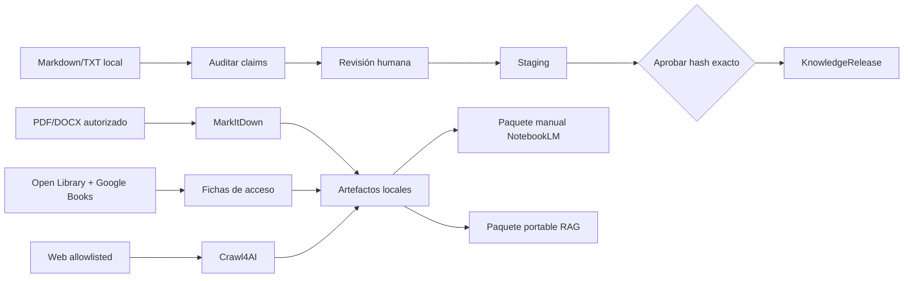

# Guía didáctica · Fábrica de conocimiento confiable de ventas

> Esta carpeta enseña el sistema. El runtime no lee ni necesita `docs/humano/`.

Este laboratorio convierte fuentes permitidas en evidencia auditable y, solo después de una
decisión humana, en un `KnowledgeRelease`. También ayuda a descubrir ediciones y accesos legales
sin confundir “está en Internet” con “se puede copiar”.

## Dos carriles separados

El carril editorial publica claims. El carril de investigación crea Markdown, manifiestos y
metadatos para revisión; no descarga libros ni publica por sí solo.

## Qué está disponible

| Capacidad | Estado y límite |
|---|---|
| Corpus local | Markdown/TXT, determinista y read-only |
| PDF/DOCX | MarkItDown, solo desde inbox autorizado y con derechos explícitos |
| Catálogos | Open Library y Google Books; lectura JSON de bajo volumen |
| Navegador | Una URL HTTPS allowlisted, `robots.txt` verificable, sin descargas ni sesión |
| NotebookLM | Paquete local; la subida es manual y `upload_performed=false` |
| RAG | JSONL de metadatos portable; sin conexión viva con otro laboratorio |
| Publicación | Claims aprobados → staging → aprobación posterior del hash → release |

## Decisiones humanas vigentes

- Se autorizó incorporar red, allowlist e investigación en inglés o español.
- Cualquier operador identificado puede aprobar un release desde el CLI.
- La jurisdicción está aprobada conceptualmente, pero falta escribir su valor concreto en
  `RESEARCH_JURISDICTION` o pasarlo al comando.
- El dominio real existe fuera del laboratorio, pero no fue identificado aquí; continúa como
  configuración, no como una suposición documental.

## Regla legal central

El uso educativo o no comercial no concede automáticamente permiso para copiar. La máquina
distingue `full_download`, `read_online`, `preview`, `borrow` y `catalog_only`; solo una
descarga completa con dominio público, licencia abierta o permiso explícito y evidencia de derechos
puede ser elegible. En este corte los catálogos únicamente descubren y clasifican: el operador
revisa.

## Recorrido recomendado

1. Ejecuta [QUICKSTART.md](QUICKSTART.md).
2. Entiende los gates en [ARCHITECTURE.md](ARCHITECTURE.md).
3. Revisa decisiones y fuentes oficiales en [METHODOLOGY.md](METHODOLOGY.md).
4. Practica con [EXERCISES.md](EXERCISES.md).
5. Diagnostica con [TROUBLESHOOTING.md](TROUBLESHOOTING.md).
6. Aplica el gate de [EVALUATION.md](EVALUATION.md).
