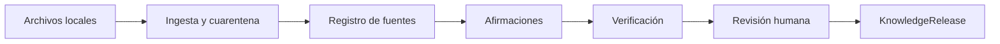

# Guía didáctica · Fábrica de conocimiento confiable de ventas

> Esta carpeta reúne la documentación para aprender. El código ejecutable permanece separado en `backend/`, `frontend/`, `contracts/` y `fixtures/`.

El laboratorio 09 puede recuperar y citar. No puede convertir una biblioteca débil en una autoridad. Este laboratorio enseña esa segunda capacidad: **auditar, contrastar y publicar** afirmaciones, no documentos sueltos ni vectores.

> Estado: **fase 1 — corte vertical local**. Las fuentes son Markdown/TXT sintéticos. La red está apagada. Un modelo local es opcional y no aprueba releases.

## Qué aprenderás

- Por qué la unidad central es la afirmación trazable (`ClaimRecord`) y no el archivo.
- Cómo se separan procedencia, apoyo, vigencia, independencia y derechos.
- Qué distingue una cita válida de una verdad.
- Por qué tres páginas que repiten el mismo comunicado no son tres evidencias.
- Cómo una persona aprueba un hash concreto y no un interruptor `--approve=true`.
- Qué queda fuera de un release: disputas, cuarentena, inyección y huecos.

## El recorrido visual

La pantalla muestra diez nodos. Un nodo solo aparece como hecho si el backend alcanzó ese estado.

## Dominio de demostración

Se usa un vertical **ficticio** de venta consultiva de vivienda, por continuidad pedagógica con el laboratorio 09. No es una biblioteca real corregida. Las decisiones de dominio, jurisdicción, allowlist web y aprobador humano siguen pendientes.

## Recorrido recomendado

1. Lee esta página.
2. Sigue [QUICKSTART.md](QUICKSTART.md).
3. Observa fuentes, claims, conflictos y el hash de aprobación.
4. Publica un release y valida sus huellas.
5. Estudia [ARCHITECTURE.md](ARCHITECTURE.md) y [METHODOLOGY.md](METHODOLOGY.md).
6. Practica con [EXERCISES.md](EXERCISES.md) y [EVALUATION.md](EVALUATION.md).
