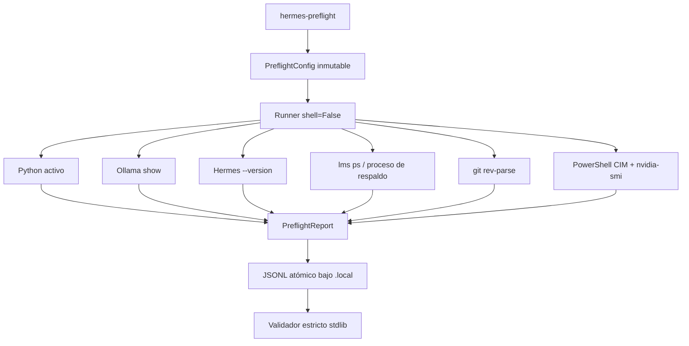

# Arquitectura

## Límite del corte actual

El runner usa listas de argumentos, `shell=False`, timeout y cwd explícito. La salida cruda solo existe en memoria el tiempo necesario para extraer datos permitidos; el JSONL conserva códigos y evidencia estructurada.

## Los diez gates

| Nodo | Comprueba | No demuestra |
|---|---|---|
| `python.runtime` | intérprete 3.12 | salud del modelo |
| `network.endpoint` | URL HTTP loopback | cero egress |
| `network.firewall` | referencia autorizada | contenido transmitido |
| `ollama.server_profile` | referencia del perfil esperado | variables reales por sí solo |
| `ollama.model` | `FROM` y `num_ctx` del alias | contexto efectivo en carga |
| `hermes.available` | versión capturable | tool calls correctos |
| `lmstudio.conflict` | ausencia de modelo LM Studio cargado | VRAM futura suficiente |
| `git.head` | SHA de partida | árbol limpio |
| `resource.ram` | margen físico y de commit | ausencia futura de paginación |
| `resource.vram` | VRAM libre antes de carga | residencia 100 % GPU posterior |

## Contrato JSONL

Cada línea contiene exactamente 14 campos comunes y usa schema `1.1`. La fase actual registra `F-LOCAL-CODE-004@0.1.0`, `scored=false` y `comparable=false`. `run.blocked` representa una condición de preparación, mientras `run.failed` representa un fallo del harness.

## Fixture B-CODE-003

El fixture es local, sintético y congelado por SHA-256. `prepare` lo copia dentro de `.local/workspaces/`; `verify` exige solo los dos cambios permitidos, conserva fronteras positivas y negativas, y comprueba por mutación que cada una de las cuatro pruebas detecta una implementación errónea. Ejecutar una solución no confiable sigue requiriendo un sandbox o autorización del operador: este verificador solo reduce el entorno y no sustituye aislamiento del sistema operativo.

## Fase futura

Hermes recibirá una copia del fixture, permisos equivalentes a los otros clientes y Ollama por loopback. Esa fase deberá emitir eventos de prompts sanitizados, tools, edición, pruebas, errores, reintentos y métricas. No existe todavía en este corte.
