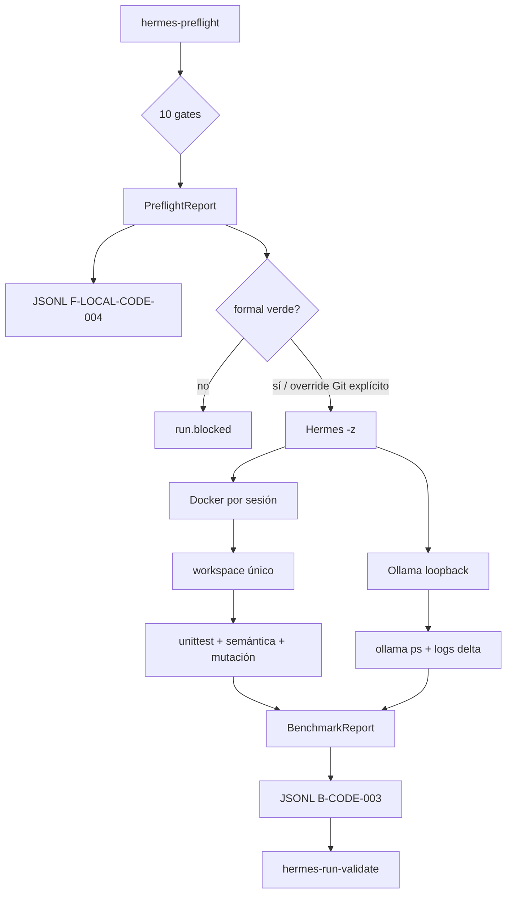

# Arquitectura

## Dos fases separadas

El preflight no inicia agentes. El benchmark solo pasa a Hermes con `--execute`. La excepción `--allow-dirty-worktree` está diseñada para este checkout de desarrollo: permite observar el flujo, conserva el bloqueo Git y desactiva score/comparabilidad.

## Los diez gates

| Nodo | Comprueba | No demuestra |
|---|---|---|
| `python.runtime` | intérprete 3.12 | salud del modelo |
| `network.endpoint` | URL HTTP loopback | cero egress |
| `network.firewall` | referencia autorizada | contenido transmitido |
| `ollama.server_profile` | referencia del perfil esperado | variables reales por sí solo |
| `ollama.model` | `FROM` y `num_ctx` del alias | contexto efectivo en carga |
| `hermes.available` | versión capturable | tool calls correctos |
| `lmstudio.conflict` | ausencia de modelo LM Studio cargado | VRAM futura suficiente |
| `git.head` | SHA exacto y worktree limpio | calidad del parche |
| `resource.ram` | margen físico y de commit | ausencia futura de paginación |
| `resource.vram` | VRAM libre antes de carga | residencia 100 % GPU posterior |

## Sandbox

`DockerSandbox` usa una imagen local, `--network=none`, `--cap-drop=ALL`, `--security-opt=no-new-privileges`, límite de PID, raíz de contenedor de solo lectura y un único bind mount RW: el workspace del fixture. El callback inyectado al verificador traduce el intérprete Windows a `python` dentro de la imagen. No se hace `docker pull` durante la corrida.

Hermes recibe la misma política por su configuración temporal: backend Docker, contenedor no persistente, sin volúmenes, sin variables reenviadas y sin red. La llamada del padre a Ollama permanece en loopback; los comandos que ejecuta el agente quedan dentro del contenedor.

## Fixture B-CODE-003

El fixture es local, sintético y congelado por SHA-256. `prepare` lo copia dentro de `.local/workspaces/`. `verify_workspace` comprueba el conjunto de archivos, permite solo `src/pricing.py` y `tests/test_pricing.py`, ejecuta la suite, valida semántica oculta y aplica mutación a las cuatro pruebas requeridas.

## Contratos JSONL

Cada línea contiene exactamente 14 campos comunes y usa schema `1.1`. El preflight usa `F-LOCAL-CODE-004@0.1.0` y el benchmark `B-CODE-003@0.1.0` con variantes distintas. Ninguno conserva prompt, respuesta, stdout, stderr, rutas personales o secretos. El validador despacha por `case_id` y verifica lifecycle, identidad, métricas y terminal.

## Observabilidad

La corrida conserva conteos, no texto: digest efímero de salida del proceso, uso normalizado, `ollama ps`, conteos de truncación y HTTP 500 del delta de logs, archivos cambiados como conteo y resultados del fixture. Si no puede observar un dato, lo marca como no verificado y no lo convierte en score.
