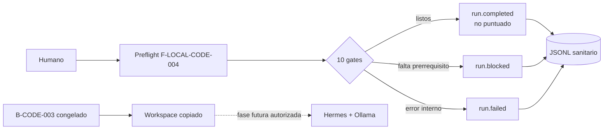

# Aprende a preparar un agente de código local sin alterar el equipo

Este laboratorio enseña una separación que evita conclusiones falsas: configurar un endpoint local, comprobar prerrequisitos y ejecutar un benchmark no son la misma cosa.

## Mapa visual

## Estados que debes distinguir

- `passed`: el preflight pudo comprobar todos sus requisitos iniciales.
- `warning`: una evidencia no está disponible en modo exploratorio; la corrida sigue sin ser comparable.
- `blocked`: falta un requisito o una autorización. No es un fallo de calidad del modelo.
- `failed`: el propio diagnóstico no pudo ejecutarse de forma confiable.

Aunque el preflight pase, el benchmark todavía necesita demostrar 100 % GPU, 65,536 tokens efectivos, ausencia de truncación, HTTP 500 y paginación sostenida, además de tools, edición y pruebas reales.

## Recorrido

1. Ejecuta las pruebas herméticas de [QUICKSTART.md](QUICKSTART.md).
2. Ejecuta el modo exploratorio sin cambiar procesos.
3. Abre el JSONL y localiza `run.started`, cada nodo y el terminal.
4. Explica por qué endpoint loopback no equivale a cero egress.
5. Prepara una copia del fixture, sin ejecutar aún un agente.
6. Continúa con [EXERCISES.md](EXERCISES.md).

La estructura y las decisiones están en [ARCHITECTURE.md](ARCHITECTURE.md) y [METHODOLOGY.md](METHODOLOGY.md).
