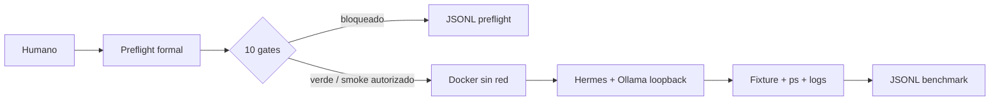

# Aprende a preparar y ejecutar un agente de código local

Este laboratorio enseña la separación entre diagnóstico, aislamiento y evaluación. El primer corte era solo preflight; ahora existe una corrida viva de Hermes contra Ollama, pero continúa separada del score oficial y de la comparación con otros clientes.

## Mapa visual

## Estados que debes distinguir

- `passed`: un gate pudo verificarse.
- `warning`: evidencia ausente en modo exploratorio; no es autorización.
- `blocked`: falta requisito, autoridad o aislamiento; no es un fallo de calidad del modelo.
- `failed`: el harness no pudo ejecutar su diagnóstico de forma confiable.
- `completed`: el proceso vivo terminó; aún puede no ser una solución correcta o comparable.

## Recorrido

1. Ejecuta la verificación hermética de [QUICKSTART.md](QUICKSTART.md).
2. Ejecuta el preflight exploratorio y valida su JSONL.
3. Revisa el alias, el perfil de Ollama, LM Studio, recursos y Git.
4. Ejecuta el benchmark solo con autorización y Docker disponible.
5. Examina el workspace y valida el JSONL de benchmark.
6. Explica por qué loopback, `--network=none` y firewall son evidencias distintas.
7. Usa [EXERCISES.md](EXERCISES.md) para repetir el razonamiento sin depender de servicios.

La estructura está en [ARCHITECTURE.md](ARCHITECTURE.md); decisiones, límites y cohortes están en [METHODOLOGY.md](METHODOLOGY.md).
