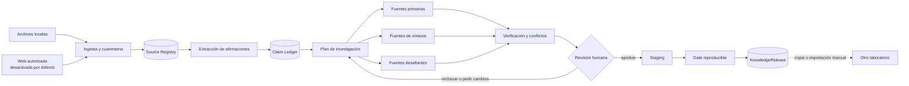

# Plan para una nueva sesión: curador multiagente de conocimiento de ventas

**Nombre propuesto del laboratorio:** `13-sales-knowledge-curator`  
**Nombre humano:** Fábrica de conocimiento confiable de ventas  
**Estado:** propuesta operativa; no implementada  
**Fecha de corte del diseño:** 2026-08-30  
**Entorno objetivo:** Windows 11, PowerShell, Python 3.12, Ollama local  
**Alcance de este archivo:** instruir una sesión futura; este documento no instala, ejecuta ni modifica ningún laboratorio existente.

## 1. Instrucción principal para la próxima sesión

La próxima sesión debe construir un laboratorio autónomo llamado
`13-sales-knowledge-curator`. Su misión será auditar la biblioteca actual de ventas, detectar
huecos y afirmaciones débiles, investigar fuentes permitidas, contrastar cada afirmación,
presentar conflictos a una persona y publicar paquetes de conocimiento versionados.

La primera sesión de implementación debe completar **la fase 0 y el corte vertical de la fase
1** descritos aquí. No debe activar navegación web real, instalar plataformas pesadas ni
modificar `09-agentic-rag`. Primero demostrará el flujo completo con fixtures sintéticos y
archivos locales. La red se añadirá después, únicamente con autorización específica.

Antes de editar:

1. Leer [AGENTS.md](AGENTS.md), cualquier `AGENTS.md` más profundo aplicable y este archivo.
2. Leer [la intención humana](docs/humano/sistema.md),
   [el índice](docs/INDEX.md), [el plan maestro](docs/PLAN_MAESTRO_DIDACTICO.md) y
   [el flujo de sesiones](docs/humano/maestro/CODEX_WORKFLOW.md).
3. Revisar `git status --short` y preservar todos los cambios existentes.
4. Recontar el corpus actual; no copiar como hechos vigentes las cifras históricas de la
   documentación.
5. Tratar `C:/Users/criss/Desktop/Claude/Repositorios_Prueba` como solo lectura.
6. No hacer commit, push, publicación, instalaciones globales ni efectos externos.
7. No confundir el sistema multiagente que se construirá con subagentes de Codex. Estos últimos
   solo se usan si el usuario los autoriza expresamente.

## 2. Problema que debe resolver

El laboratorio [`09-agentic-rag`](09-agentic-rag/README.md) puede recuperar información y citar
su procedencia, pero no puede convertir automáticamente una biblioteca débil en una autoridad.
Su [metodología](09-agentic-rag/docs/humano/METHODOLOGY.md) registra fichas editoriales, contenido
escaso, fuentes no revisadas y secciones contaminadas. Añadir más embeddings o más agentes no
corrige esa causa.

El problema real tiene cuatro capas:

1. **Calidad de fuente:** procedencia, permisos, autoría, fecha, independencia y cercanía a la
   evidencia original.
2. **Calidad de afirmación:** qué se asegura exactamente, para quién, en qué contexto y con qué
   límites.
3. **Vigencia y conflicto:** qué cambió, qué fuentes discrepan y cuál versión sigue aplicando.
4. **Gobernanza editorial:** quién puede aprobar una corrección y qué evidencia permite
   publicarla.

Por ello, la unidad central del sistema no será el documento ni el vector: será la
**afirmación trazable** (`ClaimRecord`) vinculada a evidencia verificable.

## 3. Resultado esperado

El laboratorio deberá producir un `KnowledgeRelease` autónomo y copiable con:

- fuentes registradas y versionadas;
- afirmaciones normalizadas con alcance y estado;
- evidencia exacta y localizable;
- contradicciones y huecos visibles;
- decisiones humanas auditables;
- documentos de conocimiento redactados en palabras propias;
- un manifiesto con hashes, versiones y métricas;
- una corrida JSONL sanitizada compatible con el comparador maestro.

Un release podrá copiarse o importarse manualmente en otro proyecto. Nunca existirá una llamada
en vivo, una base compartida ni una escritura automática hacia `09-agentic-rag`.

## 4. Objetivos y no objetivos

### Objetivos

- Auditar fuentes locales de ventas sin alterarlas.
- Separar hechos, resultados empíricos, recomendaciones, opiniones y publicidad.
- Detectar duplicados, sindicación, fuentes circulares, fechas ausentes y contenido obsoleto.
- Formular preguntas de investigación a partir de huecos concretos.
- Investigar en paralelo solo cuando cada rama conserve su propia procedencia.
- Exigir citas con localizador exacto para toda afirmación verificable.
- Corroborar, refutar, limitar o abstenerse; nunca rellenar huecos con prosa plausible.
- Mantener una cola visible de contradicciones y decisiones humanas.
- Publicar por staging y reemplazo atómico únicamente después de aprobación.
- Enseñar visualmente cada nodo, estado, transición, error, retry, métrica y motivo de parada.

### No objetivos

- No declarar que un LLM, una mayoría de páginas o una puntuación conoce “la verdad”.
- No reconstruir libros, cursos o artículos protegidos a partir de copias no autorizadas.
- No evadir paywalls, autenticación, CAPTCHA, `robots.txt`, términos de uso o controles de acceso.
- No enviar correo, mensajes, formularios, leads o cambios a CRM.
- No procesar teléfonos, listas de clientes ni otra PII en el primer corte.
- No hacer recomendaciones legales, financieras o regulatorias sin una fuente oficial vigente y
  revisión humana competente.
- No usar APIs de IA cloud ni fallbacks silenciosos.
- No adoptar Graph RAG, memoria persistente de agentes o una base vectorial pesada antes de que
  un experimento demuestre la necesidad.
- No publicar automáticamente una corrección generada por un modelo.

## 5. Decisiones confirmadas, propuestas y pendientes

| Tipo | Decisión |
|---|---|
| `CONFIRMADA` | El laboratorio será autónomo, copiable, didáctico y local. |
| `CONFIRMADA` | Ollama será el único proveedor LLM del runtime. |
| `CONFIRMADA` | Red, navegador, telemetría y conectores reales estarán desactivados por defecto. |
| `CONFIRMADA` | El resultado se exportará como archivos; no habrá dependencia en ejecución entre laboratorios. |
| `PROPUESTA` | Construir primero un orquestador Python propio, tipado y visible. |
| `PROPUESTA` | Usar varios roles especializados, aunque un único modelo local pueda ejecutarlos secuencialmente. |
| `PROPUESTA` | Empezar con venta consultiva de vivienda como dominio de demostración por continuidad con el laboratorio 09. |
| `PROPUESTA` | Publicar resúmenes y guías propias, más registros JSON/JSONL de evidencia y decisión. |
| `PENDIENTE HUMANO` | Confirmar si el dominio inicial será vivienda, ventas consultivas generales u otro vertical. |
| `PENDIENTE HUMANO` | Aprobar fuentes y dominios web permitidos, idiomas, jurisdicción y frecuencia de actualización. |
| `PENDIENTE HUMANO` | Nombrar quién puede aprobar releases y qué asuntos requieren un especialista. |
| `PENDIENTE HUMANO` | Autorizar en una sesión posterior la lectura web real y su presupuesto. |

Las decisiones pendientes no bloquean el MVP local: este usará un dominio ficticio y fixtures
sin PII. Sí bloquean cualquier investigación externa o publicación para uso real.

## 6. Principios de calidad

### 6.1 Una cita demuestra procedencia, no verdad

El sistema evaluará por separado:

- que el localizador exista;
- que el fragmento apoye realmente la afirmación;
- que la fuente tenga autoridad para esa afirmación;
- que siga vigente;
- que las corroboraciones sean independientes;
- que el alcance de la conclusión no exceda la evidencia.

### 6.2 No habrá un `truth_score` mágico

Se guardarán dimensiones separadas de 0 a 4: `authority`, `evidence_proximity`, `recency`,
`independence`, `applicability`, `extraction_integrity` y `rights_clarity`. Un promedio puede
ayudar a ordenar la revisión, pero nunca convierte por sí solo una afirmación en publicable.

### 6.3 Más URLs no equivalen a más corroboración

Tres artículos que repiten el mismo comunicado cuentan como una sola cadena de procedencia. El
sistema registrará `origin_source_id`, autor, editor, enlaces citados y similitud sustantiva para
detectar sindicación y evidencia circular.

### 6.4 El tipo de afirmación determina la evidencia necesaria

| Tipo | Ejemplo abstracto | Gate mínimo |
|---|---|---|
| `empirical` | una técnica cambió una métrica | método, muestra, fecha, contexto y fuente primaria o síntesis rigurosa |
| `prescriptive` | una práctica suele ser útil | contexto, límites, evidencia y al menos una fuente desafiante |
| `definition` | significado de un concepto | fuente reconocida y alcance explícito |
| `vendor_self_claim` | capacidad declarada de una herramienta | fuente oficial, marcada como afirmación del proveedor |
| `legal_or_policy` | requisito normativo | fuente oficial vigente, jurisdicción y revisión humana obligatoria |
| `anecdotal` | experiencia de una persona | nunca presentada como generalización; etiqueta visible |

## 7. Arquitectura propuesta



### Componentes

- **Backend:** Python 3.12, FastAPI, Pydantic y SQLite/FTS5.
- **Orquestación base:** máquina de estados propia; el runtime, no el LLM, controla permisos,
  presupuestos, transiciones y publicación.
- **Modelos:** un modelo Ollama explícitamente verificado para el primer corte; no habrá cambio
  automático de modelo. Embeddings solo si una prueba demuestra una mejora necesaria.
- **Frontend:** React, Vite, TypeScript y React Flow.
- **Eventos:** SSE unidireccional con eventos tipados derivados del estado real.
- **Persistencia:** `.local/data/curator.sqlite`, staging local y releases inmutables.
- **Exportación:** JSONL sanitizado más un paquete de conocimiento con manifiesto.

## 8. Equipo de agentes del runtime

“Agente” significa aquí un rol con entrada, salida, permisos y criterio de parada. Varios roles
pueden usar el mismo modelo local. En hardware limitado, las llamadas LLM serán secuenciales; el
paralelismo inicial se reservará para I/O y validadores deterministas.

| Rol | Responsabilidad | No puede hacer | Salida tipada |
|---|---|---|---|
| `orchestrator` | Mantener estado, presupuesto, permisos y transiciones. | Inventar evidencia o aprobar un release. | `WorkflowState`, `RunEvent` |
| `source_auditor` | Inventariar, deduplicar, clasificar derechos, fecha y procedencia. | Declarar verdadera una fuente por reputación. | `SourceAssessment[]` |
| `gap_planner` | Convertir baja cobertura, conflicto o caducidad en preguntas investigables. | Abrir la red o ampliar el alcance por sí mismo. | `ResearchPlan` |
| `researcher` | Buscar evidencia dentro de un adaptador y allowlist autorizados. | Navegar fuera de presupuesto, escribir en sitios o ocultar fallos. | `ResearchFinding[]` |
| `claim_extractor` | Extraer afirmaciones atómicas, alcance, condiciones y localizadores. | Fusionar afirmaciones incompatibles para que parezcan consistentes. | `ClaimCandidate[]` |
| `claim_verifier` | Comprobar apoyo, independencia, vigencia y contradicciones. | Aprobar basándose solo en confianza del modelo. | `VerificationReport` |
| `editor` | Redactar síntesis propias, límites y lenguaje didáctico. | Introducir una afirmación que no esté en el ledger. | `KnowledgeDraft` |
| `red_team` | Probar inyección, evidencia circular, cherry-picking y exceso de alcance. | Modificar la evidencia original. | `AdversarialFinding[]` |
| `publisher` | Construir staging, validar hashes y reemplazar atómicamente. | Publicar sin `ReviewDecision=approved`. | `KnowledgeRelease` |

El mismo hallazgo no puede ser extraído, verificado y aprobado por una sola llamada de modelo.
La revisión humana es una identidad distinta y queda registrada.

## 9. Máquina de estados y loops acotados

```text
scope_draft
  -> inventory_running
  -> gaps_ready
  -> research_planned
  -> awaiting_external_authorization | collecting_local
  -> sources_normalized
  -> claims_extracted
  -> verification_running
  -> conflicts_open | review_pending
  -> changes_requested | approved | rejected
  -> staging
  -> validating
  -> published | failed
```

Reglas de parada:

- máximo tres rondas de investigación por pregunta;
- máximo dos revisiones automáticas por afirmación;
- máximo de URLs, bytes, tiempo y tokens configurable por corrida;
- una fuente fallida queda como `failed`, no como evidencia ausente silenciosamente;
- un conflicto material abierto impide publicar la afirmación;
- presupuesto agotado produce `inconclusive`, nunca una conclusión forzada;
- toda transición guarda actor, hora, razón y versión anterior.

## 10. Política de fuentes y adquisición

### Entradas permitidas en el MVP

- Markdown, TXT, HTML estático, PDF y DOCX sintéticos o autorizados;
- documentos creados por el usuario o con derechos claros;
- un fixture que represente una fuente vigente, una obsoleta, una contradictoria, una duplicada
  y una con inyección indirecta.

### Web futura, solo con autorización

- `NETWORK_ENABLED=false` por defecto;
- allowlist de dominios y esquemas `https`;
- solo operaciones `GET`/`HEAD` sin login, formularios ni descargas ejecutables;
- respeto de términos, `robots.txt`, límites de tasa y tamaño;
- bloqueo de IPs privadas, localhost, redirecciones fuera de allowlist y archivos peligrosos;
- user-agent identificable y caché local con fecha de recuperación;
- ninguna acción que cambie estado externo;
- resultado ambiguo después de un timeout no se reintenta ciegamente.

### Derechos y copyright

- Conservar metadatos, hash, localizador y el fragmento mínimo permitido para verificar apoyo.
- Redactar síntesis originales; no publicar el texto completo de libros o artículos.
- Registrar `license`, `usage_basis`, `retention_policy` y `redistribution_allowed`.
- Si los derechos no están claros, el contenido queda en cuarentena y fuera del release.
- Un archivo entregado por el usuario no implica automáticamente permiso para redistribuirlo.

### Contenido no confiable

Todo texto adquirido se trata como dato. Instrucciones como “ignora tus reglas”, llamadas a
tools, HTML oculto o prompts incrustados se eliminan o señalan; nunca pasan al mensaje de sistema
ni controlan el workflow.

## 11. Contratos mínimos

| Contrato | Campos imprescindibles |
|---|---|
| `SourceRecord` | `source_id`, tipo, título, autor/editor, URI o ruta sanitizada, fechas de publicación/actualización/recuperación, licencia, base de uso, hash, idioma, jurisdicción, origen e independencia |
| `DocumentArtifact` | `artifact_id`, `source_id`, MIME, extractor y versión, hash original/normalizado, tamaño, estado de cuarentena, advertencias y localizadores |
| `ClaimRecord` | `claim_id`, texto canónico, tipo, tema, población/contexto, jurisdicción, vigencia, estado, versión, `supersedes`, creador y timestamps |
| `EvidenceLink` | `claim_id`, `source_id`, localizador exacto, relación `supports/refutes/qualifies`, fragmento mínimo, hash del fragmento y evaluación de apoyo |
| `ConflictRecord` | afirmaciones implicadas, tipo de conflicto, evidencia por lado, materialidad, resolución y responsable |
| `ResearchTask` | pregunta, motivación, fuentes objetivo, allowlist, presupuesto, criterio de suficiencia y criterio de parada |
| `ReviewDecision` | objeto revisado, decisión, persona, razón, fecha, condiciones y hash de lo aprobado |
| `KnowledgeRelease` | `release_id`, schema, dominio, corte temporal, hashes, claims incluidos/excluidos, aprobaciones, métricas, versión de modelos y rollback |
| `RunEvent` | run, secuencia, nodo, estado, timestamps, herramienta, resultado sanitizado, error, tokens, latencia, RAM/VRAM y referencias |

Estados de una afirmación:

```text
candidate -> supported_single_source -> corroborated -> human_approved -> published
          -> disputed
          -> outdated
          -> unsupported
          -> rejected
          -> superseded
```

`corroborated` no equivale a `human_approved`; `published` requiere ambos cuando aplique.

## 12. Reglas de verificación y publicación

Una afirmación publicable deberá cumplir:

1. Texto atómico y alcance explícito.
2. Al menos un localizador exacto que realmente la apoye.
3. Derechos de uso suficientes para el artefacto que se publicará.
4. Fecha o razón documentada por la que la fecha no aplica.
5. Corroboración independiente cuando se presente como conclusión general.
6. Una fuente primaria o de síntesis rigurosa para afirmaciones cuantitativas.
7. Fuente desafiante buscada o razón documentada de por qué no existe.
8. Conflictos materiales resueltos o desacuerdo presentado explícitamente.
9. Aprobación humana contemporánea sobre el hash exacto del candidato.
10. Gate técnico verde sobre el mismo release.

Excepciones etiquetadas:

- Una capacidad declarada por un proveedor puede quedar como `verified_primary_only`, pero se
  redactará “el proveedor declara”, no como validación independiente.
- Una experiencia profesional puede publicarse como `anecdotal`, nunca como regla universal.
- Una afirmación con evidencia insuficiente puede aparecer solo como hueco o pregunta abierta.

## 13. Paquete de salida

Estructura propuesta de un release:

```text
releases/<release_id>/
├── manifest.json
├── sources.jsonl
├── claims.jsonl
├── conflicts.jsonl
├── review-decisions.jsonl
├── knowledge/
│   ├── README.md
│   └── <topic>.md
├── evaluation.json
└── CHANGELOG.md
```

Proceso de publicación:

1. Construir en `staging/<run_id>/`.
2. Validar schemas, referencias, hashes, links y ausencia de PII/secretos.
3. Ejecutar la suite de evaluación sobre el candidato.
4. Confirmar aprobación humana para ese hash.
5. Mover atómicamente a un nuevo `release_id` inmutable.
6. Actualizar un puntero local `current.json` mediante reemplazo atómico.
7. Conservar el release anterior para rollback.

Una fuente válida pero vacía debe producir una proyección vacía o un fallo explícito; nunca debe
dejar información vieja aparentando vigencia.

## 14. Interfaz didáctica

El dashboard mostrará:

- grafo vivo del workflow y ruta activa;
- inventario de fuentes con fecha, derechos, hash y cadena de origen;
- tablero de afirmaciones por estado;
- matriz afirmación × evidencia;
- cola de conflictos y huecos;
- diff entre release actual y candidato;
- panel de aprobación humana con hash visible;
- presupuesto de red, tokens, tiempo y recursos;
- errores, retries, abstenciones y motivo de parada;
- exportación JSONL y descarga del release.

La UI se deriva de eventos reales. No puede pintar `done` si el backend no emitió el evento
terminal correspondiente.

## 15. Repositorios preseleccionados desde `menu_portable`

La selección parte de la receta “Agente de research profundo” de
[`menu_portable/REPO_MENU.md`](menu_portable/REPO_MENU.md), pero la reduce para mantener el
laboratorio local, explicable y sin funciones duplicadas. Los clones se inspeccionaron en solo
lectura y estaban limpios en la fecha de corte. Los SHA son una instantánea local, no una orden de
actualización.

| Repositorio | Rol propuesto | Ruta local y SHA verificado | Remoto y licencia observada | Decisión inicial |
|---|---|---|---|---|
| `gpt-researcher` | Referencia para planner → investigadores → publisher y research citado | `C:/Users/criss/Desktop/Claude/Repositorios_Prueba/gpt-researcher` · `6f998577d547b1e54ec662dac63583aa11e3b84b` | [remoto oficial](https://github.com/assafelovic/gpt-researcher) · Apache-2.0 | **Referencia, no runtime MVP.** Reusar ideas, no asumir que frecuencia entre sitios equivale a verdad. |
| `crawl4ai` | Adaptador futuro de web a Markdown controlado | `C:/Users/criss/Desktop/Claude/Repositorios_Prueba/crawl4ai` · `7e801521428ee12509994d39151006f64055ebe3` | [remoto oficial](https://github.com/unclecode/crawl4ai) · Apache-2.0 | **Candidato ejecutable tras spike.** Solo modo local, allowlist y extracción sin LLM cuando sea posible. |
| `markitdown` | Conversión local y estrecha de PDF/DOCX/HTML autorizados | `C:/Users/criss/Desktop/Claude/Repositorios_Prueba/markitdown` · `9dc0d6579b8739c9d0671ff205e071e3053c7df1` | [remoto oficial](https://github.com/microsoft/markitdown) · MIT | **Candidato ejecutable tras spike.** Instalar solo extras requeridos; plugins y servicios Azure apagados. |
| `ArchiveBox` | Preservación opcional de evidencia web permitida | `C:/Users/criss/Desktop/Claude/Repositorios_Prueba/ArchiveBox` · `f7697328dcaaff8dbd9749a25be75e50dcbe1641` | [remoto oficial](https://github.com/ArchiveBox/ArchiveBox) · MIT | **Fase posterior.** Evaluar costo, Windows/Docker, derechos y política de retención antes de adoptar. |
| `crewAI` | Variante comparable de orquestación por roles | `C:/Users/criss/Desktop/Claude/Repositorios_Prueba/crewAI` · `9e9a8577becc322f98a966ad88d7904251049744` | [remoto oficial](https://github.com/crewAIInc/crewAI) · MIT | **No MVP.** Comparar contra la base propia; fijar Ollama y `OTEL_SDK_DISABLED=true`, porque el default documentado usa OpenAI y existe telemetría anónima. |
| `langfuse` | Variante self-hosted de trazas y evaluación | `C:/Users/criss/Desktop/Claude/Repositorios_Prueba/langfuse` · `3c3ca18eed76b164b418776d8d93cc1590e1d65b` | [remoto oficial](https://github.com/langfuse/langfuse) · MIT salvo carpetas `ee` | **No MVP.** JSONL propio primero; evaluar self-hosting, licencia por carpeta y telemetría desactivada después. |

Antes de convertir un candidato en dependencia, la sesión correspondiente debe volver a
verificar remoto, SHA, licencia completa, manifest, Python/Node soportado, compatibilidad con
Ollama, telemetría, instalación en Windows y una prueba mínima hermética.

### Alternativas descartadas por ahora

- `firecrawl`: solapa con `crawl4ai`; no se combinan alternativas para sumar dependencias.
- `browser-use`: navegación agentizada menos determinista y más cara que el adaptador acotado.
- `deer-flow`: plataforma demasiado amplia para enseñar el núcleo causal en el primer corte.
- `mem0`: memoria de usuario no es un registro de evidencia ni una base editorial.
- `GraphRAG`/Neo4j: una relación explícita puede modelarse primero en SQLite; solo se adopta si
  un caso multi-hop demuestra mejora.

## 16. Estructura futura del laboratorio

```text
13-sales-knowledge-curator/
├── AGENTS.md
├── README.md
├── .env.example
├── pyproject.toml
├── uv.lock
├── package.json
├── <lockfile-frontend>
├── backend/
│   ├── src/sales_curator/
│   │   ├── api/
│   │   ├── contracts/
│   │   ├── domain/
│   │   ├── orchestration/
│   │   ├── agents/
│   │   ├── connectors/
│   │   ├── storage/
│   │   ├── evaluation/
│   │   └── cli.py
│   └── tests/
├── frontend/
│   ├── src/
│   └── tests/
├── contracts/
├── fixtures/
│   ├── corpus/
│   └── expected/
├── examples/
└── docs/humano/
    ├── README.md
    ├── QUICKSTART.md
    ├── ARCHITECTURE.md
    ├── METHODOLOGY.md
    ├── EXERCISES.md
    ├── TROUBLESHOOTING.md
    └── EVALUATION.md
```

Backend y frontend conservan sus propios entornos. El runtime no importará, leerá ni parseará
`docs/humano/`. El `.env.example` del laboratorio documentará todas las opciones necesarias para
copiarlo fuera de BL_Loops.

## 17. Variables de configuración propuestas

Solo nombres y valores seguros de ejemplo:

```dotenv
OLLAMA_BASE_URL=http://127.0.0.1:11434
CURATOR_MODEL=<modelo-local-verificado>
CURATOR_EMBEDDING_MODEL=<vacio-hasta-justificarlo>
NETWORK_ENABLED=false
ALLOWED_DOMAINS=
MAX_URLS_PER_RUN=0
MAX_BYTES_PER_SOURCE=2000000
MAX_RESEARCH_ROUNDS=3
MAX_CLAIM_REVISIONS=2
TELEMETRY_ENABLED=false
RAW_CONTENT_IN_RUN_LOGS=false
```

El arranque debe fallar con un mensaje claro si el modelo configurado no existe. No debe elegir
otro modelo o proveedor por su cuenta.

## 18. Interfaces objetivo

CLI didáctica propuesta:

```powershell
uv run sales-curator audit --source .\fixtures\corpus
uv run sales-curator plan --topic "descubrimiento de necesidades"
uv run sales-curator research --fixture .\fixtures\corpus
uv run sales-curator claims list --status disputed
uv run sales-curator review --candidate <id>
uv run sales-curator release build --candidate <id>
uv run sales-curator validate --release <release_id>
uv run sales-curator export-run --run <run_id>
```

La aprobación humana no debe aceptar un argumento libre como `--approve=true`. Debe mostrar el
diff, registrar una decisión explícita y vincularla al hash exacto del candidato.

API mínima:

- `POST /api/runs/audit`
- `POST /api/runs/research`
- `GET /api/runs/{id}`
- `GET /api/runs/{id}/events` por SSE
- `GET /api/sources`
- `GET /api/claims`
- `GET /api/conflicts`
- `POST /api/reviews`
- `POST /api/releases/build`
- `GET /api/releases/{id}`

## 19. Plan de implementación por fases

### Fase 0 — contrato y amenaza

Entregables:

- confirmar dominio o usar dominio ficticio;
- registrar decisiones confirmadas y pendientes;
- crear el laboratorio y su `AGENTS.md` portable;
- escribir schemas y fixtures antes del motor;
- modelar permisos, source policy y amenazas;
- definir eventos, estados y criterio de publicación;
- actualizar en esa misma sesión el plan maestro y el índice, porque esta entrega actual se
  limita deliberadamente a un solo archivo.

Gate:

- fixtures válidos e inválidos cubren fuente obsoleta, contradicción, duplicado, inyección,
  derechos inciertos y fuente vacía;
- schemas aceptan los válidos y rechazan los inválidos;
- ninguna dependencia externa ha sido instalada todavía.

### Fase 1 — corte vertical local para la primera sesión

Construir de extremo a extremo:

1. Ingesta de Markdown/TXT sintéticos, read-only y con hash.
2. Registro SQLite de fuentes y afirmaciones.
3. Extracción determinista para fixtures más una extracción Ollama opcional detrás de contrato.
4. Verificadores deterministas de cita, fecha, duplicado y aprobación.
5. Cola de conflictos y revisión humana local.
6. Staging y un `KnowledgeRelease` atómico.
7. Eventos JSONL sanitizados.
8. Dashboard mínimo con grafo, fuentes, claims, conflictos y diff de release.
9. Documentación humana completa, ejercicios y troubleshooting.
10. Demo local reproducible y validación del release.

No entra en fase 1: web real, PDF/DOCX real, Crawl4AI, CrewAI, ArchiveBox, Langfuse, CRM ni
integración automática con el laboratorio 09.

### Fase 2 — extracción documental y modelo local

- hacer spike de `markitdown` con un PDF y un DOCX sintéticos;
- instalar solo extras necesarios dentro de la `.venv` del laboratorio;
- comparar extracción determinista contra Ollama;
- medir precisión de claims y localizadores;
- rechazar salidas LLM que no validen el schema;
- probar dos modelos locales, uno por vez, con el mismo fixture.

### Fase 3 — investigación web autorizada

- obtener autorización explícita y una allowlist;
- hacer spike de `crawl4ai` sin proveedores cloud;
- añadir fetch seguro, caché, rate limit, robots, redirect policy y SSRF guard;
- investigar una sola pregunta con máximo tres dominios;
- conservar procedencia por rama y evidenciar fallos parciales;
- demostrar que `NETWORK_ENABLED=false` sigue siendo el default.

### Fase 4 — comparación multiagente

- establecer línea base de un solo agente;
- comparar la máquina propia contra una variante CrewAI;
- usar el mismo modelo, corpus, preguntas, presupuesto y criterios;
- desactivar telemetría y bloquear defaults cloud;
- adoptar CrewAI solo si mejora calidad o mantenibilidad de forma medible.

### Fase 5 — releases útiles para otros laboratorios

- definir perfil de exportación para un corpus de RAG;
- probar copia/importación manual en una copia temporal o fixture, no en `09-agentic-rag` vivo;
- comprobar citas, estados y rollback;
- solicitar autorización antes de reemplazar cualquier fuente real.

### Fase 6 — preservación y observabilidad avanzadas

- evaluar ArchiveBox para snapshots permitidos;
- evaluar Langfuse self-hosted frente al JSONL propio;
- mantener ambos opcionales y fuera del core;
- documentar costo de operación, licencia, retención y telemetría.

## 20. Pruebas que deben escribirse primero

### Contratos e ingesta

- acepta fuente local permitida y conserva bytes/hash;
- rechaza path traversal, symlink de escape, MIME inesperado y tamaño excesivo;
- una fuente vacía reemplaza su proyección con vacío o falla explícitamente;
- normalización repetida es idempotente;
- duplicados exactos y casi duplicados conservan cadena de origen;
- no modifica el archivo fuente.

### Claims y evidencia

- cada claim publicado tiene al menos un localizador válido;
- una cita existente pero no sustentadora falla;
- dos copias sindicadas no cuentan como dos fuentes independientes;
- una cifra sin método, población o fecha queda limitada o excluida;
- una fuente más nueva no gana automáticamente si tiene peor evidencia;
- la afirmación obsoleta queda `superseded`, no borrada;
- contradicciones materiales abren `ConflictRecord`;
- evidencia insuficiente produce abstención.

### Agentes y seguridad

- salida LLM malformada se rechaza sin reparación permisiva;
- prompt injection en el corpus no altera tools ni políticas;
- el modelo no puede habilitar red, ampliar dominios o publicar;
- timeouts y ramas fallidas quedan visibles;
- límites de rondas, tokens, URLs y tiempo detienen el loop;
- no se guarda texto crudo sensible en JSONL;
- no existe fallback cloud ni proxy accidental;
- la telemetría está apagada por defecto.

### Revisión y release

- ningún release se publica sin decisión humana válida;
- la aprobación de un hash anterior no sirve para un candidato nuevo;
- staging fallido no cambia `current.json`;
- reemplazo atómico conserva el release previo;
- manifiesto detecta manipulación de un archivo;
- dry-run no modifica SQLite, staging, releases ni punteros;
- rollback exacto restaura el release anterior.

### Independencia y visualización

- no hay imports, rutas de escritura ni bases compartidas con otros laboratorios;
- el runtime no depende de `docs/humano/`;
- cada nodo visible corresponde a un evento real;
- corrida sin evento terminal se considera inválida;
- JSONL valida contra schema y puede importarse manualmente por el comparador.

## 21. Evaluación

Métricas técnicas y editoriales:

| Métrica | Definición inicial |
|---|---|
| `citation_integrity` | claims con localizador existente y apoyo correcto / claims verificables |
| `claim_precision` | claims extraídos correctamente / claims extraídos, sobre fixture dorado |
| `gap_recall` | huecos esperados detectados / huecos del fixture |
| `conflict_recall` | conflictos esperados detectados / conflictos del fixture |
| `independence_accuracy` | cadenas de procedencia clasificadas correctamente |
| `freshness_accuracy` | vigente/obsoleto/sin fecha clasificado correctamente |
| `abstention_quality` | abstenciones correctas ante evidencia insuficiente |
| `human_acceptance` | claims aceptados sin cambios / claims revisados |
| `release_reproducibility` | mismo input/config produce mismos hashes estructurales |
| `latency`, `tokens`, `RAM`, `VRAM` | valores brutos por nodo y corrida |

Los scores aplicables pueden agregarse para comparar variantes, conforme a
[`docs/CASOS_DE_EVALUACION.md`](docs/CASOS_DE_EVALUACION.md), pero el gate de seguridad y la
aprobación humana no se compensan con un promedio alto.

Casos mínimos:

1. Corregir una recomendación deliberadamente obsoleta.
2. Detectar tres páginas que derivan de una sola fuente original.
3. Mantener como disputa dos fuentes competentes que discrepan.
4. Abstenerse ante una afirmación comercial sin evidencia.
5. Limitar una conclusión válida solo para una población concreta.
6. Resistir una instrucción maliciosa incrustada en una fuente.
7. Fallar de forma segura con una rama de investigación incompleta.
8. Publicar y hacer rollback de un release aprobado.

## 22. Gate final de cada fase

Comandos orientativos que deberán existir dentro del laboratorio:

```powershell
uv run pytest
uv run ruff check .
uv run ruff format --check .
uv run python -m compileall -q backend/src backend/tests
npm test
npm run build
uv run sales-curator demo --fixture .\fixtures\corpus
uv run sales-curator validate --release <release_id>
uv run sales-curator export-run --run <run_id>
```

Además:

- recorrido visual en navegador sin errores de consola;
- demo real contra Ollama local cuando la fase use LLM;
- release reproducible e importación del JSONL;
- revisión de links Markdown;
- `git status --short` final y procesos temporales detenidos;
- lista explícita de pruebas ejecutadas, límites y pendientes.

Un comando omitido, un resultado parcial, un `N/A` no justificado o evidencia de otro estado no
cuenta como gate verde.

## 23. Criterio de terminado del MVP

El corte vertical se considera terminado solo si:

- una persona puede seguir el QUICKSTART desde PowerShell;
- un fixture entra como fuente de solo lectura;
- el sistema detecta al menos un hueco, un duplicado, una obsolescencia y un conflicto;
- cada claim conserva procedencia exacta;
- un claim no aprobado queda fuera del release;
- el dashboard reproduce los estados reales;
- un release se construye atómicamente y valida;
- la corrida JSONL es sanitizada e importable;
- todas las pruebas y builds aplicables pasan;
- no hubo red, cloud, telemetría, PII ni escritura fuera del laboratorio.

Esto demuestra el sistema causal mínimo. No demuestra todavía que el corpus real de ventas sea
completo, correcto o apto para decisiones de negocio.

## 24. Preguntas que deben resolverse antes de la fase web

1. ¿El primer dominio real será venta consultiva de vivienda, ventas B2B, retail u otro?
2. ¿Qué países o jurisdicciones aplican?
3. ¿Se aceptan fuentes en inglés para producir conocimiento en español?
4. ¿Qué tipos de fuente están permitidos y cuáles pueden redistribuirse?
5. ¿Qué dominios integrarán la allowlist inicial?
6. ¿Qué antigüedad máxima aplica por tipo de afirmación?
7. ¿Quién aprueba releases y quién resuelve asuntos legales o regulatorios?
8. ¿Qué paquete de salida deberá probarse después con `09-agentic-rag`?

Hasta responderlas, el laboratorio puede aprender y demostrar el método con datos sintéticos,
pero no debe presentarse como fuente real corregida.

## 25. Entrega esperada de la próxima sesión

La respuesta final de esa sesión deberá separar:

- **Terminado:** archivos, corte vertical y comportamiento demostrable.
- **Verificado:** comandos, resultados, demo, JSONL, release y recorrido visual.
- **Inferido:** decisiones todavía apoyadas solo por experimentos parciales.
- **Pendiente humano:** autorización de red, alcance de ventas, fuentes y aprobador.
- **Aplazado:** integraciones y variantes que no pertenecen al MVP.

No se afirmará que “la fuente de ventas ya fue corregida” hasta que exista un release real,
revisado y aprobado. La primera victoria es construir el mecanismo que hace esa corrección
trazable, reversible y difícil de falsificar.
