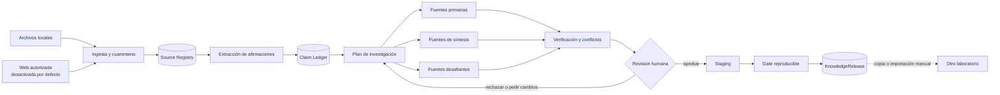

# Plan y estado de continuidad: curador multiagente de conocimiento de ventas

**Laboratorio:** `13-sales-knowledge-curator`
**Nombre humano:** Fábrica de conocimiento confiable de ventas  
**Estado:** corte editorial y expansión de investigación implementados; configuración real pendiente
**Fecha de corte del diseño:** 2026-08-30  
**Entorno objetivo:** Windows 11, PowerShell, Python 3.12, Ollama local  
**Alcance de este archivo:** conservar el diseño original y registrar qué partes existen, cuáles
siguen configurables y cuáles permanecen aplazadas.

## 1. Continuidad actual

El laboratorio autónomo ya audita una biblioteca local, detecta huecos y afirmaciones débiles,
presenta conflictos, exige revisión humana y construye paquetes versionados. La expansión actual
añade importación PDF/DOCX autorizada, catálogos bibliográficos, una captura web estrecha y
exports manuales sin conectar laboratorios en ejecución.

La red fue autorizada como capacidad, pero permanece apagada por defecto. Cada corrida exige los
tres gates de configuración, allowlist, presupuesto, jurisdicción escrita y autorización de la
invocación. La jurisdicción está aprobada conceptualmente, pero su valor concreto no se comunicó;
el dominio real tampoco se documentó. Ninguno se infiere.

Antes de editar:

1. Leer [AGENTS.md](AGENTS.md), cualquier `AGENTS.md` más profundo aplicable y este archivo.
2. Leer [la intención humana](docs/humano/sistema.md),
   [el índice](docs/INDEX.md), [el plan maestro](docs/PLAN_MAESTRO_DIDACTICO.md) y
   [el flujo de sesiones](docs/humano/maestro/CODEX_WORKFLOW.md).
3. Revisar `git status --short` y preservar todos los cambios existentes.
4. Recontar el corpus actual; no copiar como hechos vigentes las cifras históricas de la
   documentación.
5. Tratar `C:/Users/criss/Desktop/Claude/Repositorios_Prueba` como solo lectura.
6. No hacer commit, push, publicación, instalaciones globales ni efectos externos.
7. No confundir los roles del runtime con agentes de una sesión de construcción.

## 2. Problema que debe resolver

El laboratorio [`09-agentic-rag`](09-agentic-rag/README.md) puede recuperar información y citar
su procedencia, pero no puede convertir automáticamente una biblioteca débil en una autoridad.
Su [metodología](09-agentic-rag/docs/humano/METHODOLOGY.md) registra fichas editoriales, contenido
escaso, fuentes no revisadas y secciones contaminadas. Añadir más embeddings o más agentes no
corrige esa causa.

El problema real tiene cuatro capas:

1. **Calidad de fuente:** procedencia, permisos, autoría, fecha, independencia y cercanía a la
   evidencia original.
2. **Calidad de afirmación:** qué se asegura exactamente, para quién, en qué contexto y con qué
   límites.
3. **Vigencia y conflicto:** qué cambió, qué fuentes discrepan y cuál versión sigue aplicando.
4. **Gobernanza editorial:** quién puede aprobar una corrección y qué evidencia permite
   publicarla.

Por ello, la unidad central del sistema no será el documento ni el vector: será la
**afirmación trazable** (`ClaimRecord`) vinculada a evidencia verificable.

## 3. Resultado esperado

El laboratorio deberá producir un `KnowledgeRelease` autónomo y copiable con:

- fuentes registradas y versionadas;
- afirmaciones normalizadas con alcance y estado;
- evidencia exacta y localizable;
- contradicciones y huecos visibles;
- decisiones humanas auditables;
- documentos de conocimiento redactados en palabras propias;
- un manifiesto con hashes, versiones y métricas;
- una corrida JSONL sanitizada compatible con el comparador maestro.

Un release podrá copiarse o importarse manualmente en otro proyecto. Nunca existirá una llamada
en vivo, una base compartida ni una escritura automática hacia `09-agentic-rag`.

## 4. Objetivos y no objetivos

### Objetivos

- Auditar fuentes locales de ventas sin alterarlas.
- Separar hechos, resultados empíricos, recomendaciones, opiniones y publicidad.
- Detectar duplicados, sindicación, fuentes circulares, fechas ausentes y contenido obsoleto.
- Formular preguntas de investigación a partir de huecos concretos.
- Investigar en paralelo solo cuando cada rama conserve su propia procedencia.
- Exigir citas con localizador exacto para toda afirmación verificable.
- Corroborar, refutar, limitar o abstenerse; nunca rellenar huecos con prosa plausible.
- Mantener una cola visible de contradicciones y decisiones humanas.
- Publicar por staging y reemplazo atómico únicamente después de aprobación.
- Enseñar visualmente cada nodo, estado, transición, error, retry, métrica y motivo de parada.

### No objetivos

- No declarar que un LLM, una mayoría de páginas o una puntuación conoce “la verdad”.
- No reconstruir libros, cursos o artículos protegidos a partir de copias no autorizadas.
- No evadir paywalls, autenticación, CAPTCHA, `robots.txt`, términos de uso o controles de acceso.
- No enviar correo, mensajes, formularios, leads o cambios a CRM.
- No procesar teléfonos, listas de clientes ni otra PII en el primer corte.
- No hacer recomendaciones legales, financieras o regulatorias sin una fuente oficial vigente y
  revisión humana competente.
- No usar APIs de IA cloud ni fallbacks silenciosos.
- No adoptar Graph RAG, memoria persistente de agentes o una base vectorial pesada antes de que
  un experimento demuestre la necesidad.
- No publicar automáticamente una corrección generada por un modelo.

## 5. Decisiones confirmadas, implementadas y pendientes

| Tipo | Decisión |
|---|---|
| `CONFIRMADA` | El laboratorio será autónomo, copiable, didáctico y local. |
| `CONFIRMADA` | Ollama será el único proveedor LLM del runtime. |
| `CONFIRMADA` | Red, navegador, telemetría y conectores reales estarán desactivados por defecto. |
| `CONFIRMADA` | El resultado se exportará como archivos; no habrá dependencia en ejecución entre laboratorios. |
| `IMPLEMENTADA` | Orquestador Python propio, tipado, con dashboard de la corrida editorial. |
| `IMPLEMENTADA` | MarkItDown para PDF/DOCX autorizados, Open Library y Google Books, Crawl4AI estrecho y paquetes manuales NotebookLM/RAG. |
| `IMPLEMENTADA` | Staging separado de publicación y aprobación humana posterior sobre el hash exacto del candidato. |
| `APROBADA` | Red como capacidad, allowlist e idiomas inglés/español; cualquier operador identificado puede aprobar desde el CLI. |
| `CONFIGURABLE` | El dominio real existe, pero no se proporcionó su identificador; no se inventa. |
| `CONFIGURABLE` | La jurisdicción fue aprobada, pero falta escribir su valor concreto. |
| `PENDIENTE OPERATIVO` | Completar `ALLOWED_DOMAINS`, `RESEARCH_JURISDICTION` y presupuesto antes de una corrida real. |
| `APLAZADA` | CrewAI, ArchiveBox, Langfuse, embeddings e importación automática hacia `09-agentic-rag`. |

La falta de valores concretos no bloquea fixtures ni pruebas. Sí bloquea una corrida web real:
la aprobación conceptual nunca sustituye la configuración explícita y auditable.

## 6. Principios de calidad

### 6.1 Una cita demuestra procedencia, no verdad

El sistema evaluará por separado:

- que el localizador exista;
- que el fragmento apoye realmente la afirmación;
- que la fuente tenga autoridad para esa afirmación;
- que siga vigente;
- que las corroboraciones sean independientes;
- que el alcance de la conclusión no exceda la evidencia.

### 6.2 No habrá un `truth_score` mágico

Se guardarán dimensiones separadas de 0 a 4: `authority`, `evidence_proximity`, `recency`,
`independence`, `applicability`, `extraction_integrity` y `rights_clarity`. Un promedio puede
ayudar a ordenar la revisión, pero nunca convierte por sí solo una afirmación en publicable.

### 6.3 Más URLs no equivalen a más corroboración

Tres artículos que repiten el mismo comunicado cuentan como una sola cadena de procedencia. El
sistema registrará `origin_source_id`, autor, editor, enlaces citados y similitud sustantiva para
detectar sindicación y evidencia circular.

### 6.4 El tipo de afirmación determina la evidencia necesaria

| Tipo | Ejemplo abstracto | Gate mínimo |
|---|---|---|
| `empirical` | una técnica cambió una métrica | método, muestra, fecha, contexto y fuente primaria o síntesis rigurosa |
| `prescriptive` | una práctica suele ser útil | contexto, límites, evidencia y al menos una fuente desafiante |
| `definition` | significado de un concepto | fuente reconocida y alcance explícito |
| `vendor_self_claim` | capacidad declarada de una herramienta | fuente oficial, marcada como afirmación del proveedor |
| `legal_or_policy` | requisito normativo | fuente oficial vigente, jurisdicción y revisión humana obligatoria |
| `anecdotal` | experiencia de una persona | nunca presentada como generalización; etiqueta visible |

## 7. Arquitectura implementada y dirección de expansión



### Componentes

- **Backend:** Python 3.12, FastAPI, Pydantic y SQLite/FTS5.
- **Orquestación base:** máquina de estados propia; el runtime, no el LLM, controla permisos,
  presupuestos, transiciones y publicación.
- **Modelos:** un modelo Ollama explícitamente verificado para el primer corte; no habrá cambio
  automático de modelo. Embeddings solo si una prueba demuestra una mejora necesaria.
- **Frontend:** React, Vite, TypeScript y React Flow.
- **Eventos:** SSE unidireccional con eventos tipados derivados del estado real.
- **Persistencia:** `.local/data/curator.sqlite`, staging local y releases inmutables.
- **Exportación:** JSONL sanitizado más un paquete de conocimiento con manifiesto.

## 8. Equipo de agentes del runtime

“Agente” significa aquí un rol con entrada, salida, permisos y criterio de parada. Varios roles
pueden usar el mismo modelo local. En hardware limitado, las llamadas LLM serán secuenciales; el
paralelismo inicial se reservará para I/O y validadores deterministas.

| Rol | Responsabilidad | No puede hacer | Salida tipada |
|---|---|---|---|
| `orchestrator` | Mantener estado, presupuesto, permisos y transiciones. | Inventar evidencia o aprobar un release. | `WorkflowState`, `RunEvent` |
| `source_auditor` | Inventariar, deduplicar, clasificar derechos, fecha y procedencia. | Declarar verdadera una fuente por reputación. | `SourceAssessment[]` |
| `gap_planner` | Convertir baja cobertura, conflicto o caducidad en preguntas investigables. | Abrir la red o ampliar el alcance por sí mismo. | `ResearchPlan` |
| `researcher` | Buscar evidencia dentro de un adaptador y allowlist autorizados. | Navegar fuera de presupuesto, escribir en sitios o ocultar fallos. | `ResearchFinding[]` |
| `claim_extractor` | Extraer afirmaciones atómicas, alcance, condiciones y localizadores. | Fusionar afirmaciones incompatibles para que parezcan consistentes. | `ClaimCandidate[]` |
| `claim_verifier` | Comprobar apoyo, independencia, vigencia y contradicciones. | Aprobar basándose solo en confianza del modelo. | `VerificationReport` |
| `editor` | Redactar síntesis propias, límites y lenguaje didáctico. | Introducir una afirmación que no esté en el ledger. | `KnowledgeDraft` |
| `red_team` | Probar inyección, evidencia circular, cherry-picking y exceso de alcance. | Modificar la evidencia original. | `AdversarialFinding[]` |
| `publisher` | Construir staging, validar hashes y reemplazar atómicamente. | Publicar sin `ReviewDecision=approved`. | `KnowledgeRelease` |

El mismo hallazgo no puede ser extraído, verificado y aprobado por una sola llamada de modelo.
La revisión humana es una identidad distinta y queda registrada.

## 9. Máquina de estados y loops acotados

```text
scope_draft
  -> inventory_running
  -> gaps_ready
  -> research_planned
  -> awaiting_external_authorization | collecting_local
  -> sources_normalized
  -> claims_extracted
  -> verification_running
  -> conflicts_open | review_pending
  -> changes_requested | approved | rejected
  -> staging
  -> validating
  -> published | failed
```

Reglas de parada:

- máximo tres rondas de investigación por pregunta;
- máximo dos revisiones automáticas por afirmación;
- máximo de URLs, bytes, tiempo y tokens configurable por corrida;
- una fuente fallida queda como `failed`, no como evidencia ausente silenciosamente;
- un conflicto material abierto impide publicar la afirmación;
- presupuesto agotado produce `inconclusive`, nunca una conclusión forzada;
- toda transición guarda actor, hora, razón y versión anterior.

## 10. Política de fuentes y adquisición

### Entradas permitidas en el MVP

- Markdown, TXT, HTML estático, PDF y DOCX sintéticos o autorizados;
- documentos creados por el usuario o con derechos claros;
- un fixture que represente una fuente vigente, una obsoleta, una contradictoria, una duplicada
  y una con inyección indirecta.

### Web implementada, con autorización por corrida

- `NETWORK_ENABLED=false` por defecto;
- triple opt-in con `BL_LOOPS_RUNTIME_NETWORK` y `BL_LOOPS_ALLOW_REAL_CONNECTORS`;
- allowlist, presupuesto máximo configurado y `--authorize-network` en la invocación;
- jurisdicción explícita e idiomas limitados a inglés/español;
- `SafeHttpClient` para JSON de Open Library y Google Books, sin proxy ambiental;
- Crawl4AI para una página HTTPS, con `robots.txt` comprobado antes del navegador;
- bloqueo de IPs no globales, credenciales, puertos no estándar y redirects fuera de allowlist;
- límites de MIME, bytes, redirects y URL, user-agent identificable;
- ninguna acción que cambie estado externo;
- resultado ambiguo después de un timeout no se reintenta ciegamente;
- no descarga de libros, login, formularios, perfiles persistentes, stealth ni evasión de controles.

### Derechos y copyright

- Conservar metadatos, hash, localizador y el fragmento mínimo permitido para verificar apoyo.
- Redactar síntesis originales; no publicar el texto completo de libros o artículos.
- Registrar `license`, `usage_basis`, jurisdicción, permisos de retención/extracción/cita,
  `redistribution_allowed` y `notebooklm_upload_allowed`.
- Si los derechos no están claros, el contenido queda en cuarentena y fuera del release.
- Un archivo entregado por el usuario no implica automáticamente permiso para redistribuirlo.
- Uso educativo o no comercial no equivale a dominio público, licencia abierta o permiso.
- `borrow`, `preview`, `read_online` y `catalog_only` son acceso, no copias descargables.

### Contenido no confiable

Todo texto adquirido se trata como dato. Instrucciones como “ignora tus reglas”, llamadas a
tools, HTML oculto o prompts incrustados se eliminan o señalan; nunca pasan al mensaje de sistema
ni controlan el workflow.

## 11. Contratos mínimos

| Contrato | Campos imprescindibles |
|---|---|
| `SourceRecord` | `source_id`, tipo, título, autor/editor, URI o ruta sanitizada, fechas de publicación/actualización/recuperación, licencia, base de uso, hash, idioma, jurisdicción, origen e independencia |
| `DocumentImportRecord` | documento, MIME, MarkItDown/versión, hashes original/Markdown, derechos, warnings, rutas de contenido/manifiesto |
| `BookAccessOffer` | proveedor/registro, obra/edición, identificadores, idioma, modo de acceso, derechos, evidencia, jurisdicción y enlaces permitidos |
| `BookResearchReport` | consulta, jurisdicción, idiomas, ofertas normalizadas, fallos parciales y hash |
| `WebCaptureRecord` | URL solicitada/final, robots permitido, idioma, Crawl4AI/versión, derechos, hashes y rutas locales |
| `NotebookPacket` / `RagPacket` | manifiesto, fuentes o registros portables, hash y ausencia de subida/dependencia viva |
| `ClaimRecord` | `claim_id`, texto canónico, tipo, tema, población/contexto, jurisdicción, vigencia, estado, versión, `supersedes`, creador y timestamps |
| `EvidenceLink` | `claim_id`, `source_id`, localizador exacto, relación `supports/refutes/qualifies`, fragmento mínimo, hash del fragmento y evaluación de apoyo |
| `ConflictRecord` | afirmaciones implicadas, tipo de conflicto, evidencia por lado, materialidad, resolución y responsable |
| `ResearchTask` | pregunta, motivación, fuentes objetivo, allowlist, presupuesto, criterio de suficiencia y criterio de parada |
| `ReviewDecision` | objeto revisado, decisión, persona, razón, fecha, condiciones y hash de lo aprobado |
| `KnowledgeRelease` | `release_id`, schema, dominio, corte temporal, hashes, claims incluidos/excluidos, aprobaciones, métricas, versión de modelos y rollback |
| `RunEvent` | run, secuencia, nodo, estado, timestamps, herramienta, resultado sanitizado, error, tokens, latencia, RAM/VRAM y referencias |

Estados de una afirmación:

```text
candidate -> supported_single_source -> corroborated -> human_approved -> published
          -> disputed
          -> outdated
          -> unsupported
          -> rejected
          -> superseded
```

`corroborated` no equivale a `human_approved`; `published` requiere ambos cuando aplique.

## 12. Reglas de verificación y publicación

Una afirmación publicable deberá cumplir:

1. Texto atómico y alcance explícito.
2. Al menos un localizador exacto que realmente la apoye.
3. Derechos de uso suficientes para el artefacto que se publicará.
4. Fecha o razón documentada por la que la fecha no aplica.
5. Corroboración independiente cuando se presente como conclusión general.
6. Una fuente primaria o de síntesis rigurosa para afirmaciones cuantitativas.
7. Fuente desafiante buscada o razón documentada de por qué no existe.
8. Conflictos materiales resueltos o desacuerdo presentado explícitamente.
9. Aprobación humana contemporánea sobre el hash exacto del candidato.
10. Gate técnico verde sobre el mismo release.

Excepciones etiquetadas:

- Una capacidad declarada por un proveedor puede quedar como `verified_primary_only`, pero se
  redactará “el proveedor declara”, no como validación independiente.
- Una experiencia profesional puede publicarse como `anecdotal`, nunca como regla universal.
- Una afirmación con evidencia insuficiente puede aparecer solo como hueco o pregunta abierta.

## 13. Paquete de salida

Estructura implementada de un release editorial:

```text
releases/<release_id>/
├── manifest.json
├── sources.jsonl
├── claims.jsonl
├── conflicts.jsonl
├── review-decisions.jsonl
├── knowledge/
│   ├── README.md
│   └── <topic>.md
├── evaluation.json
└── CHANGELOG.md
```

La investigación mantiene salidas separadas indicadas por `--output`:

```text
research/<research_id>/report.json
documents/<document_id>/{content.md,manifest.json}
web/<capture_id>/{content.md,manifest.json}
exports/notebooklm/{manifest.json,SOURCES.md,STUDY_GUIDE.md,RESEARCH_QUESTIONS.md,sources/}
exports/rag/{manifest.json,book-access-offers.jsonl}
```

Los paquetes NotebookLM y RAG no son releases editoriales ni se publican automáticamente.

Proceso de publicación:

1. Construir en `staging/<run_id>/`.
2. Validar schemas, referencias, hashes, links y ausencia de PII/secretos.
3. Mostrar `candidate_id`, diff sanitizado y hash del staging; detenerse.
4. Confirmar una aprobación humana posterior para ese candidato y hash exactos.
5. Repetir el gate y mover atómicamente a un nuevo `release_id` inmutable.
6. Actualizar un puntero local `current.json` mediante reemplazo atómico.
7. Conservar el release anterior para rollback.

Una fuente válida pero vacía debe producir una proyección vacía o un fallo explícito; nunca debe
dejar información vieja aparentando vigencia.

## 14. Interfaz didáctica

El dashboard mostrará:

- grafo vivo del workflow y ruta activa;
- inventario de fuentes con fecha, derechos, hash y cadena de origen;
- tablero de afirmaciones por estado;
- matriz afirmación × evidencia;
- cola de conflictos y huecos;
- diff entre release actual y candidato;
- panel de aprobación humana con hash visible;
- presupuesto de red, tokens, tiempo y recursos;
- errores, retries, abstenciones y motivo de parada;
- exportación JSONL y descarga del release.

La UI se deriva de eventos reales. No puede pintar `done` si el backend no emitió el evento
terminal correspondiente.

## 15. Repositorios seleccionados y estado actual

La selección parte de la receta “Agente de research profundo” de
[`menu_portable/REPO_MENU.md`](menu_portable/REPO_MENU.md), pero la reduce para mantener el
laboratorio local, explicable y sin funciones duplicadas. Los clones se inspeccionaron en solo
lectura y estaban limpios en la fecha de corte. Los SHA son una instantánea local, no una orden de
actualización.

| Repositorio | Rol propuesto | Ruta local y SHA verificado | Remoto y licencia observada | Decisión inicial |
|---|---|---|---|---|
| `gpt-researcher` | Referencia para planner → investigadores → publisher y research citado | `C:/Users/criss/Desktop/Claude/Repositorios_Prueba/gpt-researcher` · `6f998577d547b1e54ec662dac63583aa11e3b84b` | [remoto oficial](https://github.com/assafelovic/gpt-researcher) · Apache-2.0 | **Referencia, no runtime MVP.** Reusar ideas, no asumir que frecuencia entre sitios equivale a verdad. |
| `crawl4ai` | Adaptador web a Markdown controlado | `C:/Users/criss/Desktop/Claude/Repositorios_Prueba/crawl4ai` · `7e801521428ee12509994d39151006f64055ebe3` | [remoto oficial](https://github.com/unclecode/crawl4ai) · texto Apache-2.0 más atribución adicional en `LICENSE` | **Dependencia `0.9.2`.** Browser dedicado/headless, allowlist, robots fail-closed, sin proxy/stealth/descargas; atribución a UncleCode en documentación y CLI. |
| `markitdown` | Conversión local y estrecha de PDF/DOCX autorizados | `C:/Users/criss/Desktop/Claude/Repositorios_Prueba/markitdown` · `9dc0d6579b8739c9d0671ff205e071e3053c7df1` | [remoto oficial](https://github.com/microsoft/markitdown) · MIT | **Dependencia `0.1.7`.** Solo extras PDF/DOCX; plugins y servicios Azure apagados. |
| `ArchiveBox` | Preservación opcional de evidencia web permitida | `C:/Users/criss/Desktop/Claude/Repositorios_Prueba/ArchiveBox` · `f7697328dcaaff8dbd9749a25be75e50dcbe1641` | [remoto oficial](https://github.com/ArchiveBox/ArchiveBox) · MIT | **Fase posterior.** Evaluar costo, Windows/Docker, derechos y política de retención antes de adoptar. |
| `crewAI` | Variante comparable de orquestación por roles | `C:/Users/criss/Desktop/Claude/Repositorios_Prueba/crewAI` · `9e9a8577becc322f98a966ad88d7904251049744` | [remoto oficial](https://github.com/crewAIInc/crewAI) · MIT | **No MVP.** Comparar contra la base propia; fijar Ollama y `OTEL_SDK_DISABLED=true`, porque el default documentado usa OpenAI y existe telemetría anónima. |
| `langfuse` | Variante self-hosted de trazas y evaluación | `C:/Users/criss/Desktop/Claude/Repositorios_Prueba/langfuse` · `3c3ca18eed76b164b418776d8d93cc1590e1d65b` | [remoto oficial](https://github.com/langfuse/langfuse) · MIT salvo carpetas `ee` | **No MVP.** JSONL propio primero; evaluar self-hosting, licencia por carpeta y telemetría desactivada después. |

Antes de actualizar una dependencia o activar otro candidato, la sesión correspondiente debe
volver a verificar remoto, versión/SHA, licencia completa, manifest, Python/Node soportado,
compatibilidad con Ollama, telemetría, instalación en Windows y una prueba mínima hermética.

### Alternativas descartadas por ahora

- `firecrawl`: solapa con `crawl4ai`; no se combinan alternativas para sumar dependencias.
- `browser-use`: navegación agentizada menos determinista y más cara que el adaptador acotado.
- `deer-flow`: plataforma demasiado amplia para enseñar el núcleo causal en el primer corte.
- `mem0`: memoria de usuario no es un registro de evidencia ni una base editorial.
- `GraphRAG`/Neo4j: una relación explícita puede modelarse primero en SQLite; solo se adopta si
  un caso multi-hop demuestra mejora.

## 16. Estructura actual resumida

```text
13-sales-knowledge-curator/
├── AGENTS.md
├── README.md
├── .env.example
├── pyproject.toml
├── uv.lock
├── backend/
│   ├── src/sales_curator/
│   │   ├── api/
│   │   ├── contracts/
│   │   ├── domain/
│   │   ├── orchestration/
│   │   ├── agents/
│   │   ├── connectors/
│   │   ├── storage/
│   │   ├── evaluation/
│   │   ├── research/
│   │   └── cli.py
│   └── tests/
├── frontend/
│   ├── package.json
│   ├── package-lock.json
│   └── src/
├── contracts/
├── fixtures/
│   ├── corpus/
│   └── expected/
├── examples/
└── docs/humano/
    ├── README.md
    ├── QUICKSTART.md
    ├── ARCHITECTURE.md
    ├── METHODOLOGY.md
    ├── EXERCISES.md
    ├── TROUBLESHOOTING.md
    └── EVALUATION.md
```

Backend y frontend conservan sus propios entornos. El runtime no importará, leerá ni parseará
`docs/humano/`. El `.env.example` del laboratorio documentará todas las opciones necesarias para
copiarlo fuera de BL_Loops.

## 17. Variables de configuración implementadas

Solo nombres y valores seguros de ejemplo:

```dotenv
OLLAMA_BASE_URL=http://127.0.0.1:11434
CURATOR_MODEL=
CURATOR_EMBEDDING_MODEL=
NETWORK_ENABLED=false
ALLOWED_DOMAINS=
MAX_URLS_PER_RUN=0
MAX_BYTES_PER_SOURCE=2000000
MAX_RESEARCH_ROUNDS=3
MAX_CLAIM_REVISIONS=2
MAX_LLM_CHUNKS_PER_DOCUMENT=8
RESEARCH_DOMAIN=sales-books-education
RESEARCH_JURISDICTION=
RESEARCH_LANGUAGES=en,es
RESEARCH_USER_AGENT=BL-Loops-SalesCurator/0.2 educational-research
TELEMETRY_ENABLED=false
RAW_CONTENT_IN_RUN_LOGS=false
BL_LOOPS_RUNTIME_NETWORK=false
BL_LOOPS_ALLOW_EXTERNAL_WRITES=false
BL_LOOPS_ALLOW_REAL_CONNECTORS=false
BL_LOOPS_TELEMETRY=false
BL_LOOPS_STORE_RAW_PII=false
BL_LOOPS_DATA_DIR=.local/data
BL_LOOPS_RUNS_DIR=.local/runs
```

El arranque debe fallar con un mensaje claro si el modelo configurado no existe. No debe elegir
otro modelo o proveedor por su cuenta. `sales-books-education` es una etiqueta técnica neutra del
laboratorio, no el dominio real que el usuario mantiene fuera de este repositorio.

## 18. Interfaces implementadas

CLI didáctica actual:

```powershell
uv run sales-curator --version
uv run sales-curator doctor
uv run sales-curator audit --source .\fixtures\corpus --extractor deterministic
uv run sales-curator audit --source .\fixtures\corpus --extractor ollama
uv run sales-curator plan
uv run sales-curator research --fixture .\fixtures\corpus
uv run sales-curator claims list --run <run_id> --status disputed
uv run sales-curator review --run <run_id> --candidate <claim_id> --decision approved --reviewer <id> --reason <texto> --expected-hash <sha256>
uv run sales-curator release build --run <run_id>
uv run sales-curator release publish --run <run_id> --candidate <candidate_id> --expected-hash <sha256> --reviewer <id> --reason <texto>
uv run sales-curator validate --release <release_id>
uv run sales-curator export-run --run <run_id>
uv run sales-curator document import --source <pdf-o-docx> --inbox <dir> --output <dir> --title <titulo> --author <autor> --language es --rights <rights.json>
uv run sales-curator book research --title <titulo> --jurisdiction <jurisdiccion> --url-budget <n> --authorize-network --output <dir>
uv run sales-curator web capture --url <https> --language es --rights <rights.json> --url-budget <n> --authorize-network --output <dir>
uv run sales-curator notebooklm export --report <report.json> --output <dir> --max-sources 50
uv run sales-curator rag export --report <report.json> --output <dir>
```

La aprobación humana no debe aceptar un argumento libre como `--approve=true`. Debe mostrar el
diff, registrar una decisión explícita y vincularla al hash exacto del candidato.

API mínima:

- `POST /api/runs/audit`
- `POST /api/runs/research`
- `GET /api/runs/{id}`
- `GET /api/runs/{id}/events` por SSE
- `GET /api/sources`
- `GET /api/claims`
- `GET /api/conflicts`
- `POST /api/reviews`
- `POST /api/releases/build`
- `GET /api/releases/{id}`

## 19. Plan de implementación por fases

### Fase 0 — contrato y amenaza · completada

Entregables:

- confirmar dominio o usar dominio ficticio;
- registrar decisiones confirmadas y pendientes;
- crear el laboratorio y su `AGENTS.md` portable;
- escribir schemas y fixtures antes del motor;
- modelar permisos, source policy y amenazas;
- definir eventos, estados y criterio de publicación;
- actualizar en esa misma sesión el plan maestro y el índice, porque esta entrega actual se
  limita deliberadamente a un solo archivo.

Gate:

- fixtures válidos e inválidos cubren fuente obsoleta, contradicción, duplicado, inyección,
  derechos inciertos y fuente vacía;
- schemas aceptan los válidos y rechazan los inválidos;
- ninguna dependencia externa ha sido instalada todavía.

### Fase 1 — corte vertical local · completada

Construir de extremo a extremo:

1. Ingesta de Markdown/TXT sintéticos, read-only y con hash.
2. Registro SQLite de fuentes y afirmaciones.
3. Extracción determinista para fixtures más una extracción Ollama opcional detrás de contrato.
4. Verificadores deterministas de cita, fecha, duplicado y aprobación.
5. Cola de conflictos y revisión humana local.
6. Staging y un `KnowledgeRelease` atómico.
7. Eventos JSONL sanitizados.
8. Dashboard mínimo con grafo, fuentes, claims, conflictos y diff de release.
9. Documentación humana completa, ejercicios y troubleshooting.
10. Demo local reproducible y validación del release.

La fase conserva su alcance histórico. Web, PDF/DOCX y Crawl4AI se añadieron después como
adaptadores independientes; CrewAI, ArchiveBox, Langfuse, CRM e integración automática con el
laboratorio 09 siguen fuera.

### Fase 2 — extracción documental y modelo local · corte funcional completado

- MarkItDown `0.1.7` y únicamente extras PDF/DOCX están instalados en la `.venv`;
- el importador exige inbox, tamaño, idioma y contrato de derechos, conserva hashes y no modifica
  el original;
- existe comparación por CLI entre extractor determinista y Ollama local;
- el modelo se verifica una vez, los chunks están acotados y no se usan proxies;
- JSON inválido, claves duplicadas, `source_id` ajeno, localizador inexistente o texto no literal
  fallan la corrida y producen JSONL terminal;
- comparar calidad entre dos modelos locales con el mismo fixture sigue siendo un experimento.

### Fase 3 — investigación web autorizada · corte controlado completado

- autorización, allowlist e idiomas fueron aprobados; los valores concretos siguen configurables;
- Open Library y Google Books se consultan con JSON oficial y fallos parciales visibles;
- Crawl4AI `0.9.2` captura HTML estático de una sola URL con robots fail-closed, JavaScript y
  subrecursos bloqueados, y sin proveedores cloud;
- HTTPS, DNS público, redirects/allowlist y presupuestos se validan; robots y la proyección final
  tienen límite de bytes, mientras el documento HTML superior queda acotado por una petición y
  timeout del navegador;
- `NETWORK_ENABLED=false` y los otros gates siguen siendo defaults;
- no se descarga automáticamente ningún libro ni se evade una limitación de acceso.

### Fase 4 — comparación multiagente · aplazada

- establecer línea base de un solo agente;
- comparar la máquina propia contra una variante CrewAI;
- usar el mismo modelo, corpus, preguntas, presupuesto y criterios;
- desactivar telemetría y bloquear defaults cloud;
- adoptar CrewAI solo si mejora calidad o mantenibilidad de forma medible.

### Fase 5 — releases útiles para otros laboratorios · parcial

- existe un JSONL portable de metadatos RAG con manifiesto y hash;
- existe un paquete de fichas para importación manual en NotebookLM;
- no se probó ni automatizó importación hacia `09-agentic-rag`;
- cualquier copia o reemplazo real requiere una acción manual posterior.

### Fase 6 — preservación y observabilidad avanzadas · aplazada

- evaluar ArchiveBox para snapshots permitidos;
- evaluar Langfuse self-hosted frente al JSONL propio;
- mantener ambos opcionales y fuera del core;
- documentar costo de operación, licencia, retención y telemetría.

## 20. Pruebas que deben escribirse primero

### Contratos e ingesta

- acepta fuente local permitida y conserva bytes/hash;
- rechaza path traversal, symlink de escape, MIME inesperado y tamaño excesivo;
- una fuente vacía reemplaza su proyección con vacío o falla explícitamente;
- normalización repetida es idempotente;
- duplicados exactos y casi duplicados conservan cadena de origen;
- no modifica el archivo fuente.

### Claims y evidencia

- cada claim publicado tiene al menos un localizador válido;
- una cita existente pero no sustentadora falla;
- dos copias sindicadas no cuentan como dos fuentes independientes;
- una cifra sin método, población o fecha queda limitada o excluida;
- una fuente más nueva no gana automáticamente si tiene peor evidencia;
- la afirmación obsoleta queda `superseded`, no borrada;
- contradicciones materiales abren `ConflictRecord`;
- evidencia insuficiente produce abstención.

### Agentes y seguridad

- salida LLM malformada se rechaza sin reparación permisiva;
- prompt injection en el corpus no altera tools ni políticas;
- el modelo no puede habilitar red, ampliar dominios o publicar;
- timeouts y ramas fallidas quedan visibles;
- límites de rondas, tokens, URLs y tiempo detienen el loop;
- no se guarda texto crudo sensible en JSONL;
- no existe fallback cloud ni proxy accidental;
- la telemetría está apagada por defecto.

### Revisión y release

- ningún release se publica sin decisión humana válida;
- la aprobación de un hash anterior no sirve para un candidato nuevo;
- staging fallido no cambia `current.json`;
- reemplazo atómico conserva el release previo;
- manifiesto detecta manipulación de un archivo;
- dry-run no modifica SQLite, staging, releases ni punteros;
- rollback exacto restaura el release anterior.

### Independencia y visualización

- no hay imports, rutas de escritura ni bases compartidas con otros laboratorios;
- el runtime no depende de `docs/humano/`;
- cada nodo visible corresponde a un evento real;
- corrida sin evento terminal se considera inválida;
- JSONL valida contra schema y puede importarse manualmente por el comparador.

## 21. Evaluación

Métricas técnicas y editoriales:

| Métrica | Definición inicial |
|---|---|
| `citation_integrity` | claims con localizador existente y apoyo correcto / claims verificables |
| `claim_precision` | claims extraídos correctamente / claims extraídos, sobre fixture dorado |
| `gap_recall` | huecos esperados detectados / huecos del fixture |
| `conflict_recall` | conflictos esperados detectados / conflictos del fixture |
| `independence_accuracy` | cadenas de procedencia clasificadas correctamente |
| `freshness_accuracy` | vigente/obsoleto/sin fecha clasificado correctamente |
| `abstention_quality` | abstenciones correctas ante evidencia insuficiente |
| `human_acceptance` | claims aceptados sin cambios / claims revisados |
| `release_reproducibility` | mismo input/config produce mismos hashes estructurales |
| `latency`, `tokens`, `RAM`, `VRAM` | valores brutos por nodo y corrida |

Los scores aplicables pueden agregarse para comparar variantes, conforme a
[`docs/CASOS_DE_EVALUACION.md`](docs/CASOS_DE_EVALUACION.md), pero el gate de seguridad y la
aprobación humana no se compensan con un promedio alto.

Casos mínimos:

1. Corregir una recomendación deliberadamente obsoleta.
2. Detectar tres páginas que derivan de una sola fuente original.
3. Mantener como disputa dos fuentes competentes que discrepan.
4. Abstenerse ante una afirmación comercial sin evidencia.
5. Limitar una conclusión válida solo para una población concreta.
6. Resistir una instrucción maliciosa incrustada en una fuente.
7. Fallar de forma segura con una rama de investigación incompleta.
8. Publicar y hacer rollback de un release aprobado.

## 22. Gate final de cada fase

Comandos orientativos que deberán existir dentro del laboratorio:

```powershell
uv run pytest
uv run ruff check .
uv run ruff format --check .
uv run python -m compileall -q backend/src backend/tests
npm test
npm run build
uv run sales-curator demo --fixture .\fixtures\corpus
uv run sales-curator validate --release <release_id>
uv run sales-curator export-run --run <run_id>
```

Además:

- recorrido visual en navegador sin errores de consola;
- demo real contra Ollama local cuando la fase use LLM;
- release reproducible e importación del JSONL;
- revisión de links Markdown;
- `git status --short` final y procesos temporales detenidos;
- lista explícita de pruebas ejecutadas, límites y pendientes.

Un comando omitido, un resultado parcial, un `N/A` no justificado o evidencia de otro estado no
cuenta como gate verde.

## 23. Criterio de terminado del MVP

El corte vertical se considera terminado solo si:

- una persona puede seguir el QUICKSTART desde PowerShell;
- un fixture entra como fuente de solo lectura;
- el sistema detecta al menos un hueco, un duplicado, una obsolescencia y un conflicto;
- cada claim conserva procedencia exacta;
- un claim no aprobado queda fuera del release;
- el dashboard reproduce los estados reales;
- un release se construye atómicamente y valida;
- la corrida JSONL es sanitizada e importable;
- todas las pruebas y builds aplicables pasan;
- toda red real tuvo triple opt-in, allowlist, presupuesto, jurisdicción y autorización por
  invocación; el gate determinista puede completarse sin red;
- no hubo cloud LLM, telemetría, PII ni escritura fuera del laboratorio.

Esto demuestra el sistema causal mínimo. No demuestra todavía que el corpus real de ventas sea
completo, correcto o apto para decisiones de negocio.

## 24. Decisiones humanas resueltas y configuración pendiente

| Estado | Decisión |
|---|---|
| Resuelta | Se permiten fuentes en inglés y español. |
| Resuelta | Red y allowlist están autorizadas como capacidad. |
| Resuelta | Cualquier operador identificado puede aprobar desde el CLI. |
| Pendiente de valor | Dominio real: existe fuera del laboratorio, pero no fue identificado. |
| Pendiente de valor | Jurisdicción: aprobada, pero falta su código o nombre concreto. |
| Pendiente de configuración | Hosts exactos de `ALLOWED_DOMAINS` y presupuesto por corrida. |
| Pendiente editorial | Antigüedad máxima por tipo de claim y asuntos que requieren especialista. |
| Aplazada | Importación manual de prueba hacia una copia temporal del laboratorio 09. |

Sin jurisdicción y hosts escritos, el runtime detiene la red. Esto no deshace la autorización
humana: la convierte en una decisión explícita y reproducible para cada corrida. La prueba live
usó `TEST` como centinela técnico; no resolvió la jurisdicción real.

## 25. Estado de entrega

- **Implementado, pero no liberable todavía:** corte editorial local; extractor Ollama funcional;
  CLI versionado; PDF/DOCX; Open Library y Google Books; Crawl4AI estrecho; paquetes manuales
  NotebookLM/RAG; staging, aprobación y publicación separados.
- **Gate técnico disponible, no aceptación final:** tests, lint, compile, frontend, `--version`,
  `doctor`, demo, release, JSONL y ayudas del CLI. La sección 26 registra cuatro defectos altos
  descubiertos después del último gate y prevalece sobre cualquier evidencia verde anterior.
- **Configurable:** dominio, jurisdicción y allowlist concretos.
- **Pendiente editorial:** ejecutar investigación sobre libros reales autorizados y revisar sus
  derechos/ediciones antes de enriquecer un corpus real.
- **Aplazado:** CrewAI, ArchiveBox, Langfuse, embeddings e importación a `09-agentic-rag`.

No se afirmará que “la fuente de ventas ya fue corregida” hasta que exista un release real,
revisado y aprobado. La primera victoria es construir el mecanismo que hace esa corrección
trazable, reversible y difícil de falsificar.

## 26. Relevo exacto para la siguiente sesión — 2026-08-30

La sesión se detuvo por decisión explícita del usuario. No continuar desde una supuesta entrega
verde: el laboratorio contiene una implementación amplia, pero quedan cuatro defectos `HIGH`
abiertos. No se hizo commit, push, despliegue ni publicación.

### Continuidad obligatoria

1. Trabajar en `13-sales-knowledge-curator` dentro del checkout actual; no crear rama, worktree,
   plan paralelo ni laboratorio nuevo.
2. Leer `AGENTS.md`, este plan y `git status --short`. Preservar íntegros los cambios ajenos de
   `14-local-code-hermes`, `docs/INDEX.md` y `docs/PLAN_MAESTRO_DIDACTICO.md`.
3. Tratar todos los hashes y gates de esta sección como evidencia histórica. Cualquier edición
   exige pruebas nuevas y un candidato de staging nuevo.
4. Escribir primero las regresiones de los cuatro defectos siguientes y corregirlos en un solo
   lote coherente. No publicar un release para demostrar la reparación.

### Cuatro defectos altos abiertos

1. **Compatibilidad real del hook de Crawl4AI.** La captura live autorizada de
   `https://openlibrary.org/works/OL66554W/Pride_and_Prejudice` falló cerrada con
   `'_BrowserRequestGuard' object has no attribute ...` dentro del wrapper de Playwright. Los tests
   simulados no reprodujeron el contrato real de `context.route`. Obtener el traceback completo y
   adaptar el handler sin reactivar JavaScript, subrecursos, iframes, WebSocket, métodos distintos
   de `GET`/`HEAD`, proxies, persistencia o descargas. Repetir después una sola captura live con
   allowlist exacta y derechos no redistribuibles.
2. **Texto libre dentro de approvals.** `ReviewDecision.reason` y `conditions` se empaquetan tanto
   para claims incluidos como para `candidate-approval.json`. Un operador podría copiar allí texto
   sin derecho de redistribución. Crear una proyección de aprobación autónoma y verificable que no
   exporte texto libre —por ejemplo metadatos estructurados más hash del review original— y añadir
   regresiones para claim y candidato. No basta con filtrar reviews de claims excluidos.
3. **Una decisión posterior no revoca la anterior.** Los helpers actuales aceptan cualquier
   `APPROVED` histórico del mismo objeto/hash. La última decisión exacta, ordenada de forma
   determinista por tiempo e identidad, debe ser la vigente; `REJECTED` o `CHANGES_REQUESTED`
   posterior debe bloquear `build`/`publish` y quedar demostrable en el paquete sin filtrar la
   revocación.
4. **Visibilidad antes de persistencia durable.** `publish()` mueve el paquete y actualiza
   `current.json` antes de que `service.py` persista release, claims y estado `PUBLISHED` en SQLite.
   Diseñar una publicación por fases donde `current.json` sea el último commit visible, con
   transacción SQLite y compensación/rollback verificable. Inyectar fallos en cada frontera
   (move/copy, SQLite, escritura del puntero) y demostrar que nunca queda un release visible con la
   corrida en `VALIDATING`, ni se pierde un staging recuperable.

### Evidencia histórica útil, pero no suficiente

- Suite acumulativa: `150` pruebas pasaron con basetemp aislado antes de descubrir los cuatro
  defectos anteriores.
- Ruff quedó limpio y `82` archivos formateados; `compileall`, `uv lock --check`, `npm test` y
  `npm run build` pasaron. Vite transformó `172` módulos.
- CLI: `sales-curator 0.2.0`; MarkItDown `0.1.7`; Crawl4AI `0.9.2`; lock de `127` paquetes.
- Demo técnica final anterior: `run_6f60adef1fb2`, estado `staging`, candidato
  `can_5cb19d8adbce`, hash
  `0f93d68760207d699c0c655daac02a8016eb3ba71d250e1ecae761b7bb6128b3`. Exportó tres claims y
  excluyó `clm-rights-blocked`; no existen `candidate-approval.json` ni
  `knowledge-release.json`. **No aprobar ni publicar este candidato**: quedó invalidado como
  referencia de liberación por los hallazgos posteriores.
- La captura live posterior falló cerrada y no cuenta como prueba browser verde.
- El `.env` compartido emite un warning de parseo en la línea 24. No se inspeccionó ni imprimió su
  contenido; corregirlo requiere una decisión del propietario, no una edición oportunista.

### Orden de cierre recomendado

1. Browser real: regresión del hook instalado, corrección y focales de crawler/política/CLI.
2. Reviews: proyección sin texto libre y semántica de última decisión, con claims y candidate.
3. Publicación: transacción, puntero visible al final y pruebas de fallos inyectados.
4. Ejecutar focales, luego suite completa una sola vez sobre código congelado; Ruff, formato,
   compile, lock, frontend y schemas.
5. Repetir MarkItDown sintético, búsqueda multifuente y captura live estática. Un `429` de Google
   Books debe seguir como rama parcial visible, nunca como éxito falso.
6. Crear una demo nueva en directorios `.local` nuevos, validar staging autónomamente y detenerse.
   Solo después una persona aprueba el nuevo `candidate_id`/hash y decide si publica.

Siguen faltando los valores operativos concretos de dominio, jurisdicción y hosts de allowlist.
`TEST` es únicamente un centinela técnico. NotebookLM permanece manual; no automatizar sesión,
cookies ni interfaz de consumidor.
