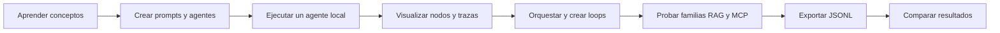

# BL_Loops

Laboratorio didáctico y visual para aprender, construir y comparar agentes de IA local desde un agente sencillo hasta orquestaciones, loops, RAG, MCP y evaluación.

> Estado actual: fase 1 sigue en construcción. La fábrica tiene su base determinista,
> `02-single-agent` ofrece el primer chat real y la rama RAG ya incluye una línea base léxica,
> una variante híbrida y un agente experto en ventas con una herramienta local acotada. El
> benchmark local-code está aprobado y `14-local-code-hermes` ya incluye preflight y el harness
> de una corrida autorizada; todavía no hay una comparación entre clientes.

## Qué se va a construir

Los laboratorios serán independientes y copiables. Compartirán la configuración común del `.env` raíz mientras vivan dentro de este workspace, pero cada uno conservará su propia `.venv`, lockfiles, código y datos. El comparador central consumirá archivos JSONL exportados manualmente.

## IA local verificada

La primera escalera de modelos ya está disponible en Ollama:

- Básico: `qwen3.5:4b`
- Estándar: `qwen3.5:9b`
- Alternativa básica: `gemma4:e2b`
- Alternativa estándar: `gemma4:e4b`

Los pesos principales se encuentran en `D:/ollama`. No hace falta descargar modelos adicionales hasta comenzar las pruebas de embeddings y reranking para RAG.

## Benchmark local de clientes de código

| Laboratorio | Cliente | Estado |
|---|---|---|
| `14-local-code-hermes` | Hermes | Preflight y harness de una corrida; benchmark puntuado pendiente. |
| `15-local-code-opencode` | OpenCode | Planificado. |
| `16-local-code-claude` | Claude Code | Planificado. |

La cohorte base usará `local-code-9b-64k`, derivado de `qwen3.5:9b` con 65,536 tokens. Si no
supera el gate, se probará `qwen3.5:4b` conservando 65,536 tokens y como cohorte separada; 32k no
es un fallback válido para Hermes u OpenCode. Claude Code debe conservar el mismo contexto o
registrar una incompatibilidad. No se presuponen niveles de esfuerzo para modelos locales.

Un endpoint de inferencia en loopback no demuestra cero egress. Esa propiedad requiere evidencia
de red independiente para el cliente y su árbol de procesos. LM Studio y llama.cpp quedan para
experimentos A/B posteriores; el modelo 27B no será el agente cotidiano.

El preflight de Hermes solo inspecciona prerrequisitos y exporta JSONL diagnóstico. El runner
separado inicia Hermes únicamente con `--execute`, usa un workspace sintético dentro de un sandbox
Docker sin red y ejecuta sus tests de evaluación; no crea modelos ni produce por sí solo una
corrida comparable. El repositorio maestro ya tiene un baseline Git; la comparación formal
permanece bloqueada hasta que estén disponibles los tres clientes y aprueben el mismo gate desde
el mismo SHA.

## Por dónde empezar

1. Abre la [guía didáctica del repositorio maestro](docs/humano/maestro/README.md).
2. Consulta [el índice documental](docs/INDEX.md).
3. Lee [el plan maestro](docs/PLAN_MAESTRO_DIDACTICO.md).
4. Revisa [los casos de evaluación](docs/CASOS_DE_EVALUACION.md).
5. Usa `.env.example` como contrato visible; el `.env` real es local y no se versiona.

La decisión sobre dependencias está explicada en [Configuración y entornos](docs/humano/maestro/ENVIRONMENTS.md): `.env` común, `.venv` y `uv.lock` por laboratorio, con caché de `uv` compartida automáticamente.

## Aplicaciones disponibles

- [`01-prompt-agent-factory/`](01-prompt-agent-factory/README.md): contratos, validación y flujo visual sin invocar todavía un modelo.
- [`02-single-agent/`](02-single-agent/README.md): chat mínimo en la terminal de Windows 11 con Ollama local y `gemma4:e4b`.
- [`06-naive-rag/`](06-naive-rag/README.md): Markdown a SQLite FTS5, recuperación léxica,
  `qwen3.5:4b`, citas por líneas y corridas JSONL sanitizadas.
- [`07-vector-rag/`](07-vector-rag/README.md): recuperación híbrida FTS5 + embeddings Qwen3,
  filtro explícito de ruido, comparación lexical/vectorial y citas.
- [`09-agentic-rag/`](09-agentic-rag/README.md): agente de ventas que formula y ejecuta una sola
  consulta al RAG híbrido, conserva memoria en RAM y declara los límites de sus fuentes.
- [`13-sales-knowledge-curator/`](13-sales-knowledge-curator/README.md): audita fuentes locales,
  contrasta afirmaciones y publica un paquete de conocimiento versionado. No escribe en el 09.
- [`14-local-code-hermes/`](14-local-code-hermes/README.md): preflight de solo diagnóstico,
  harness controlado, contratos JSONL y fixture congelado para Hermes + Ollama 64k.

## Fuentes

El orden de autoridad es:

1. `docs/humano/sistema.md` y decisiones explícitas del usuario.
2. `Prompts/` como corpus.
3. `docs/` como refuerzo.
4. `menu_portable/` para descubrir repositorios.
5. Fuentes oficiales actuales para verificar hechos temporales.

Las reglas completas para agentes de código están en [AGENTS.md](AGENTS.md). Las futuras sesiones de Codex tienen un [recorrido operativo explicado](docs/humano/maestro/CODEX_WORKFLOW.md).
