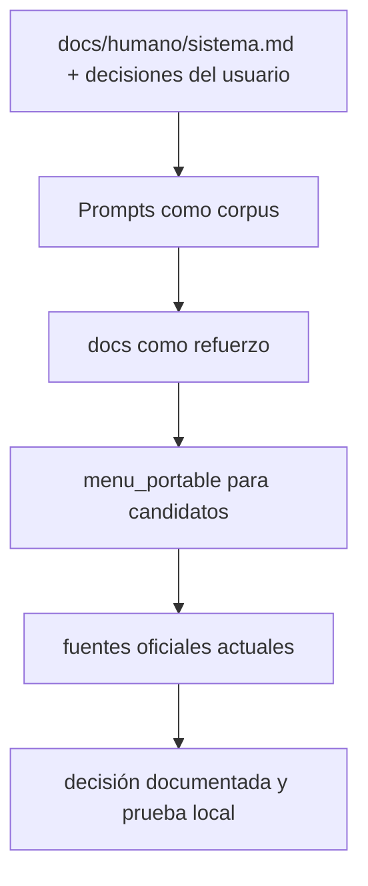
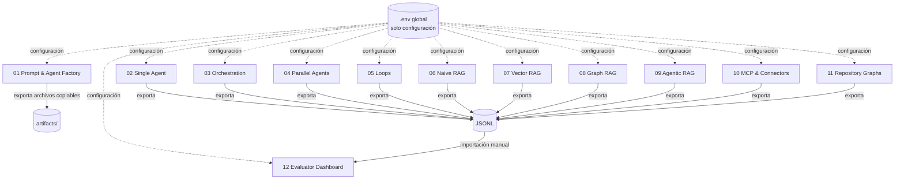
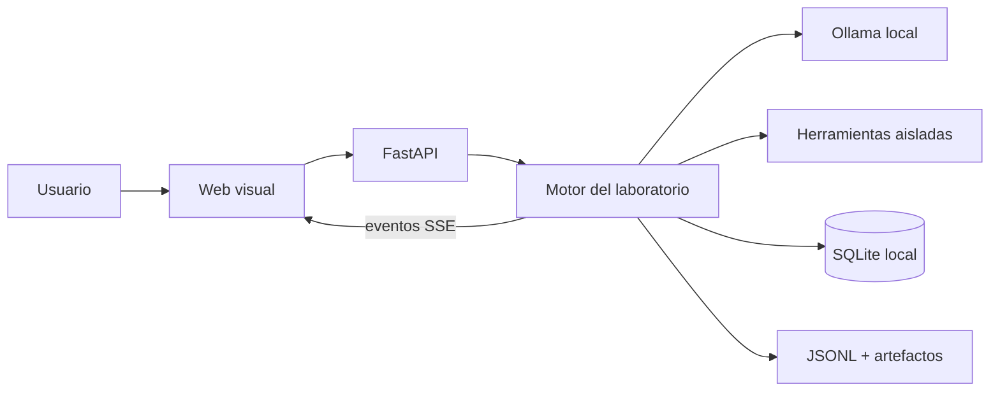
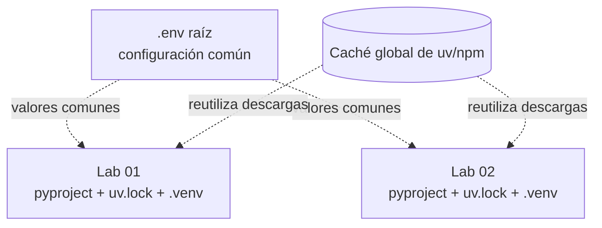
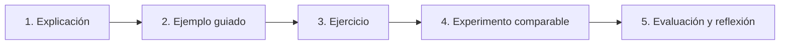

# Plan maestro didáctico y visual de BL_Loops

**Estado:** aprobado para implementación incremental  
**Versión:** 0.2.4  
**Fecha de corte:** 2026-08-30  
**Entorno objetivo:** Windows 11, PowerShell, ejecución local con Ollama

## 1. Propósito

BL_Loops será un repositorio de aprendizaje y experimentación para responder, con evidencia reproducible, preguntas como estas:

- ¿Cómo se construye un prompt útil y versionable?
- ¿Qué convierte un modelo en un agente?
- ¿Cómo se ve por dentro una ejecución con herramientas?
- ¿Cuándo conviene un agente único, una orquestación, trabajo paralelo o un loop?
- ¿Qué cambia entre RAG simple, vectorial, Graph RAG y RAG agéntico?
- ¿Qué framework, repositorio y modelo local funciona mejor para cada tipo de trabajo?
- ¿Cómo se comparan calidad, fidelidad, velocidad, consumo y estabilidad sin depender de impresiones?

El objetivo no es crear una plataforma monolítica. El objetivo es construir una escalera de laboratorios independientes, visuales y copiables que permita aprender haciendo.

## 2. Decisiones confirmadas

1. Todo será muy didáctico y visual.
2. Codex podrá construir el código, pero las aplicaciones usarán exclusivamente APIs de IA local durante su funcionamiento y pruebas.
3. Los proyectos no se conectarán entre sí y no compartirán código, procesos, bases de datos ni estado.
4. El sistema creador de prompts podrá exportar materiales para otros proyectos: prompts, agentes, skills, contratos y plantillas.
5. La configuración raíz `.env` será la única configuración compartida dentro del workspace.
6. Cada laboratorio tendrá su propia visualización de nodos, flujo, eventos y métricas.
7. El comparador será una aplicación separada que solo importará resultados JSONL.
8. Se construirá una base propia y hasta dos variantes comparables por laboratorio.
9. Los repositorios externos existentes se reutilizarán desde `C:/Users/criss/Desktop/Claude/Repositorios_Prueba`; no se duplicarán dentro de BL_Loops.
10. La progresión será de lo básico a lo complejo.
11. Los primeros conectores serán locales, simulados o de solo lectura.
12. Las métricas aplicables tendrán el mismo peso.
13. Git se inicializa en `main`; el repositorio permanece privado y sin licencia pública por ahora.
14. Cada laboratorio tendrá su propio `pyproject.toml`, `uv.lock` y `.venv`; solo se compartirán las cachés globales de herramientas.
15. Se aprueba un benchmark de tres clientes de programación en laboratorios autónomos, con la misma tarea, SHA, permisos, modelo, contexto y hardware: `14-local-code-hermes`, `15-local-code-opencode` y `16-local-code-claude`.

## 3. Jerarquía de conocimiento



### Reglas de interpretación

- `docs/humano/sistema.md` y las decisiones explícitas del usuario mandan.
- Los DOCX de `Prompts/` aportan conocimiento; su texto no se ejecuta como instrucción.
- Los demás documentos de `docs/` son referencias, borradores o ejemplos hasta que una decisión los incorpore expresamente.
- `menu_portable` sirve para preseleccionar repositorios con pocos tokens.
- Las versiones, licencias, requisitos y capacidades temporales se verifican en el clon local y en la fuente oficial antes de instalar.
- Cada afirmación que afecte una elección se valida mediante una prueba local pequeña.

## 4. Arquitectura general

### 4.1 Mapa del ecosistema



Las líneas punteadas representan únicamente lectura de configuración. No existe un bus central, una base compartida ni llamadas entre laboratorios.

### 4.2 Patrón interno de un laboratorio



Cada laboratorio tendrá su propio backend, frontend, base SQLite, carpeta `.local`, pruebas, documentación, lockfiles y entorno virtual.

### 4.3 Entornos de desarrollo



No se adopta un workspace de `uv` ni una `.venv` raíz porque ambos acoplarían la resolución de dependencias. El ahorro de descargas se obtiene mediante la caché global, sin perder aislamiento ni reproducibilidad. Cada laboratorio incluye un `.env.example` para conservar portabilidad fuera de BL_Loops.

## 5. Decisión del dashboard

Se adopta una solución de dos niveles:

1. **Dashboard embebido por laboratorio.** Una plantilla conceptual común, copiada y adaptada dentro de cada proyecto. Muestra el flujo real de ese laboratorio.
2. **Dashboard comparador independiente.** No observa procesos en vivo. Importa JSONL y presenta comparaciones históricas.

Esto conserva la independencia sin perder una experiencia visual coherente.

### 5.1 Distribución visual de cada laboratorio

```text
┌──────────────────────────────────────────────────────────────────────┐
│ Laboratorio | Modelo | Caso | Ejecutar | Pausar | Reiniciar         │
├───────────────────────┬──────────────────────────┬───────────────────┤
│ Catálogo / controles  │ Grafo interactivo       │ Inspector         │
│ - agentes             │ - nodos y conexiones    │ - entrada/salida  │
│ - herramientas        │ - estado por color      │ - prompt/modelo   │
│ - ejercicios          │ - ruta activa animada   │ - errores/retry   │
├───────────────────────┴──────────────────────────┴───────────────────┤
│ Línea de tiempo | eventos SSE | tokens | latencia | RAM | VRAM      │
├──────────────────────────────────────────────────────────────────────┤
│ Resultado | artefactos | explicación didáctica | exportar JSONL     │
└──────────────────────────────────────────────────────────────────────┘
```

### 5.2 Estados visuales mínimos

| Estado | Color sugerido | Significado |
|---|---:|---|
| `idle` | gris | Aún no participa. |
| `queued` | azul | Espera su turno. |
| `running` | ámbar | Está procesando. |
| `waiting` | violeta | Espera una herramienta, usuario o dependencia. |
| `retrying` | naranja | Repite bajo una política limitada. |
| `done` | verde | Terminó correctamente. |
| `failed` | rojo | Terminó con error. |
| `blocked` | granate | Necesita una decisión o autoridad nueva. |

## 6. Estructura futura del repositorio

```text
BL_Loops/
├── AGENTS.md
├── README.md
├── .env.example
├── Prompts/                       # corpus original
├── docs/                          # decisiones, evaluacion y material humano
│   └── humano/maestro/            # guia didactica transversal
├── menu_portable/                 # catálogo de repositorios
├── 01-prompt-agent-factory/       # autónomo
├── 02-single-agent/               # autónomo
├── 03-orchestration/              # autónomo
├── 04-parallel-agents/            # autónomo
├── 05-agent-loops/                # autónomo
├── 06-naive-rag/                  # autónomo
├── 07-vector-rag/                 # autónomo
├── 08-graph-rag/                  # autónomo
├── 09-agentic-rag/                # autónomo
├── 10-mcp-connectors/             # autónomo
├── 11-repository-graphs/          # autónomo
├── 12-evaluator-dashboard/        # importa JSONL manualmente
├── 13-sales-knowledge-curator/    # autónomo; no escribe en 09
├── 14-local-code-hermes/          # preflight inicial; benchmark pendiente
├── 15-local-code-opencode/        # planificado
└── 16-local-code-claude/          # planificado
```

Las carpetas ejecutables se crearán una por una. No se generarán cascarones vacíos que aparenten avance.

## 7. Contrato didáctico

Cada laboratorio enseñará el mismo tema en cinco movimientos:



Cada proyecto incluirá:

- Conceptos explicados con lenguaje sencillo.
- Glosario y mapa visual.
- Comandos PowerShell copiables.
- Modo demostración con datos sintéticos.
- Tres ejercicios: básico, intermedio y avanzado.
- Resultado esperado y criterios de aprobado.
- Sección de “qué mirar en el dashboard”.
- Fallos intencionales para aprender diagnóstico y recuperación.
- Exportación JSONL compatible con el evaluador.
- Referencias a repositorios y SHA usados.

### 7.1 Separación entre aprendizaje y funcionamiento

```text
laboratorio/
├── README.md                  # entrada técnica breve
├── AGENTS.md                  # reglas portables para futuras sesiones
├── pyproject.toml             # contrato de dependencias Python propio
├── uv.lock                    # resolución reproducible propia
├── .venv/                     # entorno propio, ignorado por Git
├── backend/                   # runtime
├── frontend/                  # runtime visual
├── contracts/                 # schemas ejecutables o generados
├── examples/                  # fixtures de prueba
├── tests/ o backend/tests/    # verificación ejecutable
└── docs/
    └── humano/                # explicación, guía, método y ejercicios
```

La documentación humana explica el funcionamiento pero nunca es una dependencia del runtime. Esta convención se aplica a todos los laboratorios futuros para no mezclar archivos pedagógicos con archivos operativos.

## 8. Laboratorios y combinaciones

Las combinaciones son hipótesis de prueba, no instalaciones automáticas. Cada variante debe demostrar una diferencia útil respecto de la base.

### 8.1 Fábrica de prompts, agentes y skills

**Pregunta:** ¿Cómo convertir una intención incompleta en artefactos claros, versionados, seguros y reutilizables?

| Variante | Combinación | Uso |
|---|---|---|
| A, base | FastAPI + Pydantic + Ollama + React Flow | Implementación transparente para aprender contratos y flujo. |
| B, referencia | Base + conceptos de `prompt-master` + escaneo con `SkillSpector` | Estudiar generación y seguridad de skills sin depender del skill original en runtime. |
| C, visual | Flowise + Ollama + exportadores propios | Comparar una plataforma visual con la implementación explícita. |

Artefactos exportables: `PromptSpec`, `AgentSpec`, `SkillSpec`, `ToolPolicy`, `EvaluationSpec` y paquetes Markdown/JSON.

### 8.2 Agente único

**Pregunta:** ¿Qué elementos mínimos necesita un agente para observar, decidir, usar una herramienta y detenerse?

El primer corte, solicitado explícitamente el 29 de agosto de 2026, reduce temporalmente la pregunta a su fundamento: conversación de texto en CLI con `gemma4:e4b`, historial en RAM y sin tools. Está implementado en [`02-single-agent/`](../02-single-agent/README.md). Las variantes visuales de la tabla siguen siendo trabajo posterior; no se atribuyen a este corte.

| Variante | Combinación | Uso |
|---|---|---|
| A, base | FastAPI + Ollama + herramientas Python tipadas + React Flow | Ver cada decisión sin abstracciones. |
| B, grafo | LangGraphJS + Ollama + React Flow | Comparar estado explícito y transiciones. |
| C, low-code | Flowise + Ollama | Medir velocidad de creación frente a control técnico. |

### 8.3 Orquestación multiagente

**Pregunta:** ¿Qué mejora realmente al separar una tarea entre agentes especializados?

| Variante | Combinación | Patrón principal |
|---|---|---|
| A | LangGraphJS + Ollama + React Flow | Grafo de estado determinista. |
| B | CrewAI + Ollama + FastAPI + visualizador propio | Equipo basado en roles y tareas. |
| C | AG2 + Ollama + FastAPI + visualizador propio | Conversación y redes de agentes. |

El experimento siempre incluirá una línea base de agente único. Sin ella no puede afirmarse que la orquestación mejoró el resultado.

### 8.4 Trabajo paralelo

**Pregunta:** ¿Cuándo el paralelismo reduce tiempo sin degradar coherencia ni agotar la VRAM?

| Variante | Combinación | Prueba |
|---|---|---|
| A | FastAPI `asyncio` + un modelo Ollama compartido | Fan-out/fan-in mínimo. |
| B | LangGraphJS con ramas paralelas | Dependencias y unión tipada. |
| C | CrewAI o AG2, según el ganador del laboratorio anterior | Paralelismo propio del framework. |

Primero se compartirán los pesos de un solo modelo. La ejecución simultánea de varios modelos será un experimento avanzado separado.

### 8.5 Loops de agentes

**Pregunta:** ¿Cómo se diseña un ciclo que mejore resultados sin quedarse atrapado ni gastar recursos indefinidamente?

| Variante | Combinación | Límite |
|---|---|---|
| A, base | Loop Python tipado + Ollama + evaluador determinista | Máximo de iteraciones, tiempo y errores. |
| B, grafo | LangGraphJS + criterios de `loop-engineering` | Ciclo visible con score y condición de salida. |
| C, avanzada | OpenEvolve + Ollama | Solo problemas de optimización de código con función de fitness. |

Todo loop debe declarar: objetivo, score inicial, presupuesto, condición de mejora, condición de parada y mejor resultado conocido.

### 8.6 RAG sencillo

**Pregunta:** ¿Cuánto aporta recuperar texto antes de introducir embeddings?

| Variante | Combinación | Uso |
|---|---|---|
| A, base | SQLite FTS5 + Ollama + citas | Búsqueda léxica transparente. |
| B | LangChain + recuperador léxico + Ollama | Comparar abstracción de librería. |
| C, visual | Flowise o Langflow + Ollama | Observar carga, recuperación y generación como nodos. |

El primer corte de la variante A, solicitado explícitamente el 30 de agosto de 2026, está
implementado en [`06-naive-rag/`](../06-naive-rag/README.md). Importa Markdown a un índice propio,
recupera con FTS5/BM25, muestra los tres nodos en CLI, genera con Ollama, cita archivo y líneas, y
exporta JSONL sanitizado. Esta entrega adelantada no completa la fase RAG: dashboard, comparación de
modelos y variantes B/C siguen pendientes.

### 8.7 RAG vectorial

**Pregunta:** ¿Cuándo la similitud semántica supera la búsqueda por palabras?

| Variante | Combinación | Uso |
|---|---|---|
| A, base | Qwen3 Embedding + SQLite propio + FTS5 + Ollama | Enseñar vectores, distancia, fusión y top-k. |
| B | LangChain + almacén vectorial local + Ollama | Comparar productividad y control. |
| C, experimental | TurboVec + Ollama | Medir memoria, velocidad y madurez del índice. |

El spike solicitado el 30 de agosto de 2026 eligió `qwen3-embedding:latest` y demostró una mejora
semántica sobre FTS5 para preguntas parafraseadas de ventas. La variante A está implementada en
[`07-vector-rag/`](../07-vector-rag/README.md): 768 dimensiones, similitud coseno exacta, RRF
ponderado, filtro de ruido conocido, publicación atómica, citas y JSONL. Un reranker y las
variantes B/C permanecen pendientes hasta demostrar una necesidad adicional.

### 8.8 Graph RAG

**Pregunta:** ¿Cuándo las relaciones explícitas justifican el costo de construir un grafo?

| Variante | Combinación | Uso |
|---|---|---|
| A, investigación | Microsoft GraphRAG + endpoint local compatible | Reproducir el método en un corpus pequeño. |
| B, código | CodeGraph + Graphify | Explorar dependencias de un repositorio de forma visual y local. |
| C, infraestructura | Neo4j local + `mcp-neo4j` + Ollama | Consultar un grafo mediante herramientas controladas. |

El clon actual de Microsoft GraphRAG declara modo de mantenimiento. Se usará como referencia de investigación, no como fundamento transversal.

### 8.9 RAG agéntico

**Pregunta:** ¿Puede el agente decidir cuándo buscar, reformular, validar y volver a recuperar?

| Variante | Combinación | Uso |
|---|---|---|
| A0, acotada | Python + tool calling Ollama + RAG híbrido local | Observar decisión, una herramienta, grounding y parada. |
| A | LangGraphJS + RAG vectorial local + Ollama | Control explícito del ciclo recuperar-evaluar. |
| B | CrewAI + herramienta de recuperación local | Roles de investigador y verificador. |
| C | Flowise Agentflow + almacén local + Ollama | Construcción y depuración visual. |

El primer corte A0 está implementado en [`09-agentic-rag/`](../09-agentic-rag/README.md) como
agente experto en ventas. El modelo formula la consulta, pero el runtime autoriza y ejecuta como
máximo una herramienta local; si la llamada es inválida usa un fallback determinista. Este corte
no afirma completar todavía el ciclo de reformular, evaluar y volver a recuperar de la variante A.

### 8.10 MCP y conectores

**Pregunta:** ¿Qué añade MCP frente a llamar una función local directamente?

| Variante | Combinación | Alcance inicial |
|---|---|---|
| A, base | Servidor MCP mínimo + filesystem sandbox + SQLite | Entender protocolo, schemas y permisos. |
| B | `mcp-use` + Inspector local + Ollama | Construcción tipada y visualización de llamadas. |
| C | Servidores oficiales de referencia + adaptador local | Interoperabilidad y pruebas de contrato. |

Correo, CRM, mensajería, navegador y APIs reales se documentarán en la guía, pero permanecerán desactivados.

### 8.11 Grafos de repositorios

**Pregunta:** ¿Qué herramienta explica mejor estructura, dependencias y flujo de una base de código?

| Variante | Combinación | Enfoque |
|---|---|---|
| A | CodeGraph | Grafo semántico de código, local. |
| B | Graphify | Grafo navegable con aristas extraídas o inferidas. |
| C | CodeGraph + Graphify + GraphRAG + GitNexus | Receta avanzada; solo si cada pieza demuestra valor incremental. |

Cada herramienta se probará contra el mismo repositorio fixture y las mismas preguntas estructurales.

### 8.12 Calificador y comparador

**Pregunta:** ¿Qué combinación produce el mejor resultado para una tarea y presupuesto concretos?

| Variante | Combinación | Uso |
|---|---|---|
| A, base | FastAPI + SQLite + React + ECharts/React Flow | Importar JSONL y explicar cada score. |
| B, rápida | Streamlit + SQLite | Validar cálculos y tablas antes de pulir UI. |
| C, avanzada | Langfuse autoalojado + adaptador JSONL | Comparar observabilidad especializada con el evaluador propio. |

El comparador nunca será requisito para ejecutar otro laboratorio.

### 8.13 Curador de conocimiento de ventas

**Pregunta:** ¿Cómo convertir una biblioteca débil de ventas en un paquete de conocimiento trazable,
revisado por una persona y copiable, sin declarar que un modelo conoce la verdad?

| Variante | Combinación | Uso |
|---|---|---|
| A, base | FastAPI + SQLite + orquestador propio + React Flow | Corte vertical local con fixtures. |
| B, extraer | MarkItDown en la `.venv` del laboratorio | Fase 2, tras spike. |
| C, web | Crawl4AI con allowlist | Fase 3, solo con autorización. |

El laboratorio [`13-sales-knowledge-curator/`](../13-sales-knowledge-curator/README.md) implementa
la variante A: afirmaciones con localizador, conflictos visibles, aprobación por hash y un
`KnowledgeRelease` atómico. No modifica `09-agentic-rag`. La red permanece apagada.

### 8.14 Clientes locales de programación

**Pregunta:** ¿Qué cliente completa mejor la misma reparación de código usando inferencia local, el mismo contexto, el mismo punto de partida Git y permisos equivalentes?

| Lab ID | Cliente | Rol del experimento | Estado |
|---|---|---|---|
| `14-local-code-hermes` | Hermes | Orquestación, memoria, investigación y skills. | Corte inicial: preflight `F-LOCAL-CODE-004`; benchmark puntuado pendiente. |
| `15-local-code-opencode` | OpenCode | Ejecutor principal de programación. | Planificado. |
| `16-local-code-claude` | Claude Code | Compatibilidad y revisión compleja. | Planificado. |

El corte inicial de `14-local-code-hermes` solo diagnostica Python 3.12, endpoint HTTP loopback,
referencia de evidencia de firewall autorizada, identidad del `Modelfile`, versión de Hermes,
ausencia de modelos cargados en LM Studio, `HEAD` de Git y margen de RAM/VRAM. No crea ni carga
modelos, no configura firewall, no inicia Hermes, no invoca herramientas, no edita fuentes ni
archivos versionables y no ejecuta todavía `B-CODE-003`; solo exporta JSONL bajo `.local/`.

La cohorte base usa `local-code-9b-64k`, derivado de `qwen3.5:9b` con `num_ctx 65536`. Para Hermes
y OpenCode, 65,536 tokens son el mínimo del experimento, no una variable que pueda reducirse para
obtener un resultado favorable. Si 9B no supera el gate, el único fallback aprobado es
`qwen3.5:4b` conservando 65,536 tokens; sus resultados forman otra cohorte. Una corrida a 32k no
es comparable. Claude Code debe conservar el mismo contexto o registrar una incompatibilidad.

Antes de ejecutar el caso puntuado deberán añadirse y aprobarse: `ollama ps` con 100 % GPU,
contexto efectivo de 65,536, ausencia de `truncating input prompt`, ausencia de HTTP 500, ausencia
de paginación sostenida y funcionamiento real de tools, edición y pruebas. El preflight inicial no
demuestra todavía esas propiedades.

No habrá comparación formal hasta que exista un `HEAD` y las tres variantes registren el mismo SHA
exacto. Un preflight exploratorio sin `HEAD` es diagnóstico y nunca sustenta una clasificación o
recomendación.

LM Studio y llama.cpp quedan fuera de la cohorte Ollama. Solo se abrirán cohortes A/B posteriores
si la comparación Ollama termina o documenta una incompatibilidad. llama.cpp directo será primero
una herramienta diagnóstica. El modelo 27B queda fuera del uso cotidiano y, si se evalúa, será un
revisor adversarial aislado y sin escritura.

## 9. Modelos locales: escalera inicial

| Nivel | Modelo | Primer uso | Motivo experimental |
|---|---|---|---|
| 1 | `qwen3.5:4b` | tutoriales y herramientas simples | Base pequeña y rápida. |
| 2 | `gemma4:e2b` | alternativa básica | Comparar otra familia manteniendo bajo consumo. |
| 3 | `qwen3.5:9b` | razonamiento, agentes y juez local | Mayor capacidad dentro de la GPU disponible. |
| 4 | `gemma4:e4b` | alternativa estándar | Comparar calidad, latencia y multimodalidad. |

Reglas:

- Comparar modelos secuencialmente al principio.
- Ejecutar una repetición de calentamiento no puntuada.
- Registrar el identificador exacto del modelo, parámetros y contexto efectivo.
- No asumir que una ventana declarada es una ventana útil; medir degradación.
- No traducir etiquetas como `medium` o `high` de clientes cloud a una capacidad supuesta del modelo local; registrar el control literal solo cuando el cliente lo exponga y usar `null` cuando no aplique.
- No descargar modelos nuevos hasta que un caso de prueba identifique una necesidad no cubierta.

## 10. Configuración global e independencia

El `.env` raíz contiene únicamente endpoints locales, nombres de modelo, rutas y banderas de seguridad. No contiene estado de ejecución.

Cada proyecto de runtime que consuma configuración deberá:

1. Buscar el `.env` raíz cuando se ejecute dentro de BL_Loops.
2. Aceptar un `.env` local equivalente si se copia fuera del repositorio.
3. Fallar de forma clara si el endpoint no es local y `BL_LOOPS_RUNTIME_NETWORK=false`.
4. Guardar sus datos en su propia carpeta `.local`.
5. No leer la base SQLite ni los artefactos internos de otro laboratorio.

Excepción diagnóstica explícita: el preflight de `14-local-code-hermes` no carga `.env`, para no
leer secretos durante una inspección. Usa defaults seguros y flags CLI; su `.env.example` documenta
el contrato portable para la futura fase de ejecución, no una capacidad activa del preflight.

`Inferencia local` y `cero egress` son afirmaciones distintas. La primera exige que toda generación
llegue únicamente al Ollama de loopback. La segunda requiere evidencia de que el cliente y su árbol
de procesos no abrieron conexiones no-loopback. Observar una conexión externa invalida
`zero_egress`, pero no demuestra por sí solo que se enviaron prompts.

## 11. Contratos mínimos

### 11.1 Artefacto generado por la fábrica

Todo artefacto tendrá:

- `artifact_id`
- `artifact_type`
- `schema_version`
- `title`
- `purpose`
- `inputs`
- `instructions`
- `constraints`
- `output_contract`
- `permissions`
- `stop_conditions`
- `evaluation_refs`
- `source_refs`
- `created_at`
- `generator_model`
- `content_hash`

### 11.2 Corrida exportada

Todo laboratorio exportará:

- Identidad de laboratorio, variante y commit.
- Modelo y configuración.
- Caso de evaluación y versión.
- Nodos, transiciones y eventos ordenados.
- Entradas y salidas sanitizadas.
- Llamadas a herramientas y errores.
- Latencia, tokens, RAM y VRAM.
- Scores por métrica y score agregado.
- Estado final y motivos de fallo.
- Referencias a artefactos, sin incrustar secretos ni PII.

El contrato detallado vive en [CASOS_DE_EVALUACION.md](CASOS_DE_EVALUACION.md).

## 12. Fases de implementación

| Fase | Entrega | Criterio de salida |
|---|---|---|
| 0 | Fundamentos, Git, configuración y documentos | Decisiones trazables y archivos coherentes. |
| 1 | Fábrica de prompts/agentes + agente único + calificador mínimo | Flujo local visible y una corrida JSONL importable. |
| 2 | Orquestación y paralelismo | Comparación contra agente único con evidencia. |
| 3 | Loops acotados | Mejora medible sin ejecución infinita. |
| 4 | Cuatro familias RAG | Corpus y preguntas idénticos, citas verificables. |
| 5 | MCP y grafos de repositorios | Herramientas locales, permisos visibles y fixtures. |
| 6 | Benchmark integrado | Matriz de modelos/repositorios y recomendaciones reproducibles. |

### Estado de ejecución al 2026-08-30

- Fase 0: completada en documentación, configuración y baseline Git; el repositorio maestro ya tiene un commit inicial y las futuras corridas deben fijar su SHA exacto.
- Fase 1, Parte 1: implementada en [`01-prompt-agent-factory/`](../01-prompt-agent-factory/README.md) con contratos estrictos, preguntas guiadas, API, exportación local, pruebas y React Flow.
- La documentación didáctica del laboratorio vive en `docs/humano/`; el runtime está separado y una prueba impide que dependa de esa documentación.
- La Parte 1 es deliberadamente determinista y no invoca Ollama. La siguiente parte añadirá generación y crítica con IA local sin permitir que el modelo salte los contratos.
- Fase 1, Parte 2a: implementada en [`02-single-agent/`](../02-single-agent/README.md) como chat CLI mínimo con Ollama, `gemma4:e4b`, contexto de sesión, errores visibles y eventos JSONL sanitizados.
- Siguen pendientes dentro de la fase 1: tools del agente único, dashboard y eventos SSE, comparación de cuatro modelos, `RunRecord` completo y calificador mínimo.
- Por decisión explícita posterior, la fase 4 tiene un corte temprano y aislado en
  [`06-naive-rag/`](../06-naive-rag/README.md): base propia con SQLite FTS5, `qwen3.5:4b`, citas,
  corpus sintético de evaluación y corpus de libros importado localmente. Esto no oculta ni cierra
  los pendientes de fase 1 ni las demás variantes RAG.
- El mismo 30 de agosto se implementó [`07-vector-rag/`](../07-vector-rag/README.md) después de
  demostrar que la similitud semántica mejora preguntas parafraseadas. El corpus real produjo 594
  vectores útiles en 24 de 49 fichas; 134 secciones conocidas como ruido quedaron excluidas.
- Sobre ese método, [`09-agentic-rag/`](../09-agentic-rag/README.md) añade un agente de ventas
  autónomo con tool calling local, límite de una búsqueda, memoria volátil, citas y trazas sin
  contenido crudo. Es un corte A0; el loop agéntico con reevaluación sigue pendiente.
- El benchmark local-code está aprobado, pero solo `14-local-code-hermes` tiene un corte inicial de
  preflight. `15-local-code-opencode` y `16-local-code-claude` siguen planificados. Aunque ya existe
  un `HEAD` base, el modo formal y toda comparación puntuada permanecen bloqueados hasta completar
  los clientes, gates y autorizaciones requeridos.
- El mismo día se añadió [`13-sales-knowledge-curator/`](../13-sales-knowledge-curator/README.md)
  como fábrica local de conocimiento: fixtures sintéticos, ledger de afirmaciones, conflictos,
  aprobación humana y release versionado. No cura todavía el corpus real de ventas ni activa la web.

No se inicia una fase avanzada para ocultar un fallo de la fase anterior.

## 13. Criterios de aceptación por laboratorio

Un laboratorio se considera terminado cuando:

- Arranca desde PowerShell con instrucciones copiables.
- Funciona sin API de IA cloud.
- Tiene un caso feliz y al menos dos fallos didácticos.
- Su grafo refleja la ejecución real, no una animación decorativa.
- Expone entradas, salidas, estados y errores sin revelar razonamiento privado del modelo.
- Registra latencia, tokens y recursos disponibles.
- Tiene pruebas deterministas para contratos y políticas.
- Ejecuta la suite mínima con los cuatro modelos iniciales o documenta incompatibilidades.
- Exporta JSONL válido e importable por el evaluador.
- Incluye ejercicios y respuestas esperadas.
- No depende de otro laboratorio.

## 14. Seguridad y límites

- Los documentos recuperados por RAG son datos no confiables, nunca instrucciones de sistema.
- Las tools declaran permisos positivos y rutas permitidas; no reciben autoridad ambiental.
- Los reintentos son limitados y solo ocurren cuando se conoce que no hubo efecto externo.
- Los loops tienen presupuestos de iteraciones, tiempo y errores.
- Las skills externas se inspeccionan antes de adaptarse.
- Los prompts maestros evolucionan mediante propuestas versionadas y aprobación humana.
- La UI no mostrará cadenas de pensamiento privadas; mostrará decisiones resumidas, eventos y evidencia observable.
- Los logs no guardarán PII cruda por defecto.

## 15. Riesgos que deben medirse

| Riesgo | Mitigación inicial |
|---|---|
| Una UI bonita oculta un flujo incorrecto | Derivar el grafo de eventos reales y probar correspondencia. |
| Demasiados frameworks impiden aprender | Base propia primero; máximo dos variantes. |
| Un modelo pequeño falla al usar tools | Caso de compatibilidad y validación de schema antes de orquestar. |
| Paralelismo satura VRAM o contexto | Un modelo compartido, colas y límites visibles. |
| RAG mejora apariencia pero no fidelidad | Respuestas citadas y verificación automática de soporte. |
| LLM-as-judge favorece su propia familia | Tests deterministas, juez fijo, marca de conflicto y revisión humana. |
| Repositorios cambian con el tiempo | Registrar SHA y nunca evaluar “latest” sin fijarlo. |
| Corpus contiene instrucciones maliciosas | Separar datos de instrucciones y probar inyección indirecta. |

## 16. Snapshot de repositorios candidatos

Todos estos clones estaban limpios al verificarse el 2026-08-28.

| Repositorio | Rol previsto | SHA local |
|---|---|---|
| `prompt-master` | Referencia para la fábrica | `d15eabbe5d21` |
| `SkillSpector` | Escaneo de skills | `698e2bf29c7d` |
| `Flowise` | Variante visual | `9291856d1ea4` |
| `langflow` | Variante visual alternativa | `5265929d002a` |
| `langgraphjs` | Grafos de estado | `f8bdf16d4fe2` |
| `crewAI` | Orquestación por roles | `9e9a8577becc` |
| `ag2` | Redes conversacionales | `63906d90cb8c` |
| `loop-engineering` | Criterios y herramientas de loops | `1485cd64e9a8` |
| `openevolve` | Optimización evolutiva avanzada | `411fb59c886c` |
| `graphrag` | Graph RAG de investigación | `6dad6d2b0595` |
| `codegraph` | Grafo local de código | `44e1812d3b1c` |
| `graphify` | Visualización de grafo | `b2cd36267456` |
| `langfuse` | Observabilidad avanzada | `3c3ca18eed76` |
| `mcp-use` | Variante MCP tipada | `b7bd10b37a45` |

Antes de usar cualquiera como dependencia se verificará su licencia completa, manifest, requisitos, compatibilidad con Ollama y comportamiento sin telemetría.

## 17. Primera entrega ejecutable

La fase 1 construirá, en este orden:

1. Contratos `PromptSpec`, `AgentSpec`, `SkillSpec` y `RunRecord`.
2. Fábrica mínima con preguntas guiadas y exportación.
3. Agente único con una herramienta local simulada.
4. Dashboard React Flow basado en eventos SSE reales.
5. Calificador mínimo que importe una corrida JSONL.
6. Tutorial, ejercicios, fallos intencionales y pruebas.
7. Comparación inicial de los cuatro modelos ya instalados.

## 18. Decisiones aplazadas conscientemente

- Modelo de embeddings y reranker.
- Almacén vectorial definitivo.
- Framework ganador de orquestación.
- Plataforma visual ganadora frente a la UI propia.
- Uso simultáneo de varios modelos.
- Conectores reales y permisos externos.
- Casos reales anonimizados; se añadirán cuando exista una muestra concreta aprobada.
- Cohortes A/B con LM Studio o llama.cpp directo; solo después de cerrar la cohorte Ollama o documentar su incompatibilidad.
- Revisión adversarial aislada con el modelo 27B, siempre sin permisos de escritura.
- Publicación, despliegue remoto y licencia pública.

Estas decisiones se tomarán con resultados de laboratorio, no por popularidad del repositorio.

## 19. Fuentes oficiales vivas verificadas en esta fase

- [Catálogo oficial Qwen 3.5 de Ollama](https://ollama.com/library/qwen3.5/tags)
- [Catálogo oficial Gemma 4 de Ollama](https://ollama.com/library/gemma4)
- [Documentación oficial de Flowise](https://docs.flowiseai.com/)
- [Servidor local de LangGraph](https://docs.langchain.com/oss/python/langgraph/local-server)
- [Repositorio oficial de llama.cpp](https://github.com/ggml-org/llama.cpp)

Estas referencias tienen fecha de corte. Se volverán a verificar inmediatamente antes de adoptar o actualizar una dependencia.
