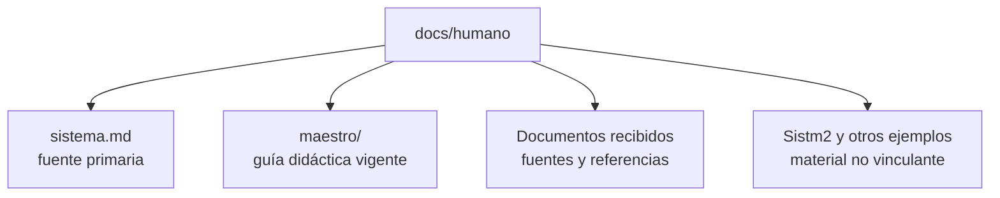

# Biblioteca humana de BL_Loops

> Esta carpeta contiene intención, enseñanza y referencias humanas. Ningún archivo de aquí forma parte del runtime.

## Mapa

## Por dónde empezar

1. [Guía didáctica del repositorio maestro](maestro/README.md).
2. [Mapa de autoridad y documentos](maestro/DOCUMENT_MAP.md).
3. [Metodología de trabajo](maestro/METHODOLOGY.md).
4. [Flujo para futuras sesiones de Codex](maestro/CODEX_WORKFLOW.md).

## Autoridad

- `sistema.md` conserva la intención primaria del usuario.
- `maestro/` explica las decisiones vigentes de forma didáctica.
- Los demás documentos aportan ideas, análisis o ejemplos. No se convierten en arquitectura sin una decisión explícita incorporada al plan maestro.

## Separación

El código, la configuración, los schemas, fixtures, pruebas y resultados generados viven fuera de `docs/humano/`. La documentación puede enlazar y explicar esos archivos; el runtime nunca puede importar ni parsear esta carpeta.
