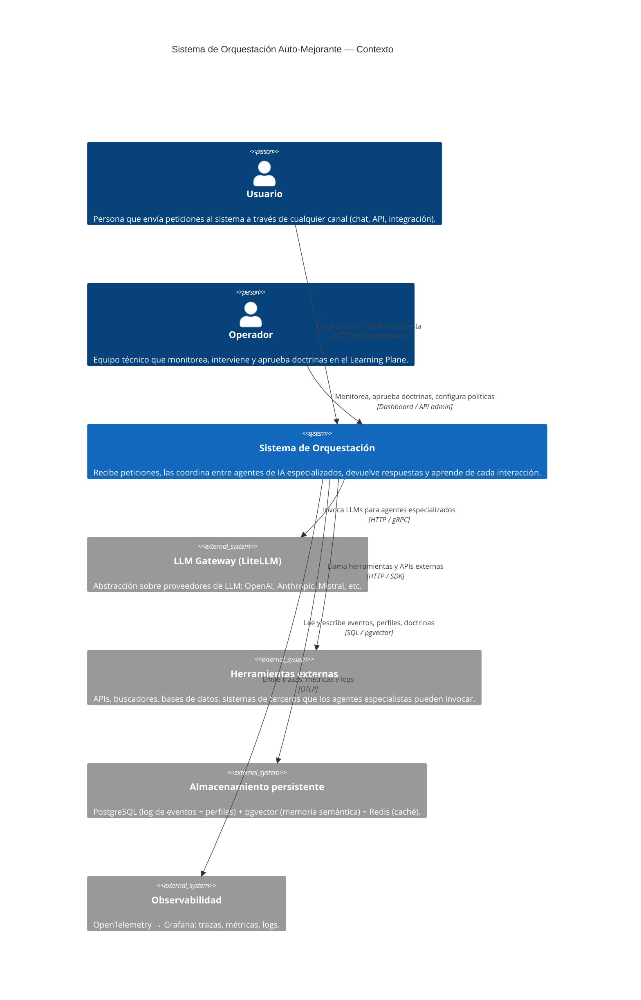

# Contexto del sistema — C4 Nivel 1

> **Status**: `draft` | Última revisión: 2026-05-07

Describe qué es el sistema visto desde fuera: quién lo usa, con qué interactúa y qué hace a grandes rasgos.

---

## Diagrama de contexto

---

## Actores externos

### Usuario
- Puede ser humano o sistema automatizado.
- Interactúa por HTTP REST (síncronamente) o por mensajes asincrónicos.
- El sistema mantiene un **Profile per-usuario** que persiste entre sesiones.
- No tiene visibilidad del interior del sistema, solo de la respuesta final.

### Operador
- Técnico o equipo técnico con acceso al plano de aprendizaje.
- Aprueba doctrinas antes de que se desplieguen globalmente (opcional según política).
- Recibe alertas de `slo.breached` y `drift.detected`.
- Puede hacer rollback manual de cualquier doctrina.

---

## Responsabilidades del sistema (dentro del alcance)

1. **Recibir y clasificar** cualquier petición entrante.
2. **Planificar y delegar** subtareas a los guilds especializados.
3. **Sintetizar y entregar** la respuesta final al usuario.
4. **Registrar** cada interacción como eventos inmutables.
5. **Mantener el profile** individual de cada usuario.
6. **Detectar patrones** a partir del log de eventos.
7. **Promover doctrinas** validadas que mejoran el comportamiento global.
8. **Auto-monitorear** su propia salud y SLOs.
9. **Bloquear acciones inseguras** vía Compliance Officer.

---

## Fuera de alcance del sistema

- Selección de proveedores LLM específicos (gestionado por LLM Gateway externo).
- Interfaz de usuario / frontend de chat (consume la API del sistema).
- Infraestructura de nube, Kubernetes, CI/CD (capa de operaciones externa).
- Gestión de identidad / autenticación de usuarios (delega a sistema IAM externo).

---

## Garantías del sistema hacia el usuario

| Garantía                    | Mecanismo                                      |
|-----------------------------|------------------------------------------------|
| Respuesta siempre entregada | Falla cerrada: fallback ante error interno     |
| Privacidad por diseño       | Anonymizer obligatorio antes de memoria global |
| Trazabilidad completa       | Event store append-only con correlation_id     |
| Mejora continua             | Learning loop federado con validación A/B      |
| Sin acciones inseguras      | Compliance Officer con veto absoluto           |
