# C4 Nivel 2 — Contenedores

> **Status**: `draft` | Última revisión: 2026-05-07

Vista de los contenedores lógicos del sistema y sus relaciones principales.

---

## Diagrama

```mermaid
C4Container
  title Sistema de Orquestación — Contenedores (C4 Nivel 2)

  Person(user, "Usuario")
  Person(operator, "Operador")

  Container_Boundary(sys, "Sistema de Orquestación") {
    Container(gw, "API Gateway", "FastAPI", "Punto de entrada HTTP. Autenticación, rate-limit, inyección de IDs.")
    Container(mo, "Meta-Orchestrator", "FastAPI + NATS consumer", "CEO. Recibe petición, crea plan, garantiza entrega.")
    Container(rt, "Router / Triage", "NATS consumer", "Clasifica petición, aplica políticas, delega a guild correcto.")
    Container(co, "Compliance Officer", "FastAPI (síncrono)", "Veto en tiempo real. Bloquea acciones inseguras.")
    Container(ra, "Resource Allocator", "NATS consumer", "Controla presupuesto de tokens y latencia.")
    Container(guilds, "Workers de Guild", "NATS consumers", "7 guilds: Research, Production, Analysis, Communication, Memory, Learning, QA.")
    Container(specialists, "Especialistas", "Workers + LLM calls", "Agentes tácticos intercambiables dentro de cada guild.")
    Container(profiler, "User Profiler", "NATS consumer", "Mantiene y actualiza perfiles per-usuario.")
    Container(auditor, "Auditor", "Worker batch", "Revisión post-hoc de decisiones. Detecta drift.")
    Container(miner, "Pattern Miner", "Worker batch", "Agrega señales anonimizadas en patrones.")
    Container(doctrine, "Doctrine Publisher", "NATS consumer", "Despliega doctrinas validadas a todos los módulos.")
    Container(telemetry, "Telemetry / SRE", "NATS consumer + OTLP", "Monitoreo de salud, latencia, errores.")
  }

  ContainerDb(eventstore, "Event Store", "PostgreSQL 16", "Log inmutable append-only. Fuente de verdad.")
  ContainerDb(profiles, "Profiles DB", "PostgreSQL 16", "Perfiles per-usuario y preferencias.")
  ContainerDb(learning, "Learning DB", "PostgreSQL 16", "Doctrinas, experimentos, patrones.")
  ContainerDb(vectors, "Vector Store", "PostgreSQL 16 + pgvector", "Memoria semántica global (solo anonimizado).")
  ContainerDb(cache, "Cache", "Redis", "Memoria de trabajo efímera y rate-limit.")
  Container(bus, "Event Bus", "NATS JetStream", "Sistema nervioso central. Pub/sub, streams, KV.")
  Container(llmgw, "LLM Gateway", "LiteLLM", "Abstracción multi-proveedor de LLMs.")
  Container(otel, "Observabilidad", "OpenTelemetry + Grafana", "Trazas, métricas, logs, dashboards.")

  Rel(user, gw, "HTTP request / response")
  Rel(operator, doctrine, "Aprueba doctrinas / configura políticas", "API admin")
  Rel(gw, mo, "HTTP")
  Rel(mo, bus, "pub/sub")
  Rel(rt, bus, "pub/sub")
  Rel(co, mo, "veto síncrono", "HTTP")
  Rel(guilds, bus, "pub/sub")
  Rel(specialists, llmgw, "llamadas LLM")
  Rel(profiler, bus, "pub/sub")
  Rel(miner, bus, "pub/sub")
  Rel(doctrine, bus, "pub/sub")
  Rel(telemetry, otel, "OTLP")
  Rel(mo, eventstore, "escribe eventos")
  Rel(guilds, eventstore, "escribe eventos")
  Rel(profiler, profiles, "R/W")
  Rel(miner, learning, "R/W")
  Rel(doctrine, learning, "R/W")
  Rel(guilds, vectors, "búsqueda semántica")
  Rel(mo, cache, "memoria de trabajo")
```

---

## Relaciones clave entre contenedores

| De | A | Protocolo | Propósito |
|---|---|---|---|
| API Gateway | Meta-Orchestrator | HTTP POST | Petición entrante |
| Meta-Orchestrator | Event Bus | NATS publish | Dispersar tareas |
| Router/Triage | Event Bus | NATS subscribe | Clasificar petición |
| Guilds | Event Bus | NATS subscribe/publish | Recibir tareas, emitir resultados |
| Todos los módulos | Event Store | SQL INSERT | Log inmutable |
| User Profiler | Profiles DB | SQL R/W | Mantener perfil |
| Pattern Miner | Learning DB | SQL R/W | Guardar patrones |
| Doctrine Publisher | Event Bus | NATS publish | Distribuir doctrina |
| Compliance Officer | Meta-Orchestrator | HTTP síncrono | Veto en ruta crítica |
| Especialistas | LLM Gateway | HTTP | Llamadas a modelos |

---

## Contenedores no presentes en el MVP (fases posteriores)

- **Anonymizer** (fase 4+): servicio dedicado que intercepta antes de escribir en Vector Store.
- **A/B Validator** (fase 8): worker que opera experimentos y decide promotes/rollbacks.
- **Doctrine KV** (fase 8): NATS KV Store con doctrinas activas, consultado por todos los módulos en arranque.
