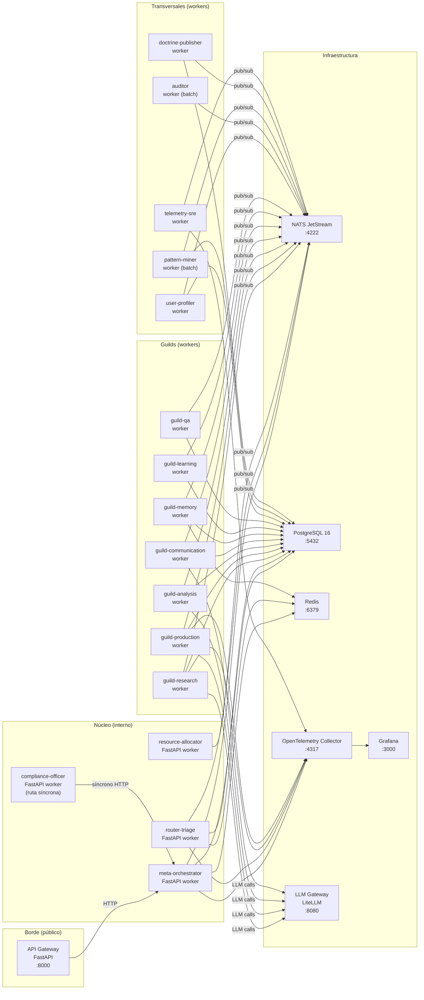

# Topología de despliegue

> **Status**: `draft` | Última revisión: 2026-05-07

Describe los procesos/servicios que corren, su transporte de comunicación y sus dependencias de infraestructura.

---

## Diagrama de despliegue

---

## Servicios y responsabilidades de proceso

### API Gateway (borde)

- **Puerto expuesto**: `:8000` HTTP/HTTPS
- **Responsabilidades**: autenticación/autorización (delega a IAM externo), rate-limit, routing al `meta-orchestrator`, inyección de `tenant_id` y `correlation_id`.
- **No tiene lógica de negocio**.

### Núcleo

| Servicio | Puerto | Modo | Escala |
|---|---|---|---|
| meta-orchestrator | interno | HTTP worker + consumer NATS | 1–3 réplicas |
| router-triage | interno | Consumer NATS | 2–5 réplicas |
| compliance-officer | interno | Síncrono en ruta crítica | 2 réplicas mínimo |
| resource-allocator | interno | Consumer NATS | 1–2 réplicas |

### Guilds

Todos los guilds son **consumers NATS** que escuchan subjects del tipo `task.guild.<nombre>.*`.

| Guild | Escala sugerida | LLM propio |
|---|---|---|
| research | 2–10 | Sí (búsqueda + síntesis) |
| production | 2–10 | Sí (escritura/código) |
| analysis | 1–5 | Sí (cuantitativo) |
| communication | 1–3 | Sí (formato/traducción) |
| memory | 1–3 | No (R/W puro) |
| learning | 1–2 | Sí (pattern description) |
| qa | 2–5 | Sí (evaluación) |

### Transversales

| Servicio | Modo | Frecuencia |
|---|---|---|
| user-profiler | Consumer NATS | Tiempo real |
| auditor | Batch + alertas | Horario / diario |
| pattern-miner | Batch | Nocturno |
| doctrine-publisher | Event-driven | Al recibir `experiment.concluded` |
| telemetry-sre | Consumer NATS | Tiempo real |

---

## Infraestructura de datos

### NATS JetStream

- **Streams**: `REQUESTS`, `TASKS`, `MEMORY`, `LEARNING`, `AUDIT`, `TELEMETRY`
- **Retention**: por tiempo (7 días default) o por tamaño
- **Consumers**: todos durables con `ack explicit` para garantizar at-least-once
- **KV Store**: configuración dinámica de doctrinas activas
- **Object Store**: artefactos grandes (outputs de producción)

### PostgreSQL 16

- **Bases de datos**:
  - `orchestrator_events` — event store (append-only)
  - `orchestrator_state` — proyecciones materializadas
  - `orchestrator_profiles` — perfiles per-usuario
  - `orchestrator_learning` — doctrinas, experimentos, patrones
- **Extensiones requeridas**: `pgvector`, `pg_partman`, `pgcrypto`

### Redis

- **Uso**: memoria de trabajo (TTL por `correlation_id`), rate-limit del Resource Allocator, cache de perfiles calientes.

---

## Consideraciones de despliegue

- **Fase 1–4 (MVP)**: todos los servicios pueden correr como procesos en un solo servidor o en Docker Compose. NATS en modo single-node, PostgreSQL single-instance.
- **Fase 5+ (producción)**: NATS en cluster de 3 nodos, PostgreSQL con réplica de lectura + backups, Redis Sentinel o Cluster.
- **Fase 9 (federación completa)**: considerar NATS en modo hub-and-spoke o Leaf Nodes para multi-región.
- **Secrets**: nunca en código. Variables de entorno o Vault. La API key del LLM Gateway es el secreto más crítico.
