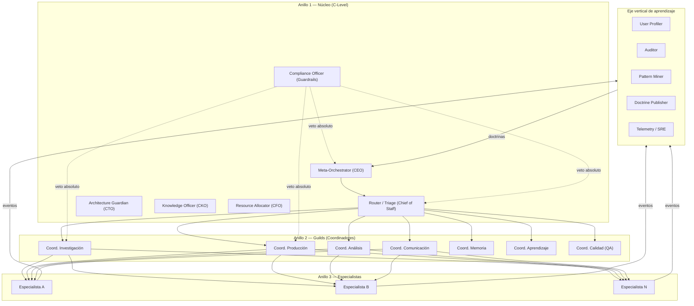

# Topología de hub federado en 3 anillos

> **Status**: `draft` | Última revisión: 2026-05-07 | Ver también: ADR-0001

---

## Diagrama principal



---

## Los tres anillos

### Anillo 1 — Núcleo

Toma decisiones de alto nivel. **Nunca ejecuta trabajo** directamente.

| Módulo | Rol análogo | Responsabilidad clave |
|---|---|---|
| Meta-Orchestrator | CEO | Recibe intención, asigna recursos, garantiza entrega |
| Router / Triage | Chief of Staff | Clasifica petición, aplica políticas |
| Architecture Guardian | CTO | Vela por contratos; bloquea cambios que rompen al resto |
| Knowledge Officer | CKO | Dueño de memoria global, decide qué es doctrina |
| Resource Allocator | CFO | Presupuesta tokens, latencia, costo |
| Compliance Officer | Guardrails | Veto absoluto; bloquea acciones inseguras |

### Anillo 2 — Guilds

Coordinan dominios especializados. Reportan al Meta-Orchestrator vía Router.

| Guild | Especialidad |
|---|---|
| Investigación | Búsqueda, fact-checking, síntesis de fuentes |
| Producción | Escritura, código, generación de artefactos |
| Análisis | Datos, cálculo, modelado cuantitativo |
| Comunicación | Formato, traducción, adaptación al canal/tono |
| Memoria | Lectura/escritura del knowledge base |
| Aprendizaje | Opera el ciclo de mejora |
| Calidad (QA) | Evalúa cada output antes de entregarlo |

### Anillo 3 — Especialistas

Operadores tácticos intercambiables. **Se reentrenan o sustituyen sin afectar al resto**.

Ejemplo dentro del guild de Investigación: `web-searcher`, `deep-reader`, `citation-checker`, `contradiction-detector`.

Todos exponen el mismo puerto genérico (`specialist-interface.md`).

---

## Eje vertical de aprendizaje

Cruza los tres anillos. **Sube señales, baja doctrina.**

```
Especialistas (Ring3) → Telemetry/SRE → Pattern Miner → Doctrine Publisher → Meta-Orchestrator (Ring1)
                                         ↑
                                     Auditor (valida post-hoc)
```

| Componente | Dirección | Función |
|---|---|---|
| Telemetry / SRE | Subida | Recoge métricas y trazas de todos los módulos |
| Auditor | Subida | Detecta drift, degradación, fairness |
| Pattern Miner | Subida | Agrega señales débiles en patrones |
| Doctrine Publisher | Bajada | Convierte patrones validados en políticas |

---

## Por qué esta geometría y no otra

Ver tabla comparativa completa en `plan.md §2.2`. Resumen:

| Topología | Veredicto |
|---|---|
| Estrella pura | Falla arriba de ~10 nodos (SPOF + cuello de botella) |
| Malla completa | Solo para sub-dominios pequeños (O(n²) coordinación) |
| Pipeline lineal | OK para sub-flujos, no para el todo |
| Blackboard | Usar como subcomponente, no como estructura global |
| **Hub federado en anillos** | **Elegido: control claro + paralelismo + federación** |

---

## Principios de coordinación entre anillos

- **Ring1 → Ring2**: delegación vía evento `task.dispatched`. Ring1 no llama directamente a Ring3.
- **Ring2 → Ring3**: asignación directa dentro del guild. Ring3 solo conoce a su coordinador.
- **Ring3 → Eje vertical**: publicación de telemetría y resultados. No hay llamada hacia arriba; solo eventos.
- **Eje vertical → Ring1**: publicación de doctrinas y alertas. Ring1 puede ignorar o adoptar.
- **Compliance Officer**: línea punteada de veto que puede cortar cualquier enlace en tiempo real.
