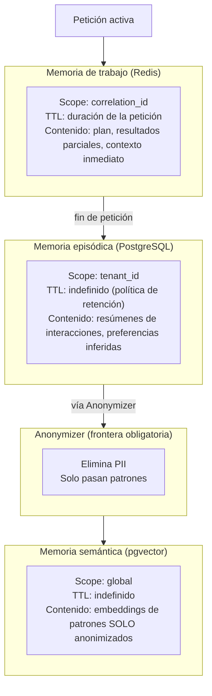

# Capas de memoria

> **Status**: `draft` | Última revisión: 2026-05-07

---

## Las tres capas



---

## Comparativa de capas

| Dimensión | Trabajo | Episódica | Semántica |
|---|---|---|---|
| Motor | Redis | PostgreSQL 16 | PostgreSQL + pgvector |
| Scope | `correlation_id` | `tenant_id` | Global |
| TTL | Petición activa | Política de retención | Política de retención |
| Contiene PII | Sí (efímero) | Sí (protegido) | **Nunca** |
| Acceso | Síncrono, muy rápido | Asíncrono, rápido | Semántico, por similitud |
| Borrable (GDPR) | Auto-expira | Sí, por `tenant_id` | No (ya anonimizado) |
| Escribe | Meta-Orchestrator, Guilds | Guild de Memoria | Guild de Memoria vía Anonymizer |
| Lee | Meta-Orchestrator, Guilds | Guild de Memoria | Guild de Memoria |

---

## Flujo de escritura episódica

Al terminar una petición (`response.delivered`):

1. Guild de Memoria recibe el evento.
2. Genera un **resumen** de la interacción (no guarda el texto completo).
3. Extrae `key_topics`, `sentiment`, `satisfaction_signal`.
4. Inserta en `episodic_memory` con `tenant_id` y `occurred_at`.
5. Invalida el caché de perfil en Redis.

**Lo que NUNCA se guarda en episódica**:
- Texto completo de la petición del usuario.
- Texto completo de la respuesta.
- Datos de terceros mencionados en la petición.

---

## Flujo de escritura semántica

Solo ocurre después de pasar por el Anonymizer:

1. User Profiler extrae señal de comportamiento (sin PII).
2. Pattern Miner agrega señales de múltiples usuarios.
3. Anonymizer verifica: sin `tenant_id`, sin nombres, sin emails, sin cualquier PII.
4. Guild de Memoria genera embedding con el modelo configurado.
5. Verifica deduplicación por `content_hash`.
6. Inserta en `semantic_memory`.

---

## Flujo de lectura (recuperación de contexto)

Antes de planificar una petición, el Meta-Orchestrator consulta al Guild de Memoria:

```
1. ¿Hay estado activo en Redis para este correlation_id?
   → Si hay: usar (estado de la petición actual en curso)

2. ¿Hay historial episódico para este tenant_id?
   → Últimas N interacciones + perfil del User Profiler

3. ¿Hay contexto semántico relevante?
   → Buscar top-K embeddings similares al query en pgvector
   → Filtrar por relevance_score > umbral
   → Truncar si excede el budget de tokens del contexto
```

**Prioridad**: trabajo > episódica > semántica.
Si el budget de tokens se agota: primero se descarta semántica, luego episódica.

---

## Políticas de retención

| Capa | Retención default | Configurable |
|---|---|---|
| Trabajo | TTL automático | Por petición (en constraints) |
| Episódica | 24 meses | Sí, por doctrina |
| Semántica | Indefinida | Solo archivado, no borrado |

**GDPR**: si un usuario solicita borrado, se elimina toda su memoria episódica y su perfil. La memoria semántica no se puede borrar individualmente (ya está anonimizada y agregada).

---

## Dimensión de embeddings

- Modelo de referencia: text-embedding-3-small (OpenAI) o equivalente open-source.
- Dimensión: 1536 (configurable en `postgres-schema.sql` línea `VECTOR(1536)`).
- Índice: `ivfflat` con `vector_cosine_ops` para búsqueda aproximada eficiente.
- Si se cambia el modelo de embeddings: re-index requerido (migración planificada).
