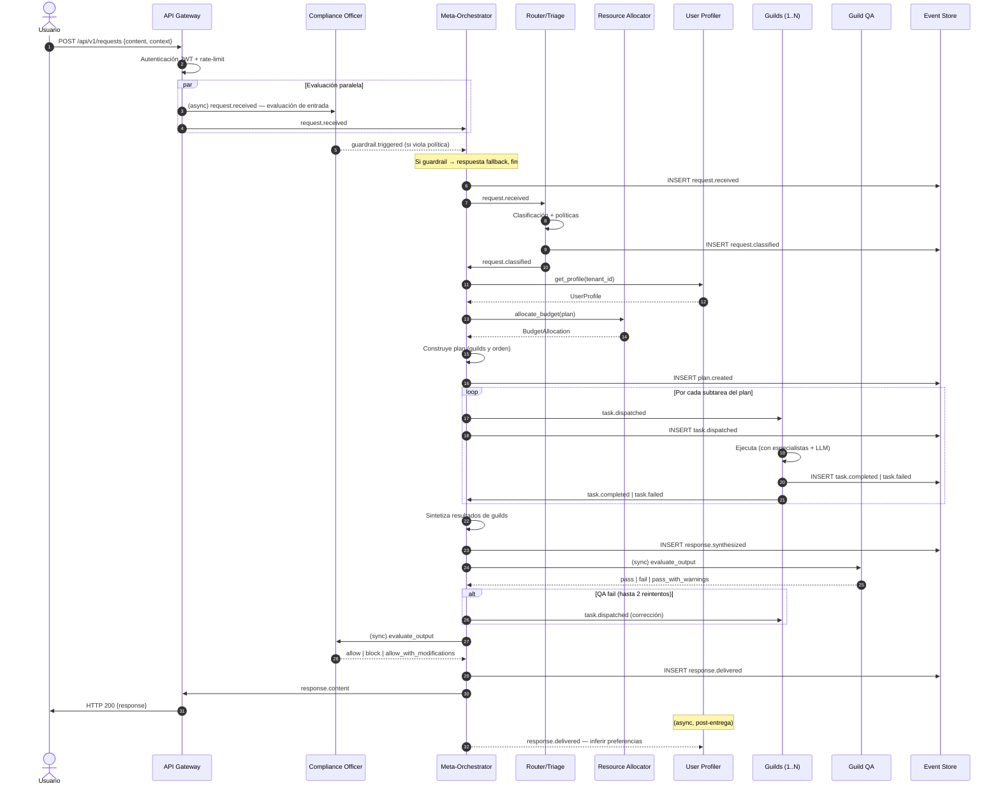

# Flujo 1 — Ciclo de petición

> **Status**: `draft` | Última revisión: 2026-05-07

Flujo cardinal desde que el usuario envía una petición hasta que recibe la respuesta.

---

## Diagrama

---

## Invariantes del flujo

1. **Compliance Officer evalúa SIEMPRE** tanto la entrada como la salida. No hay bypass.
2. **El event store se escribe en cada transición** de estado. Si falla el write al store, la operación falla.
3. **El perfil del usuario se inyecta ANTES de planificar**, nunca después.
4. **El presupuesto de tokens se asigna ANTES de despachar tareas**, nunca optimistamente.
5. **Si el plan falla por completo**, se entrega una respuesta de fallback. La tasa de respuestas entregadas ≥ 99.9%.

---

## Manejo de errores en el flujo

| Escenario | Comportamiento |
|---|---|
| `guardrail.triggered` en entrada | Respuesta fallback segura, no se invocan guilds |
| `task.failed` (guild) | Reintento automático hasta 2 veces; si sigue fallando, plan degrada |
| QA falla 3 veces | Respuesta parcial con advertencia de calidad |
| Timeout del plan | Respuesta parcial con los guilds que completaron |
| Compliance bloquea el output | Respuesta fallback; evento registrado |
| Event store no disponible | Petición rechazada (fail-fast, no hay operación sin audit trail) |

---

## SLO de punta a punta

- p50: < 3s
- p95: < 8s
- p99: < 15s
- Tasa de entrega (con o sin fallback): ≥ 99.9%
