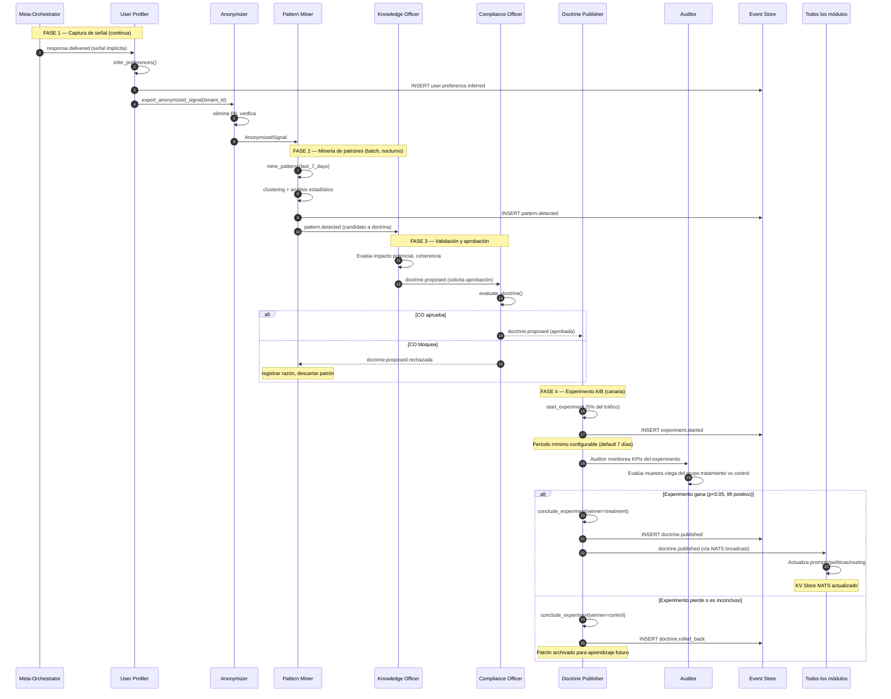

# Flujo 2 — Ciclo de aprendizaje

> **Status**: `draft` | Última revisión: 2026-05-07

Flujo de mejora continua: desde señal de comportamiento hasta doctrina publicada.

---

## Diagrama

---

## Tiempos del ciclo

| Fase | Duración típica | Configurable |
|---|---|---|
| Captura de señal | Continua (por petición) | N/A |
| Acumulación de señales (antes de minar) | 7 días | Sí |
| Minería de patrones (batch) | 1–4h (depende del volumen) | Sí |
| Validación por KO + CO | 0–48h (humano puede intervenir) | Sí |
| Experimento A/B | Mínimo 7 días | Sí (por doctrina) |
| **Ciclo completo** | **~14–21 días** | Sí |

---

## Invariantes del ciclo

1. **El Anonymizer es obligatorio** antes de que cualquier dato de usuario llegue al Pattern Miner.
2. **El Compliance Officer tiene veto** sobre cualquier doctrina propuesta, sin excepción.
3. **Ninguna doctrina se despliega al 100% sin pasar por canaria** (5% por defecto).
4. **El rollback es automático** si un KPI cardinal cae > 2% durante el experimento.
5. **Todo experimento se archiva**, gane o pierda, para aprendizaje futuro.

---

## Señales de aprendizaje reconocidas

| Señal | Tipo | Peso |
|---|---|---|
| Re-prompt inmediato tras respuesta | Implícita negativa | Alto |
| Copia del output sin modificar | Implícita positiva | Medio |
| Expansión explícita ("más detalle") | Explícita refinamiento | Medio |
| Rating explícito (si disponible) | Explícita | Alto |
| Tiempo de lectura largo | Implícita positiva | Bajo |
| Guardrail activado | Implícita negativa | Crítico |
| QA fallado (antes de entrega) | Interna negativa | Alto |

---

## Protección anti-reward-hacking

El Auditor evalúa con un evaluador **independiente** del que generó el output. Si el sistema aprende a "parecer bueno" en las métricas de QA sin serlo realmente, el Auditor lo detecta al comparar con evaluación adversarial externa.
