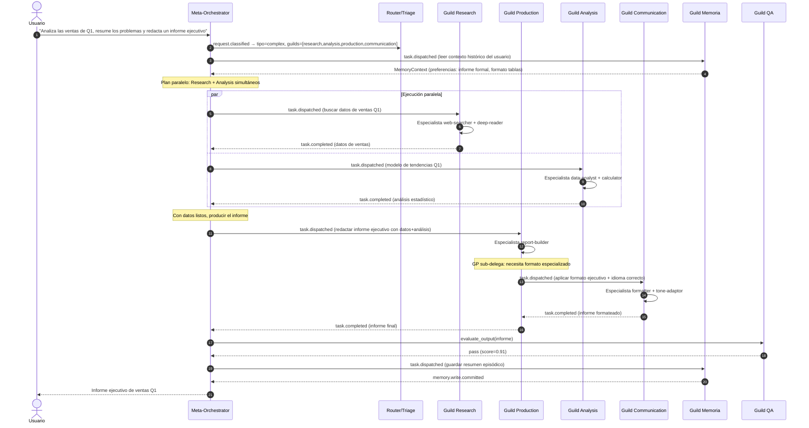

# Flujo 3 — Federación y delegación entre guilds

> **Status**: `draft` | Última revisión: 2026-05-07

Flujo que muestra cómo el Meta-Orchestrator coordina múltiples guilds en una petición compleja y cómo los guilds se sub-delegan entre ellos cuando es necesario.

---

## Diagrama: Petición multi-guild con sub-delegación



---

## Reglas de federación

### Paralelismo

Los guilds pueden ejecutarse en paralelo cuando **no hay dependencia de datos** entre ellos. El Meta-Orchestrator decide el grafo de dependencias al crear el plan:

```
Research ──┐
           ├──► Production ──► Communication
Analysis ──┘
```

### Sub-delegación entre guilds

Un guild **puede delegar a otro guild** si necesita una capacidad que no tiene:
- Production → Communication (para formatear el output)
- Research → Memory (para buscar en memoria episódica)
- Analysis → Memory (para recuperar datos históricos)

**Regla**: la sub-delegación es solo un nivel. Un guild delegado no puede delegar a un tercero (evita explosión de recursión).

### Límite de tareas en paralelo

El Resource Allocator define el máximo de tareas concurrentes según el presupuesto disponible. Default: 5 guilds en paralelo.

---

## Tipos de plan soportados

| Tipo de plan | Descripción | Guilds típicos |
|---|---|---|
| Secuencial simple | Un guild, una tarea | Production |
| Paralelo homogéneo | Varios guilds del mismo tipo en paralelo | Research x3 |
| Paralelo heterogéneo | Guilds diferentes en paralelo, síntesis al final | Research + Analysis |
| Pipeline | La salida de un guild es la entrada del siguiente | Research → Production |
| Híbrido | Combinación de paralelo y pipeline | Research+Analysis → Production → Communication |
| Multi-iterativo | Ciclos de corrección hasta pasar QA | Production ↔ QA (hasta 2 iteraciones) |

---

## Invariantes de federación

1. **El Meta-Orchestrator es el único coordinador global**. Los guilds no se llaman entre sí directamente en la ruta principal (solo sub-delegaciones permitidas).
2. **Cada guild tiene un timeout independiente**. Si un guild no responde a tiempo, el plan degrada sin ese guild.
3. **La memoria se inyecta al inicio del plan**, no en medio de la ejecución.
4. **El Guild de Memoria siempre es el último en escribir** (post-entrega), nunca durante la síntesis.
