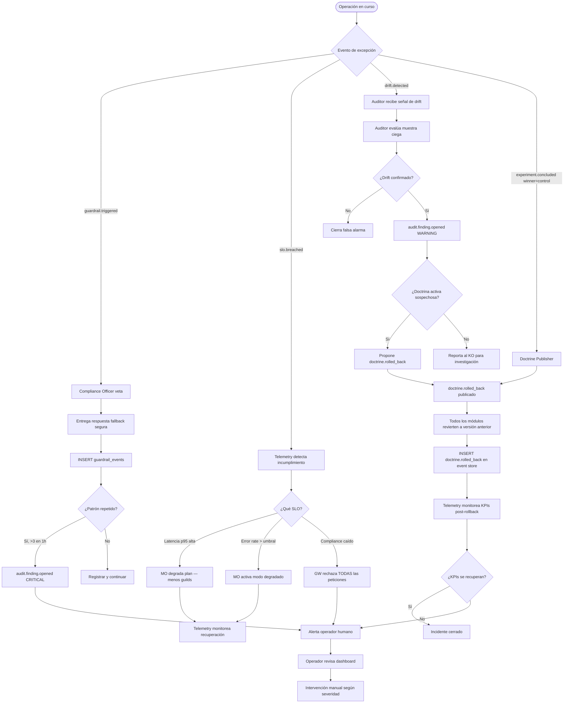
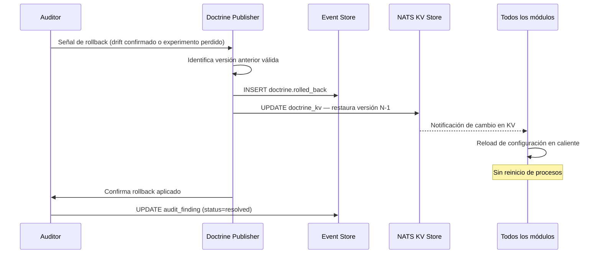

# Flujo 4 — Escalación y manejo de incidentes

> **Status**: `draft` | Última revisión: 2026-05-07

Flujo que cubre los escenarios de excepción: vetos de compliance, fallos de SLO, incidentes de auditoría y rollbacks de doctrina.

---

## Diagrama: Escalación completa

---

## Niveles de escalación

| Nivel | Trigger | Receptor | Tiempo de respuesta esperado |
|---|---|---|---|
| P3 - Info | `drift.detected` suave | Auditor (auto) | < 24h |
| P2 - Warning | `slo.breached` no crítico | Telemetry + MO (auto) | < 1h |
| P2 - Warning | `audit.finding.opened` WARNING | Auditor + KO | < 4h |
| P1 - Critical | `audit.finding.opened` CRITICAL | Operador humano | < 15min |
| P0 - Emergency | Compliance caído o múltiples SLOs críticos | Operador humano (alerta inmediata) | Inmediato |

---

## Rollback de doctrina: protocolo detallado

**Garantías del rollback**:
- Sin downtime: los módulos recargan configuración en caliente desde NATS KV.
- Tiempo de rollback completo: < 30 segundos desde que se publica `doctrine.rolled_back`.
- La doctrina retirada queda en estado `rolled_back` en la tabla `doctrines` (nunca borrada).
- Se mantiene la causalidad en el event store: el `doctrine.rolled_back` referencia al `doctrine.published` original.

---

## Modo degradado del sistema

Cuando el Meta-Orchestrator detecta presión de recursos o fallos múltiples activa el **modo degradado**:

| Modo | Guilds activos | Calidad esperada | Trigger |
|---|---|---|---|
| Normal | Todos los definidos en el plan | Alta | Sin incidentes |
| Degradado leve | Solo guilds críticos (production + communication) | Media | SLO latencia > p95 |
| Degradado severo | Solo production (respuesta directa sin investigación) | Baja | SLO latencia > p99 o error rate > 5% |
| Fallback total | Respuesta estática + log del error | Mínima | Cualquier fallo sistémico |

El usuario siempre recibe una respuesta con una nota indicando el modo si no es Normal.
