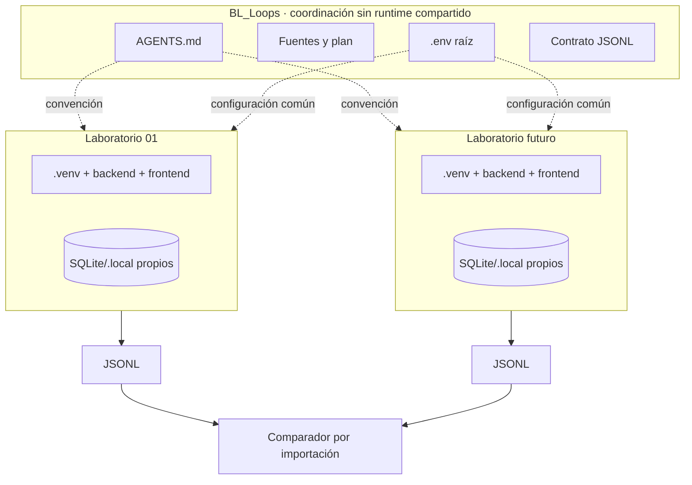
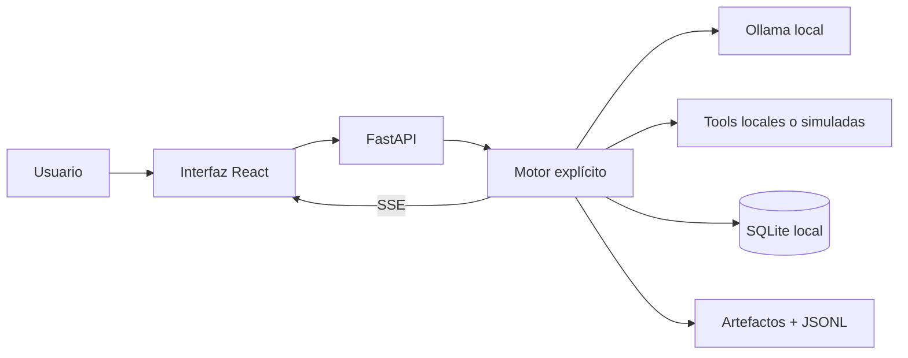
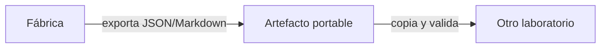

# Arquitectura didáctica de BL_Loops

## 1. La raíz no es una aplicación central

BL_Loops es un **repositorio maestro de conocimiento y experimentos**. Su raíz define reglas, fuentes, formatos y una progresión. Cada carpeta numerada contiene una aplicación autónoma.

No existen flechas de ejecución entre laboratorios. El comparador tampoco consulta procesos en vivo.

## 2. Cinco capas conceptuales

| Capa | Contenido | Qué produce |
|---|---|---|
| Autoridad | Decisiones del usuario, `sistema.md`, `AGENTS.md` | Límites y prioridades |
| Conocimiento | `Prompts/`, documentos humanos, repositorios de referencia | Ideas y candidatos |
| Decisión | Plan maestro, casos de evaluación, ADR futuros | Hipótesis verificables |
| Ejecución | Backend, frontend, contratos y pruebas de cada laboratorio | Demostraciones y corridas |
| Evidencia | JSONL, métricas, artefactos y valoración humana | Comparaciones reproducibles |

Una capa posterior puede usar la anterior, pero el runtime no debe leer documentos humanos para decidir cómo funcionar.

## 3. Clasificación física de archivos

### Documentación humana

Vive en `docs/humano/` y responde preguntas como “qué es”, “por qué existe” y “cómo lo practico”. Puede contener Mermaid, tablas, ejercicios y referencias.

### Documentación de decisión

Vive directamente en `docs/`, por ejemplo:

- `PLAN_MAESTRO_DIDACTICO.md`.
- `CASOS_DE_EVALUACION.md`.
- `INDEX.md`.

Describe compromisos vigentes del repositorio. No es runtime, pero tiene más autoridad que una referencia de estudio.

### Archivos operativos

Viven dentro de cada laboratorio:

- `AGENTS.md` con reglas portables para futuras sesiones.
- `backend/`, `frontend/` y scripts.
- `pyproject.toml`, `uv.lock`, `package.json` y lockfiles.
- `contracts/`, fixtures y pruebas.
- `.local/`, bases, logs y exportaciones ignoradas por Git.

## 4. Patrón interno de un laboratorio

No todos los nodos aparecen desde la primera parte. Se añaden cuando sirven al objetivo educativo de esa etapa. Por ejemplo, un flujo síncrono corto no necesita SSE hasta que haya eventos prolongados que observar.

## 5. Contratos que sí pueden viajar

Un laboratorio puede exportar:

- Prompts, agentes, skills y plantillas.
- JSON Schema y contratos JSON.
- Fixtures sintéticos.
- Corridas JSONL sanitizadas.

El proyecto receptor copia y versiona el artefacto. No importa el paquete Python del proyecto que lo creó.

## 6. Estado compartido permitido

| Elemento | Política |
|---|---|
| `.env` raíz | Configuración común local; permitido |
| Ollama en `D:/ollama` | Servicio y pesos locales; permitido |
| Caché global de `uv`/npm | Optimización de descargas; permitido |
| `.venv`, `uv.lock`, `node_modules` | Uno por laboratorio |
| SQLite, `.local`, logs, índices | Uno por laboratorio |
| Código o servicios de otro laboratorio | Prohibido como dependencia runtime |

La explicación completa está en [ENVIRONMENTS.md](ENVIRONMENTS.md).

## 7. Por qué esta arquitectura es útil para aprender

- Un fallo queda encerrado en el laboratorio que lo produjo.
- Dos variantes pueden usar versiones incompatibles sin contaminarse.
- Copiar un laboratorio demuestra si realmente es autónomo.
- Las métricas se comparan mediante archivos, no mediante una plataforma oculta.
- Es posible retirar un experimento sin romper los demás.

El costo es cierta duplicación. En BL_Loops esa duplicación es deliberada: hace visibles las dependencias y evita una abstracción compartida prematura.
