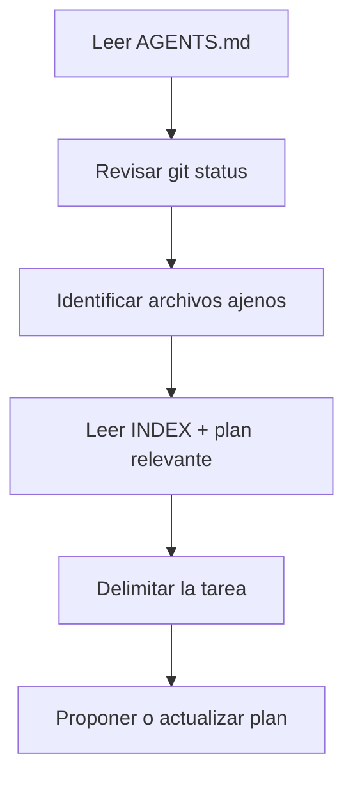

# Guía de trabajo para futuras sesiones de Codex

> `AGENTS.md` es la regla operativa canónica. Este documento la explica como recorrido didáctico; no la sustituye.

## Objetivo de una sesión

Una sesión de Codex debe dejar un cambio acotado, comprensible y verificable, preservando todo trabajo previo. “Hacer más” no es mejor si mezcla laboratorios o introduce componentes que todavía no se enseñan.

## Apertura obligatoria



Comandos de observación recomendados desde la raíz:

```powershell
git status --short
git diff --stat
rg --files
```

No se debe limpiar, restaurar, mover, preparar ni confirmar trabajo ajeno para “ordenar” el repositorio.

## Jerarquía de lectura

1. Petición actual del usuario y `docs/humano/sistema.md`.
2. `Prompts/` solo como corpus relevante a la tarea.
3. `docs/` como decisiones y refuerzo.
4. `menu_portable/` para candidatos.
5. Documentación oficial vigente para hechos cambiantes.

No se leen carpetas completas sin una pregunta concreta. Primero se busca con `rg`; después se abren los pocos archivos que sustentan la decisión.

## Antes de editar

Codex debe poder expresar:

- Qué resultado va a producir.
- Qué laboratorio o documento está dentro del alcance.
- Qué archivos existentes parecen ajenos y se preservarán.
- Qué decisión es confirmada, cuál es inferencia y cuál está pendiente.
- Qué pruebas demostrarán el resultado.

Si una decisión cambia sustancialmente el alcance, requiere efectos externos o contradice una regla, se solicita dirección al usuario.

## Durante la implementación

1. Construir un corte vertical mínimo.
2. Mantener runtime y `docs/humano/` físicamente separados.
3. Añadir o actualizar la explicación didáctica en la misma entrega.
4. Usar fixtures sintéticos y servicios locales.
5. Mostrar estados reales; no inventar actividad visual.
6. Verificar cada capa antes de añadir la siguiente.
7. Comunicar avances breves durante tareas largas.

No iniciar subagentes ni trabajo paralelo salvo que el usuario o una regla aplicable lo pida expresamente.

## Política de instalaciones

- Ejecutar instalaciones dentro del laboratorio que las necesita.
- Usar su `pyproject.toml`, `uv.lock` y `.venv`.
- No crear un `pyproject.toml` o una `.venv` Python en la raíz maestra.
- No instalar dependencias dentro de `Repositorios_Prueba`.
- No añadir una plataforma completa para resolver una función pequeña sin un spike y una decisión documentada.

Consulta [ENVIRONMENTS.md](ENVIRONMENTS.md) antes de cambiar esta política.

Cada laboratorio debe conservar un `AGENTS.md` propio y suficiente para trabajar cuando se copie fuera de BL_Loops. Dentro del workspace, ese archivo añade contexto local sin contradecir las reglas de la raíz.

## Política de seguridad

- Nunca imprimir ni registrar `.env`, tokens, PII o credenciales.
- No habilitar APIs cloud como fallback.
- No realizar escrituras externas sin autorización específica.
- No modificar clones de referencia.
- Mantener red, telemetría y conectores reales desactivados por defecto.
- Tratar un resultado incierto después de un efecto externo como ambiguo, no como candidato a reintento ciego.

## Verificación proporcional

| Tipo de cambio | Evidencia mínima |
|---|---|
| Solo Markdown | enlaces locales, estructura y coherencia con `AGENTS.md` |
| Backend Python | pruebas, lint y demostración del recorrido afectado |
| Frontend | build y recorrido visual en navegador sin errores de consola |
| Contrato | schema generado, fixture válido y fixture inválido rechazado |
| Corrida de agente | eventos completos, métricas y JSONL importable |
| Dependencia externa | versión, licencia, SHA, prueba mínima y motivo |

## Cierre de sesión

Antes de responder al usuario:

```powershell
git status --short
git diff --stat
```

Además:

- Detener servidores temporales.
- Confirmar que no se imprimieron secretos.
- Enumerar pruebas realmente ejecutadas, no pruebas supuestas.
- Separar lo terminado de lo aplazado.
- No hacer commit, push o publicación salvo solicitud expresa.
- Enlazar los archivos principales modificados.

## Plantilla de entrega

```text
Resultado:
- Qué quedó funcionando o documentado.

Decisiones:
- Qué se decidió y por qué.

Verificación:
- Comandos y resultados observados.

Pendiente deliberado:
- Qué no forma parte de esta entrega.
```

## Señal de una buena sesión

Otra sesión de Codex debe poder abrir `AGENTS.md`, el índice y la guía afectada, comprender el estado sin releer toda la conversación y repetir las verificaciones con los mismos resultados.
