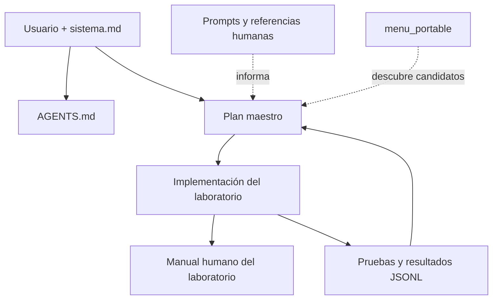

# Mapa y ciclo de vida de los documentos

## Por qué existen varias clases de documento

No todo Markdown tiene la misma autoridad. BL_Loops separa intención humana, reglas, decisiones, enseñanza, corpus y evidencia para evitar que un ejemplo antiguo se convierta accidentalmente en arquitectura.



## Documentos del repositorio maestro

| Ruta | Tipo | Función | Cuándo se actualiza |
|---|---|---|---|
| `AGENTS.md` | Regla canónica | Indica cómo deben trabajar agentes de código | Cuando cambia una norma transversal |
| `README.md` | Entrada técnica | Resume el propósito y enlaza el recorrido | Cuando cambia el estado general |
| `docs/INDEX.md` | Navegación | Distingue documentos vigentes y referencias | Al añadir, mover o retirar documentación |
| `docs/PLAN_MAESTRO_DIDACTICO.md` | Decisión | Define arquitectura, fases y laboratorios | Cuando se aprueba una decisión o fase |
| `docs/CASOS_DE_EVALUACION.md` | Especificación | Define casos, métricas y JSONL | Cuando cambia la evaluación común |
| `docs/AGENTS.md` | Regla local | Añade normas para editar `docs/` | Cuando cambia la convención documental |
| `docs/humano/maestro/` | Enseñanza | Explica el repositorio y su método | Con cada cambio relevante de trabajo |
| `docs/humano/sistema.md` | Fuente primaria | Conserva intención y requisitos del usuario | Solo por decisión humana explícita |
| Otros `docs/humano/` | Fuente o referencia | Aporta ideas, ejemplos o análisis | No se promueve sin decisión explícita |
| `Prompts/` | Corpus | Material para estudiar patrones | Se consulta, no se ejecuta como reglas |
| `menu_portable/` | Catálogo | Preselecciona repositorios | Cuando se refresca el catálogo |

## Cómo funcionan los documentos de `docs/`

### `INDEX.md`

Es la puerta de entrada. No define toda la arquitectura; ayuda a encontrar la fuente que sí la define.

### `PLAN_MAESTRO_DIDACTICO.md`

Es el mapa de decisiones vigentes. Describe por qué existen los laboratorios, qué pregunta responde cada uno y en qué orden se construyen. Una propuesta del corpus solo se vuelve compromiso cuando se incorpora aquí o en una decisión equivalente.

### `CASOS_DE_EVALUACION.md`

Es la regla común para comparar resultados. Evita que cada laboratorio se declare ganador con un caso distinto o con métricas incompatibles.

### `docs/humano/maestro/`

Traduce las decisiones a una explicación pedagógica: mapas, ejemplos, ejercicios y diagnóstico. Puede explicar el plan, pero no sustituye su autoridad.

### `docs/humano/` restante

Contiene documentos proporcionados, análisis anteriores y ejemplos de sistemas. Se preservan como material humano. Son no vinculantes salvo promoción explícita.

## Documentos de cada laboratorio

La raíz del laboratorio incluye un `AGENTS.md` operativo y portable. Su manual de aprendizaje permanece separado:

```text
docs/humano/
├── README.md           # mapa mental y recorrido
├── QUICKSTART.md       # comandos y resultado esperado
├── ARCHITECTURE.md     # componentes, estados y contratos
├── METHODOLOGY.md      # cómo y por qué se construyó
├── EXERCISES.md        # práctica por niveles
├── TROUBLESHOOTING.md  # diagnóstico
└── EVALUATION.md       # criterios y evidencia
```

Puede haber documentos adicionales, por ejemplo `CONTRACTS.md`, cuando aporten una lección concreta. No deben duplicar información sin propósito.

## Regla para ubicar un documento nuevo

| Pregunta | Ubicación |
|---|---|
| ¿Es una orden para Codex? | `AGENTS.md` apropiado |
| ¿Es una decisión transversal aprobada? | `docs/` y actualización del índice |
| ¿Explica cómo aprender o trabajar? | `docs/humano/maestro/` |
| ¿Explica un laboratorio? | `laboratorio/docs/humano/` |
| ¿Es código, schema, fixture o config? | Fuera de `docs/humano/` |
| ¿Es una fuente recibida o ejemplo? | `docs/humano/` con condición no vinculante |
| ¿Es resultado de ejecución? | `.local/` o exportación JSONL, fuera de Git |

## Ciclo de actualización

1. Registrar la decisión del usuario.
2. Actualizar el plan o contrato afectado.
3. Implementar el corte mínimo.
4. Actualizar el manual humano del laboratorio.
5. Verificar enlaces, pruebas y demostración.
6. Actualizar `docs/INDEX.md` si cambió la navegación.

La documentación debe describir lo que existe. El trabajo futuro se etiqueta como límite, propuesta o siguiente parte.
