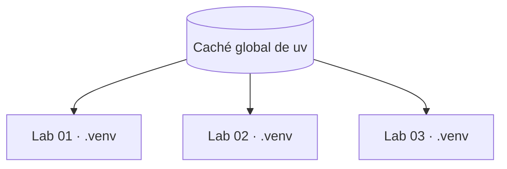
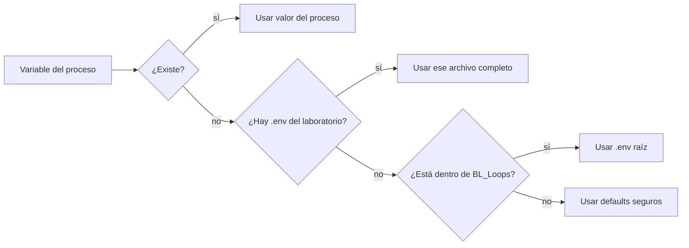

# Configuración y entornos: qué compartir y qué aislar

## Decisión

**Sí conviene compartir el `.env` raíz para la configuración común. No conviene compartir una sola `.venv` entre todos los laboratorios.**

```text
Compartido                             Aislado por laboratorio
──────────────────────────────────     ─────────────────────────────────
.env raíz (configuración común)        .venv (paquetes instalados)
.env.example (contrato visible)        uv.lock (versiones resueltas)
Ollama y modelos en D:/ollama          node_modules y package-lock.json
Caché de descargas de uv y npm         SQLite, .local, logs e índices
Contrato de eventos JSONL              backend, frontend y tests
```

## Por qué no usar una `.venv` común

Dos laboratorios pueden necesitar versiones distintas de FastAPI, Pydantic, un framework de agentes o una librería de embeddings. Si comparten el mismo entorno:

1. `uv sync` de un proyecto puede quitar paquetes que el otro necesita.
2. Una actualización cambia varios experimentos a la vez.
3. El `uv.lock` deja de describir con precisión el entorno ejecutado.
4. Copiar un laboratorio fuera de BL_Loops ya no reproduce su comportamiento.
5. Comparar variantes pierde validez porque comparten estado invisible.

La documentación oficial de `uv` indica que el entorno persistente normal vive en `.venv` junto al `pyproject.toml`. También advierte que reutilizar una ruta absoluta mediante `UV_PROJECT_ENVIRONMENT` en varios proyectos permite que cada invocación sobrescriba el entorno compartido.

## Cómo se evita desperdiciar espacio

`uv` ya mantiene una caché global de dependencias y evita volver a descargar o reconstruir paquetes conocidos. En Windows su ubicación normal está bajo `%LOCALAPPDATA%\uv\cache`.

Por tanto:



Los entornos están aislados, pero reutilizan archivos y descargas cuando `uv` puede hacerlo. No se habilitará por ahora la función preliminar de entornos centralizados; el comportamiento estable y visible es más educativo.

## Política del `.env`

### Dentro de BL_Loops

La raíz contiene:

- `.env.example`: nombres, ejemplos seguros y comentarios; se versiona.
- `.env`: valores locales reales; se ignora en Git y lo leen los laboratorios.

Los valores comunes incluyen endpoint local de Ollama, nombres de modelos, rutas conocidas y puertas de seguridad.

### Al copiar un laboratorio

Cada laboratorio conserva su propio `.env.example`. Fuera de BL_Loops:

```powershell
Copy-Item -LiteralPath .env.example -Destination .env
```

Así deja de depender del workspace sin cambiar su contrato.

### Precedencia actual



La implementación actual selecciona un solo archivo dotenv: el local si existe o el de la raíz. No mezcla ambos. Por eso, dentro del workspace se recomienda usar solo el `.env` raíz; un `.env` de laboratorio debe contener el contrato completo cuando se copie o se use como sustituto deliberado.

Pydantic Settings da prioridad a variables del proceso sobre valores del archivo dotenv. El código debe validar tipos y rechazar configuraciones peligrosas, nunca asumir que un texto del `.env` es seguro.

## Rutas relativas

Valores como `.local/data` deben resolverse contra la raíz del **laboratorio que está ejecutándose**, no contra BL_Loops. De esta manera dos proyectos pueden leer la misma cadena del `.env` y aun así escribir en carpetas distintas.

```text
01-prompt-agent-factory/.local/data
02-single-agent/.local/data
```

## Comandos recomendados

Desde el laboratorio elegido:

```powershell
uv sync --all-groups
uv run pytest
uv run python -c "import sys; print(sys.prefix)"
```

El último comando debe mostrar una ruta dentro de la `.venv` de ese laboratorio. Se prefiere `uv run` sobre activar manualmente el entorno.

## Antipatrones prohibidos

- Crear `BL_Loops/.venv` para todos los proyectos.
- Definir un mismo `UV_PROJECT_ENVIRONMENT` absoluto para varios laboratorios.
- Crear un workspace de `uv` en la raíz: implicaría un lockfile y entorno comunes.
- Instalar paquetes manualmente con `pip` sin reflejarlos en `pyproject.toml` y `uv.lock`.
- Versionar `.venv`, `.env`, `node_modules`, modelos o datos generados.
- Colocar secretos en `.env.example`.
- Imprimir el `.env` para diagnosticarlo.

## ¿Cuándo podría revisarse esta decisión?

Solo si varios laboratorios dejan de ser aplicaciones independientes y pasan a formar un único producto versionado. Eso sería un cambio de arquitectura y requeriría decisión humana explícita, migración y nuevas pruebas de reproducibilidad.

## Referencias oficiales verificadas el 29 de agosto de 2026

- [uv: estructura de un proyecto y entorno `.venv`](https://docs.astral.sh/uv/concepts/projects/layout/)
- [uv: configuración de la ruta del entorno](https://docs.astral.sh/uv/concepts/projects/config/#project-environment-path)
- [uv: caché de dependencias](https://docs.astral.sh/uv/concepts/cache/)
- [Pydantic Settings: archivos dotenv y prioridad](https://docs.pydantic.dev/latest/concepts/pydantic_settings/#dotenv-env-support)
