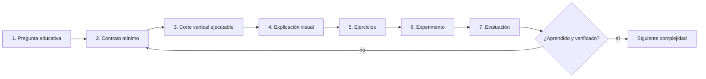
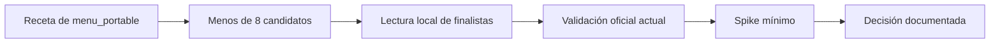

# Metodología de trabajo de BL_Loops

## Principio rector

> Construir la parte más pequeña que permita **ver, explicar, practicar y evaluar** una idea.

La sencillez no significa omitir contratos o pruebas. Significa posponer todo componente que todavía no ayude a aprender la lección actual.

## El ciclo de trabajo



## 1. Empezar por una pregunta, no por una herramienta

Ejemplo correcto:

> ¿Qué diferencia observable hay entre un prompt y un agente con condición de parada?

Ejemplo demasiado amplio:

> Instalemos cinco frameworks multiagente.

La herramienta se elige después de definir qué se quiere observar y medir.

## 2. Definir el contrato mínimo

Antes de programar se escriben:

- Entrada sintética.
- Salida esperada.
- Estados visibles.
- Errores que deben aparecer.
- Efectos prohibidos.
- Criterios de aprobado.

Un contrato puede comenzar como Pydantic, JSON Schema o una tabla precisa. Debe ser verificable por código siempre que sea posible.

## 3. Construir un corte vertical pequeño

Un corte vertical atraviesa interfaz, API y lógica solo hasta producir un resultado real. No se crean diez carpetas vacías para representar trabajo futuro.

```text
intención -> una pantalla -> un endpoint -> una regla -> una prueba -> una explicación
```

Si una base de datos, SSE, MCP o un framework no participa todavía en ese recorrido, se documenta como límite deliberado y se aplaza.

## 4. Incluir la documentación durante el trabajo

Cada cambio significativo debe actualizar, según corresponda:

| Cambio | Documento humano mínimo |
|---|---|
| Nueva capacidad | `README.md` o `ARCHITECTURE.md` |
| Nuevo comando | `QUICKSTART.md` |
| Decisión o límite | `METHODOLOGY.md` o plan maestro |
| Nuevo fallo conocido | `TROUBLESHOOTING.md` |
| Nueva conducta evaluable | `EVALUATION.md` |
| Nueva práctica | `EXERCISES.md` |

La documentación no se deja para una fase final: se escribe mientras las razones todavía son verificables.

## 5. Progresión didáctica obligatoria

Cada tema sigue cinco movimientos:

1. **Explicación:** concepto en lenguaje sencillo.
2. **Ejemplo:** recorrido reproducible con datos sintéticos.
3. **Ejercicio:** una modificación pequeña hecha por el estudiante.
4. **Experimento:** comparación controlada de una variable.
5. **Evaluación:** evidencia, métricas y reflexión.

## 6. Reglas para mantenerlo simple

- Un objetivo educativo principal por entrega.
- Una implementación base antes de añadir frameworks.
- Hasta dos variantes comparables, incorporadas progresivamente.
- Un modelo Ollama compartido por prueba antes de experimentar con concurrencia de modelos.
- Tools simuladas o de solo lectura antes de efectos externos.
- Datos sintéticos antes de casos anonimizados.
- SSE cuando haya estados prolongados; no por decoración.
- SQLite cuando exista estado que deba persistir; no por anticipación.
- Toda complejidad nueva debe responder “qué permite aprender o medir”.

## 7. Selección de repositorios



Se registra ruta, remoto, SHA, licencia, función y condición de referencia o dependencia. Los clones de `Repositorios_Prueba` permanecen en solo lectura.

## 8. Definición de terminado

Una entrega no está terminada solo porque “abre”. Debe tener:

- Recorrido funcional completo para su alcance declarado.
- Estados, errores y salidas visibles.
- Pruebas deterministas relevantes.
- Build del frontend cuando exista.
- Demostración local con datos sintéticos.
- Documentación humana actualizada y separada del runtime.
- Enlaces locales válidos.
- Exportación JSONL e importación de prueba cuando ya exista una corrida evaluable.
- Límites y trabajo futuro escritos sin presentarlos como implementados.

## 9. Cómo aumentar complejidad

Solo se pasa al siguiente nivel cuando la base permite responder tres preguntas:

1. ¿Qué entra y qué sale?
2. ¿Qué ocurrió en cada estado?
3. ¿Qué evidencia demuestra que funcionó o falló?

Si alguna respuesta depende de “confiar en el modelo” o de leer logs ambiguos, todavía falta contrato u observabilidad.
