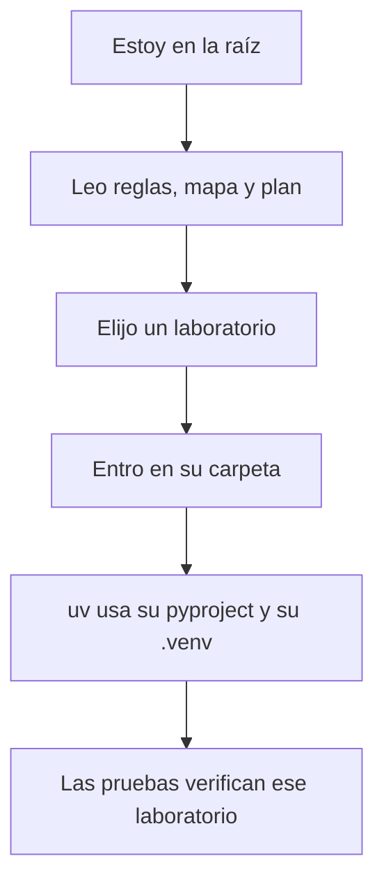

# Inicio rápido del repositorio maestro

> Esta guía reconoce el workspace y abre un laboratorio. No instala nada en repositorios externos ni muestra el contenido del `.env`.

## Resultado esperado

Al terminar sabrás:

- Dónde están las reglas y el plan.
- Si la configuración local existe, sin leer sus secretos.
- Qué herramientas están disponibles.
- Cómo preparar y verificar un laboratorio aislado.
- Qué comandos pertenecen a la raíz y cuáles al proyecto elegido.

## 1. Abrir la raíz correcta

```powershell
Set-Location C:\Users\criss\Desktop\Claude\BL_Loops
Get-Location
git status --short
```

`git status --short` es una observación, no una orden de limpiar. Todo archivo previo debe tratarse como trabajo que se conserva.

## 2. Leer el mapa mínimo

En este orden:

1. [`AGENTS.md`](../../../AGENTS.md): reglas operativas.
2. [`docs/INDEX.md`](../../INDEX.md): mapa documental.
3. [`PLAN_MAESTRO_DIDACTICO.md`](../../PLAN_MAESTRO_DIDACTICO.md): decisiones y progresión.
4. Esta guía maestra: explicación humana de cómo trabajar.

No hace falta leer todo `Prompts/` ni todo `docs/humano/` en cada sesión. Se consultan únicamente las fuentes relevantes para la tarea.

## 3. Comprobar herramientas

```powershell
git --version
uv --version
node --version
npm --version
ollama --version
```

Si una herramienta falta, detén la preparación de ese componente y consulta [TROUBLESHOOTING.md](TROUBLESHOOTING.md). No instales plataformas completas por anticipado.

## 4. Preparar la configuración compartida

Comprueba únicamente si el archivo existe:

```powershell
Test-Path -LiteralPath .env
```

Si devuelve `False`, crea la copia local:

```powershell
Copy-Item -LiteralPath .env.example -Destination .env
```

No muestres el contenido del `.env` en la terminal, en logs ni en respuestas. Su contrato público es `.env.example`.

## 5. Comprobar Ollama local

```powershell
Invoke-RestMethod -Method Get -Uri "http://127.0.0.1:11434/api/tags" |
    Select-Object -ExpandProperty models |
    Select-Object name
```

El resultado esperado es una lista de modelos locales. Esta consulta no descarga modelos ni llama a internet.

## 6. Entrar en un laboratorio

Ejemplo con el primero:

```powershell
Set-Location .\01-prompt-agent-factory
uv sync --all-groups
npm --prefix frontend install
```

Este comando crea o actualiza `01-prompt-agent-factory/.venv`. No debe crear una `.venv` compartida en la raíz.

## 7. Ejecutar sus verificaciones

```powershell
uv run pytest
uv run ruff check .
npm --prefix frontend run build
uv run factory-demo
```

Consulta la [guía propia del laboratorio](../../../01-prompt-agent-factory/docs/humano/QUICKSTART.md) para iniciar sus servidores y seguir el recorrido visual.

Para probar directamente el chat CLI del segundo laboratorio:

```powershell
Set-Location ..\02-single-agent
uv sync --all-groups
uv run single-agent
```

Su recorrido completo está en la [guía de inicio del agente único](../../../02-single-agent/docs/humano/QUICKSTART.md).

Para probar el RAG léxico con un corpus Markdown:

```powershell
Set-Location ..\06-naive-rag
uv sync --locked --all-groups
uv run naive-rag index --source "<ruta-a-los-markdown>"
uv run naive-rag ask "<pregunta-con-palabras-del-corpus>"
uv run naive-rag-validate
```

La importación genera un SQLite propio dentro del laboratorio; la consulta no lee documentos de
otro laboratorio ni necesita la documentación humana. Sigue la
[guía del RAG sencillo](../../../06-naive-rag/docs/humano/QUICKSTART.md) para usar el corpus de
libros y entender sus tres nodos.

Para comparar recuperación lexical, vectorial e híbrida sobre el mismo corpus:

```powershell
Set-Location ..\07-vector-rag
uv sync --locked
uv run vector-rag index --source "C:\Users\criss\Desktop\Claude\BL_Loops\docs\humano\Libros"
uv run vector-rag search --mode hybrid "¿Cómo vender sin presionar?"
uv run vector-rag ask "¿Cómo vender sin presionar?"
uv run vector-rag-validate
```

El recorrido y la política de filtrado están en la
[guía del RAG híbrido](../../../07-vector-rag/docs/humano/QUICKSTART.md).

Para probar el agente experto en ventas con una sola herramienta local:

```powershell
Set-Location ..\09-agentic-rag
uv sync --locked
uv run sales-agent index --source "C:\Users\criss\Desktop\Claude\BL_Loops\docs\humano\Libros"
uv run sales-agent ask "¿Cómo vender una vivienda sin presionar?"
uv run sales-agent chat
uv run sales-agent-validate
```

El agente posee su propio índice; no importa la base ni el código del laboratorio 07. Consulta
su [quickstart](../../../09-agentic-rag/docs/humano/QUICKSTART.md) para interpretar tool calls,
fallback, memoria en RAM y fuentes no revisadas.

## Regla de orientación



Si no puedes identificar qué `pyproject.toml`, `.venv` o `package.json` está usando un comando, no lo ejecutes todavía.
