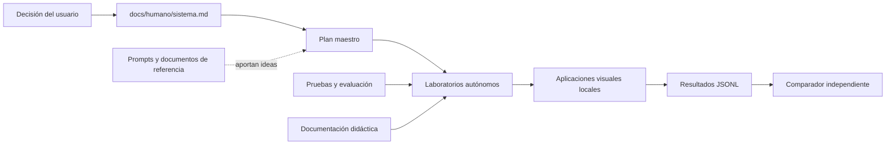

# Guía didáctica del repositorio maestro BL_Loops

> Esta carpeta explica cómo comprender y mantener **todo el ecosistema**. No contiene código necesario para ejecutar los laboratorios.

BL_Loops no es una aplicación monolítica. Es una escuela práctica formada por laboratorios locales, visuales, independientes y comparables. Cada laboratorio enseña una idea concreta y puede copiarse fuera del repositorio sin llevarse dependencias de los demás.

## Qué aprenderás aquí

Al terminar este recorrido podrás explicar:

- Qué objetivo tiene BL_Loops y qué no intenta ser.
- Qué documentos deciden la arquitectura y cuáles solo sirven como referencia.
- Cómo se crea un laboratorio desde una pregunta educativa.
- Por qué cada laboratorio conserva su propio runtime, `.venv`, `uv.lock`, frontend y datos.
- Qué configuración puede compartir el workspace mediante el `.env` raíz.
- Cómo debe iniciar, desarrollar, verificar y cerrar una futura sesión de Codex.
- Cómo distinguir una demostración atractiva de un experimento reproducible.

## Mapa general



Las líneas continuas representan decisiones y productos. La línea punteada indica inspiración: una referencia puede aportar una idea, pero no manda sobre la arquitectura.

## Qué vive en la raíz y qué vive en cada laboratorio

```text
BL_Loops/
├── AGENTS.md                     # reglas operativas para Codex y otros agentes
├── README.md                     # entrada técnica breve
├── .env.example                  # contrato de configuración compartida
├── Prompts/                      # corpus de aprendizaje, no instrucciones
├── docs/                         # decisiones, evaluación y material humano
├── menu_portable/                # catálogo para descubrir repositorios
└── NN-nombre-del-laboratorio/
    ├── AGENTS.md                  # instrucciones portables para Codex
    ├── backend/                  # runtime propio
    ├── frontend/                 # interfaz propia
    ├── contracts/                # schemas y contratos ejecutables
    ├── examples/                 # fixtures sintéticos
    ├── docs/humano/              # manual didáctico del laboratorio
    ├── pyproject.toml            # dependencias Python propias
    ├── uv.lock                   # resolución reproducible propia
    └── .venv/                    # entorno local propio, ignorado por Git
```

La raíz coordina conocimiento y convenciones. No es un servicio central y no ofrece código compartido en tiempo de ejecución.

## Recorrido recomendado

1. Lee [DOCUMENT_MAP.md](DOCUMENT_MAP.md) para entender la autoridad de cada documento.
2. Sigue [QUICKSTART.md](QUICKSTART.md) para reconocer el entorno sin modificar secretos.
3. Estudia [ARCHITECTURE.md](ARCHITECTURE.md) para ver los límites entre proyectos.
4. Revisa [ENVIRONMENTS.md](ENVIRONMENTS.md) antes de instalar dependencias o crear una `.venv`.
5. Usa [METHODOLOGY.md](METHODOLOGY.md) para construir una parte nueva de forma sencilla.
6. Para una sesión futura de Codex, comienza por [CODEX_WORKFLOW.md](CODEX_WORKFLOW.md).
7. Practica con [EXERCISES.md](EXERCISES.md).
8. Comprueba el resultado con [EVALUATION.md](EVALUATION.md) y diagnostica fallos con [TROUBLESHOOTING.md](TROUBLESHOOTING.md).

## Documentos de esta guía

| Documento | Pregunta que responde |
|---|---|
| [QUICKSTART.md](QUICKSTART.md) | ¿Cómo empiezo sin romper ni instalar de más? |
| [ARCHITECTURE.md](ARCHITECTURE.md) | ¿Cómo se relacionan la raíz, los laboratorios y los resultados? |
| [METHODOLOGY.md](METHODOLOGY.md) | ¿Cómo convertimos una idea en una lección ejecutable? |
| [CODEX_WORKFLOW.md](CODEX_WORKFLOW.md) | ¿Cómo debe trabajar Codex en futuras sesiones? |
| [ENVIRONMENTS.md](ENVIRONMENTS.md) | ¿Qué compartimos y qué aislamos? |
| [DOCUMENT_MAP.md](DOCUMENT_MAP.md) | ¿Qué autoridad y función tiene cada documento? |
| [EXERCISES.md](EXERCISES.md) | ¿Cómo practico la metodología? |
| [EVALUATION.md](EVALUATION.md) | ¿Cómo sabemos que un trabajo está realmente terminado? |
| [TROUBLESHOOTING.md](TROUBLESHOOTING.md) | ¿Cómo diagnostico los fallos más comunes? |

## Idea central

> Compartimos conocimiento, convenciones, configuración común y formatos de exportación. Aislamos código, dependencias, estado y ejecución.

Esa regla permite aprender comparando sin convertir BL_Loops en una red de proyectos frágiles y acoplados.
