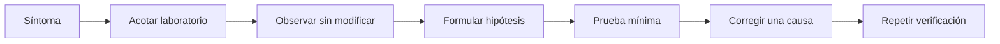

# Diagnóstico del repositorio maestro

## Método de diagnóstico



No se empieza limpiando cachés, eliminando entornos o reinstalando todo. Primero se identifica la causa.

## `uv` usa el proyecto equivocado

### Síntoma

Un comando instala paquetes inesperados o no encuentra el paquete del laboratorio.

### Comprobación

```powershell
Get-Location
Get-ChildItem -LiteralPath . -Filter pyproject.toml
uv run python -c "import sys; print(sys.prefix)"
```

### Solución

Entra en la carpeta que contiene el `pyproject.toml` del laboratorio. La ruta de `sys.prefix` debe apuntar a su `.venv`.

## Apareció una `.venv` en la raíz

### Causa probable

Se ejecutó una herramienta Python desde la raíz o se configuró un entorno común.

### Acción

No la borres automáticamente. Primero comprueba si contiene trabajo en uso y quién la creó. Corrige el comando o configuración para que cada laboratorio use su entorno. Una eliminación material requiere confirmar el objetivo exacto.

## El laboratorio no encuentra el `.env`

### Comprobación segura

```powershell
Test-Path -LiteralPath .env
Test-Path -LiteralPath .\01-prompt-agent-factory\.env.example
```

No uses `Get-Content .env`. Dentro de BL_Loops debe bastar el `.env` raíz; fuera, crea un archivo local desde el ejemplo del laboratorio.

## Una variable parece ignorada

### Causas probables

- Existe un `.env` local y sustituye al de la raíz.
- Una variable del proceso tiene prioridad sobre dotenv.
- El nombre no coincide con el alias esperado por Pydantic.
- El valor no pasa validación.

### Diagnóstico

Expón en un endpoint de salud únicamente el **origen** de configuración y valores no sensibles. Nunca devuelvas secretos ni el diccionario completo de settings.

## Ollama no responde

```powershell
Invoke-RestMethod -Method Get -Uri "http://127.0.0.1:11434/api/tags"
```

Si falla, comprueba el proceso local y el endpoint configurado. No actives un fallback cloud. Una prueba que requiere Ollama debe quedar fallida o explícitamente omitida, nunca verde por sustitución silenciosa.

## Conflicto de puertos

```powershell
Get-NetTCPConnection -State Listen |
    Where-Object LocalPort -In 5173,8011,11434 |
    Select-Object LocalAddress,LocalPort,OwningProcess
```

Identifica primero el proceso propietario. No termines procesos desconocidos. Usa otro puerto documentado para la sesión si corresponde.

## El frontend compila pero la pantalla falla

Verifica por separado:

1. Build de TypeScript/Vite.
2. Respuesta de salud de FastAPI.
3. URL de API usada por el frontend.
4. Consola y red del navegador.
5. Recorrido completo, no solo la carga inicial.

Una captura bonita no demuestra que los nodos representen estados reales.

## Se mezcló documentación con runtime

### Señal

Código Python o TypeScript lee rutas bajo `docs/humano`.

### Búsqueda

```powershell
rg -n "docs[/\\]humano|docs\\humano" -g "*.py" -g "*.ts" -g "*.tsx"
```

Mueve el contrato necesario a `contracts/`, configuración o código. La documentación puede enlazarlo; el runtime no puede depender del tutorial.

## Un enlace Markdown está roto

Confirma la ruta relativa desde el archivo que contiene el enlace, no desde la raíz. Actualiza también `docs/INDEX.md` si cambió la navegación principal.

## Un repositorio de referencia parece requerir instalación

Detente. Registra primero ruta, SHA, licencia y función. Prefiere leer su código o documentación. Instalar dependencias dentro de `Repositorios_Prueba` solo es válido cuando el laboratorio lo requiere y el alcance está autorizado.

## Una prueba deja archivos fuera del laboratorio

La prueba es inválida para BL_Loops. Redirige temporales a `.local/` o a una carpeta temporal validada. Comprueba que las rutas resueltas permanecen dentro del laboratorio antes de borrar o mover contenido.
